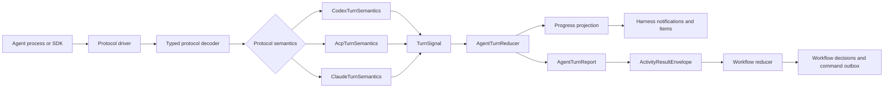
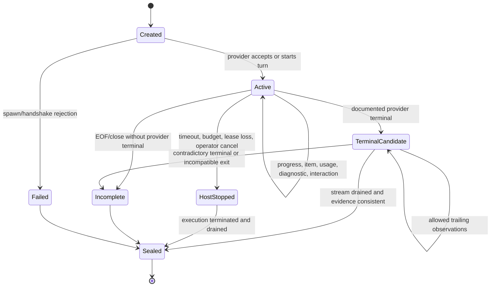

# Code Agent Turn Reduction Architecture

- Status: Proposed
- Date: 2026-08-28
- Decision owners: Harness maintainers
- Scope: agent runtime protocol interpretation and turn termination
- Related documents:
  - `docs/codex-app-server-reference.md`
  - `docs/opencode-acp-reference.md`
  - `docs/opencode-acp-runtime-spec.md`
  - `docs/prompt-workflow-contract-long-term-design.md`
  - `docs/zero-output-completion-detection-spec.md`
  - `docs/activity-status-contract-enforcement-spec.md`
  - `docs/workflow-runtime-v2-state-machine-spec.md`

## Decision Summary

Harness should introduce a pure, provider-neutral **agent turn reducer** between Code Agent
protocol semantics and the workflow runtime. The reducer owns one common Harness turn lifecycle:
output assembly, item correlation, diagnostics, interaction state, terminal evidence, and stream
finalization. It does not decide whether an issue is fixed, a pull request is ready, or a workflow
may advance.

The selected architecture is an hourglass:

1. `CodexTurnSemantics` interprets both `codex exec --json` and `codex app-server` facts.
2. `AcpTurnSemantics` interprets standard ACP v1 facts, initially for OpenCode and potentially for
   Cursor, Grok Build, and Gemini CLI.
3. `ClaudeTurnSemantics` interprets Claude Agent SDK messages and the current Claude Code
   `stream-json` compatibility surface.
4. All three emit the same small `TurnSignal` contract to one `AgentTurnReducer`.

Each surface keeps its own driver and typed decoder. Protocol semantics remain non-generic; only
the Harness turn lifecycle and final `AgentTurnReport` are generic. Raw wire formats are never fed
to a universal parser or reducer.

The immediate repair should be deliberately smaller than the target architecture:

- add `CodexTurnSemantics`, the canonical `TurnSignal` contract, and `AgentTurnReducer`;
- route both existing Codex surfaces through the same semantics module and reducer;
- make an explicit Codex terminal event authoritative;
- retain protocol-defined non-terminal diagnostics, including item-level error records, without
  treating them as terminal;
- add recorded fixtures for the recurring structured-error failure;
- leave workflow reducers, activity semantics, other agents, and public configuration unchanged.

This fixes the repeated Codex problem without turning the repair into a multi-agent feature project.

## Why This RFC Exists

Harness currently asks adapters to translate provider output directly into `AgentEvent`. That type
mixes progress with termination:

- `Diagnostic { severity: Error }` is explicitly non-terminal;
- `Error` is terminal;
- `TurnCompleted` is terminal evidence on some surfaces but becomes an output item in the turn
  engine;
- returning `Ok(())` from `start_turn` can complete a Harness turn even when no provider terminal
  marker was observed;
- process exit, protocol response, and provider terminal status are interpreted in different files.

The result is semantic drift. Codex app-server preserves diagnostics separately from terminal
`turn/completed`, while the Codex exec parser currently records both top-level and item-shaped
`error` values as `structured_error`. Those two exec event locations do not have the same lifecycle
role. A message whitelist can hide one known warning, but it cannot make the two surfaces agree as
Codex adds new diagnostics.

This is a protocol interpretation problem, not an output-text cleanup problem. Calling the missing
component a “normalizer” would obscure its responsibility. A reducer is the precise model: it folds
an ordered stream of typed facts into state and produces one terminal report under explicit
invariants.

## Scope

### Goals

- Give every supported Code Agent surface an explicit, testable terminal-authority contract.
- Make Codex exec and app-server agree when they describe the same turn outcome.
- Reuse formal ACP lifecycle semantics without assuming every ACP implementation is identical.
- Preserve provider-specific information needed for debugging and future capabilities.
- Separate diagnostic severity from turn termination.
- Separate provider completion from activity-contract and workflow completion.
- Make protocol drift observable and safe rather than silently ignored or guessed from prose.
- Allow incremental migration without a flag day or public runtime rewrite.

### Non-goals

- Do not create one universal wire event schema for all agents.
- Do not make Codex app-server, Claude Agent SDK, or ACP pretend to be the same protocol.
- Do not infer retryability or success from English message substrings.
- Do not decide whether code changes satisfy an issue or PR.
- Do not replace `ActivityResultEnvelope` or the workflow reducer.
- Do not add Cursor, Grok Build, Gemini CLI, or Claude Agent SDK integration in the first repair.
- Do not change agent prompts, sandbox policy, or GitHub interaction rules in the first repair.
- Do not treat a direct model API as equivalent to a Code Agent runtime.

## Terminology and Layer Boundaries

The following names are normative in this document:

| Term | Responsibility |
|---|---|
| **protocol driver** | Owns process or connection lifecycle, JSON-RPC request IDs, stdin/stdout, callbacks, interrupts, and approvals. It is impure and asynchronous. |
| **typed decoder** | Parses one wire frame into a protocol-specific Rust type. It validates required fields of known messages and preserves unknown messages. |
| **turn reducer** | Pure ordered fold over typed protocol facts plus stream/process finalization. It owns turn semantics and produces one `AgentTurnReport`. |
| **turn projection** | Converts reducer progress into Harness notifications and persisted `Item` values. It cannot decide termination. |
| **activity result extraction** | Converts a completed agent turn into an `ActivityResultEnvelope` and validates structured activity output. |
| **workflow reducer** | Applies domain invariants and decides workflow state transitions and commands. |

There is no new type called `AgentRuntime`. Existing code should continue to use `AgentBackend` for
the backend abstraction. `CodeAgent` and `AgentAdapter` remain historical aliases during migration.

## Research Method and Source Precedence

This RFC was researched on 2026-08-28. It covers the agents named in the design request and two
additional comparators that materially test the architecture:

- OpenAI Codex
- Claude Code and Claude Agent SDK
- Cursor Agent CLI
- xAI Grok Build
- OpenCode, because Harness already supports it
- Gemini CLI, because it exposes both JSONL and ACP and therefore tests protocol-family reuse

Claims use this precedence:

1. current official protocol or product documentation;
2. an official published SDK type or open-source implementation;
3. a pinned, reproducible local probe;
4. Harness implementation notes;
5. inference, marked explicitly as such.

Local reference documents are useful implementation history, but they are not normative when a
current official schema disagrees. Versions and capabilities must be captured at runtime or in
fixtures; a product name alone is not a protocol version.

## External Protocol Survey

### OpenAI Codex

Codex exposes two relevant wire surfaces plus public SDK wrappers.

`codex exec --json` emits JSONL containing thread, turn, item, error, and terminal turn events.
Current official documentation lists `turn.completed`, `turn.failed`, `item.*`, and `error` event
types. It also supports a final JSON Schema through `--output-schema`.

`codex app-server` is a bidirectional JSON-RPC protocol for rich integrations. Its core model is
Thread -> Turn -> Item. A turn finishes with `turn/completed`, whose status is `completed`,
`interrupted`, or `failed`. Current official documentation separately defines `warning` as a
non-fatal runtime warning and says a failed turn emits `error` followed by a failed terminal status.
Items have started/completed lifecycle notifications, and `item/completed` is authoritative for the
final item state. App-server supports approvals, interruption, steering, session history, and rich
tool or elicitation requests.

Codex also publishes TypeScript and Python SDKs for programmatic local agents. Both provide
start/continue/resume thread APIs; the official Python SDK explicitly controls a pinned local Codex
app-server over JSON-RPC. OpenAI recommends the SDK for automation and app-server for deep custom
clients. For Harness, an SDK can be another driver, but it does not create a fourth semantic family:
SDK results and app-server events still describe Codex threads and turns. A later SDK adoption must
compare the SDK's exposed terminal evidence with the native app-server driver before replacing it.

Architectural consequence: non-terminal Codex diagnostics must remain separate from failure
evidence and explicit terminal state. Exec and app-server should share Codex turn semantics even
though their framing and field names differ.

### Claude Code and Claude Agent SDK

Claude Code `-p --output-format stream-json` emits newline-delimited events and ends with a `result`
message containing final response and session metadata. The CLI returns a non-zero exit code on run
failure, although failures inside a run can also be represented on stdout.

The Claude Agent SDK exposes richer typed messages. `ResultMessage` is the end of the agent loop and
has explicit subtypes:

- `success`
- `error_max_turns`
- `error_max_budget_usd`
- `error_during_execution`
- `error_max_structured_output_retries`

It also provides `stop_reason`, structured output on successful schema validation, usage, session
identity, and permission denials. The SDK documentation warns that a small number of trailing system
events may arrive after `ResultMessage`, so a consumer should seal terminal meaning but drain the
stream instead of breaking immediately. Streaming input supports long-lived sessions, interruption,
runtime permission callbacks, and user questions.

No current official Claude Code documentation reviewed for this RFC advertises an ACP server.
Therefore Claude should have its own reducer. The future preferred rich driver is the Agent SDK;
the existing CLI stream remains a compatibility driver into the same Claude reducer.

### Cursor Agent

Cursor headless mode supports `json` and `stream-json`. The documented JSONL stream contains init,
user, assistant message, tool start/completion, and terminal success result events. Optional
`--stream-partial-output` adds deltas plus documented duplicate flushes that consumers must skip. On
failure, the process exits non-zero and the stream may end without a terminal result.

Cursor also exposes `agent acp` over JSON-RPC/stdio. It implements the ACP session lifecycle,
permission requests, cancellation, session load, and standard session updates. Cursor adds blocking
questions and plan approval plus notification extensions for todos, subagent tasks, and image
generation.

Architectural consequence: a future Harness Cursor integration should prefer ACP, use the shared ACP
reducer for standard lifecycle facts, and handle Cursor extensions in a Cursor profile. Headless
JSONL is a fallback surface, not the source of shared ACP semantics.

### xAI Grok Build

Grok Build supports a TUI, headless `plain`/`json`/`streaming-json`, persistent headless sessions,
and `grok agent stdio` as an ACP v1 agent. Official documentation shows initialization,
authentication, session creation, `session/prompt`, streamed `agent_message_chunk` updates, and a
terminal `stopReason` response.

The public headless documentation does not currently specify a complete `streaming-json` event
union. The ACP contract is therefore the safer integration surface: it has a published terminal
response and capability negotiation. Harness should not invent detailed Grok headless semantics
from examples.

### OpenCode

OpenCode exposes `opencode run --format json` and `opencode acp`. Harness already implements both.
The ACP path follows version 1 initialization, `session/new`, `session/prompt`, `session/update`,
permission requests, cancellation, and terminal `stopReason`. Existing Harness probes are recorded
in `docs/opencode-acp-reference.md`.

Architectural consequence: OpenCode should be the first real implementation used to extract
`AcpTurnSemantics` from the existing adapter and feed the shared `AgentTurnReducer`. Provider
details such as model configuration and command-line flags remain in `OpenCodeProtocolDriver`.

### Gemini CLI

Gemini CLI headless streaming JSON documents init, message, tool use, tool result, error, and terminal
result events. Its documentation explicitly says `error` can represent non-fatal warnings and system
errors. Exit codes distinguish general failure, input error, and turn-limit exhaustion.

Gemini CLI also exposes `gemini --acp` with initialize/authenticate, new/load session, prompt,
cancel, session mode, file-system proxy, and standard ACP updates.

Architectural consequence: Gemini independently confirms both important design rules: an
error-shaped stream event is not universally terminal, and ACP is reusable as a protocol family.
Gemini integration itself remains outside the initial implementation scope.

### Agent Client Protocol v1

ACP is the only shared formal protocol found across multiple researched Code Agents. Its baseline
turn contract is:

1. negotiate protocol version and capabilities with `initialize`;
2. authenticate if required;
3. create or load a session;
4. send `session/prompt`;
5. receive zero or more `session/update` notifications and client-directed requests;
6. receive the response to the original `session/prompt` with one `StopReason`.

ACP v1 stop reasons are `end_turn`, `max_tokens`, `max_turn_requests`, `refusal`, and `cancelled`.
`session/cancel` is a notification. Tool permissions are server-to-client JSON-RPC requests.
Capabilities, not product names, advertise optional session load/resume, client filesystem,
terminal, and MCP transports.

ACP standardizes the outer interaction but not every provider extension, authentication method,
configuration option, or tool payload. It should produce one shared reducer plus provider profiles,
not one undifferentiated adapter implementation.

## Capability and Lifecycle Comparison

The table reports documented public surfaces as of the research date. “Profile” means the feature is
provider-specific on top of a shared protocol.

| Agent surface | Machine stream | Explicit terminal authority | Session continuation | Interrupt/cancel | Interactive approvals/input | Native structured result |
|---|---|---|---|---|---|---|
| Codex exec | JSONL | `turn.completed` / `turn.failed` plus process result | resume command | process signal | preset approval policy; not a rich callback channel | `--output-schema` |
| Codex app-server | native JSON-RPC | `turn/completed.turn.status` | start/resume/fork | `turn/interrupt` | approvals and elicitation requests | provider turn items; activity schema remains Harness-owned |
| Codex SDK | typed library over local Codex; Python uses app-server | typed run result backed by Codex turn | start/continue/resume | SDK-specific | SDK-specific | typed final response; activity schema remains Harness-owned |
| Claude Code CLI | stream-json | terminal `result` plus process result | continue/resume | process signals | generally preset CLI policy | `--json-schema` |
| Claude Agent SDK | typed async stream | `ResultMessage.subtype` | persistent/resume/fork | SDK interrupt | permission and question callbacks | `structured_output` |
| Cursor headless | JSONL | success `result`; failure may be non-zero EOF | resume | process signal | preset force/config rules | no documented arbitrary output schema in reviewed CLI docs |
| Cursor ACP | ACP v1 JSON-RPC | `session/prompt.stopReason` | new/load | `session/cancel` | ACP permission plus Cursor question/plan profile | no ACP-standard activity schema |
| Grok headless | JSONL, incompletely specified | final JSON/process contract; detailed union not published | id/resume/continue | process signal | `--always-approve` preset | final JSON, schema guarantees not documented |
| Grok ACP | ACP v1 JSON-RPC | `session/prompt.stopReason` | ACP session | `session/cancel` | ACP permission profile | no ACP-standard activity schema |
| OpenCode ACP | ACP v1 JSON-RPC | `session/prompt.stopReason` | new/load when advertised | `session/cancel` | ACP permission | no ACP-standard activity schema |
| Gemini headless | JSONL | terminal `result` plus exit code | product-specific | process signal | preset approval mode | final JSON |
| Gemini ACP | ACP v1 JSON-RPC | `session/prompt.stopReason` | new/load when advertised | cancel | ACP permission | no ACP-standard activity schema |

Two conclusions follow:

1. Terminal evidence is available on every recommended rich surface, but it is expressed
   differently.
2. ACP is a genuine shared protocol family; JSONL by itself is only a framing format and does not
   imply shared semantics.

## Selected Architecture



The driver performs I/O. The decoder establishes typed wire facts. A protocol-semantics module
classifies those facts using the provider or published protocol contract. The reducer applies only
the common Harness turn lifecycle. The projection makes progress visible. Activity extraction and
workflow reduction remain downstream and independently testable.

### Why a Generic Reducer Only After Protocol Semantics

Provider-only end-to-end reducers would preserve too much duplication: Cursor ACP, Grok ACP,
OpenCode ACP, and Gemini ACP would each rediscover the same terminal response and cancellation
rules. A reducer over raw events would instead erase meaningful differences such as Codex item
authority, Claude trailing events, ACP stop reasons, and provider-specific interactions.

The stable middle is a canonical semantic signal contract:

- share what a published protocol makes invariant;
- isolate transport spelling in typed decoders;
- classify protocol meaning in explicit semantics modules;
- keep provider extensions and evidence provenance intact;
- reduce only lifecycle facts that already have a Harness meaning.

This boundary follows the strongest pattern found in comparable systems. MultiClaude keeps tmux,
worktree, task state, and explicit worker completion separate. Agent-aware terminals such as Otty
project provider hooks into a deliberately small presence contract. Alera retains per-agent event
mapping before projecting shared presence state. The Herd control plane keeps provider adapters and
provider-specific event mappers before producing its shared transcript envelope. None of these
systems safely treats arbitrary raw provider events as one universal protocol.

### Protocol Driver Contract

The target backend surface should return a report rather than encode terminal state into a progress
channel:

```rust
#[async_trait]
pub trait AgentBackend: Send + Sync {
    fn name(&self) -> &str;
    fn capabilities(&self) -> AgentCapabilitiesSnapshot;

    async fn run_turn(
        &self,
        request: AgentRequest,
        progress: mpsc::Sender<AgentProgressEvent>,
    ) -> Result<AgentTurnReport, AgentStartError>;

    async fn interrupt(&self) -> Result<()>;
    async fn terminate_and_drain(&self) -> Result<()>;
    async fn steer(&self, text: String) -> Result<()>;
    async fn respond_interaction(
        &self,
        id: AgentInteractionId,
        response: AgentInteractionResponse,
    ) -> Result<()>;
}
```

`AgentStartError` is limited to failures before a turn can be identified or reduced, such as an
unspawnable binary or failed initial handshake. Once a provider turn is accepted, stream, provider,
timeout, cancellation, and protocol failures belong in `AgentTurnReport.termination` so every
started turn has a durable outcome.

During migration, the existing `execute`, `execute_stream`, and `start_turn` methods remain. A
compatibility bridge converts `AgentTurnReport` into the existing `AgentEvent` stream. New reducers
must not depend on that lossy projection.

### Protocol Semantics Contract

Protocol semantics convert typed wire facts into canonical signals. They do not mutate workflow
state and do not decide whether the task was successful:

```rust
pub trait TurnSemantics<Fact> {
    fn interpret(&mut self, fact: Fact) -> Vec<TurnSignal>;
}
```

`CodexTurnSemantics`, `AcpTurnSemantics`, and `ClaudeTurnSemantics` are separate implementations.
This is not a renamed universal normalizer: each implementation owns the protocol-specific rules
that decide whether an error-shaped fact is a diagnostic, retry evidence, an interaction failure,
or an authoritative terminal marker.

### Pure Reducer Contract

The single reducer is a deterministic value with no I/O:

```rust
pub struct AgentTurnReducer { /* private state */ }

impl AgentTurnReducer {
    pub fn apply(&mut self, signal: TurnSignal) -> Vec<AgentProgressEvent>;
    fn finish(self, end: TurnStreamEnd) -> AgentTurnReport;
}

pub enum TurnStreamEnd {
    ProcessExit { code: Option<i32> },
    ConnectionClosed,
    HostCancelled { reason: String },
    HostTimedOut { timeout_secs: u64 },
    BudgetStopped { budget_usd: f64 },
}
```

The reducer may record terminal evidence before the stream ends, but `finish` seals the report.
This accommodates Claude SDK trailing events and lets process exit corroborate or contradict the
provider terminal marker.

### Common Turn Report

```rust
pub struct AgentTurnReport {
    pub identity: AgentTurnIdentity,
    pub protocol: AgentProtocolIdentity,
    pub termination: AgentTurnTermination,
    pub terminal_evidence: TerminalEvidence,
    pub output: AgentOutput,
    pub items: Vec<AgentItemRecord>,
    pub diagnostics: Vec<AgentDiagnostic>,
    pub interactions: Vec<AgentInteractionRecord>,
    pub usage: TokenUsage,
    pub activity: AgentActivitySummary,
    pub unknown_events: Vec<UnknownProtocolEvent>,
}

pub enum AgentTurnTermination {
    Completed,
    Cancelled { origin: CancellationOrigin, reason: String },
    Failed { failure: AgentTurnFailure },
    Incomplete { failure: AgentTurnFailure },
}
```

`Incomplete` means the stream ended without sufficient terminal evidence or contained contradictory
terminal evidence. It is not success. The workflow runtime may map it to a retryable failed
activity, but that policy remains outside the reducer.

`AgentTurnIdentity` records Harness turn ID plus provider thread/session/turn IDs when present.
`AgentProtocolIdentity` records provider, surface, protocol family, negotiated version, binary or SDK
version when known, and capability snapshot digest.

### Terminal Evidence

The report must say why Harness believes a turn ended:

```rust
pub struct TerminalEvidence {
    pub provider_marker: Option<ProviderTerminalMarker>,
    pub process_exit: Option<i32>,
    pub stream_closed: bool,
    pub host_action: Option<HostTerminalAction>,
    pub contradictions: Vec<TerminalContradiction>,
}
```

This prevents future debugging from collapsing into “the adapter returned an error.” It also allows
safe changes to policy without reparsing old prose.

### Diagnostics Are Data, Not Control Flow

```rust
pub struct AgentDiagnostic {
    pub severity: DiagnosticSeverity,
    pub category: DiagnosticCategory,
    pub code: Option<String>,
    pub message: String,
    pub retry_hint: RetryHint,
    pub source: DiagnosticSource,
}
```

A diagnostic never changes `AgentTurnTermination` by itself. It may be retained as evidence if the
stream later ends incompletely. Terminal state changes only through a documented provider terminal,
a host terminal action, or stream finalization without valid terminal evidence.

This rule eliminates message whitelists such as “this particular skill warning is safe.” New
diagnostic wording no longer changes control flow.

### Failure Classification

`AgentTurnFailure` should use structured evidence:

```rust
pub struct AgentTurnFailure {
    pub stage: FailureStage,
    pub kind: FailureKind,
    pub retry: RetryHint,
    pub code: Option<String>,
    pub message: String,
}

pub enum FailureStage {
    Spawn,
    Authentication,
    Handshake,
    Transport,
    Protocol,
    Provider,
    Policy,
    Host,
}

pub enum RetryHint {
    Retryable,
    NotRetryable,
    Unknown,
}
```

Decoders may set a retry hint only from a documented code, HTTP status, protocol field, or host
policy. Unknown messages remain `Unknown`; they are not text-classified into retryable or fatal.
Workflow retry policy consumes this hint together with attempt budget and activity policy.

### Progress Events

The target progress stream should exclude terminal variants:

```rust
pub enum AgentProgressEvent {
    TurnStarted,
    AssistantTextDelta { message_id: Option<String>, text: String },
    AssistantMessageCompleted { message_id: Option<String>, text: String },
    ToolStarted { id: String, name: String, input: Value },
    ToolProgress { id: String, content: Value },
    ToolCompleted { id: String, outcome: ToolOutcome },
    UsageUpdated { usage: TokenUsage, semantics: UsageSemantics },
    DiagnosticObserved { diagnostic: AgentDiagnostic },
    InteractionRequested { request: AgentInteractionRequest },
    ProviderExtension { namespace: String, kind: String, payload: Value },
}
```

The existing `AgentEvent::Error`, `TurnCompleted`, `TurnCancelled`, and `Done` become compatibility
outputs only. New code must use the returned report for terminal state.

### Output Assembly and Item Identity

Providers deliver text as deltas, snapshots, or both. Reducers must encode the delivery contract;
they must not deduplicate by comparing text:

- Codex `item/completed` is authoritative for final item state.
- Codex exec item completion and app-server item completion map to the same Codex item fact.
- Cursor headless assistant events are complete message segments by default. With
  `--stream-partial-output`, only timestamped events without `model_call_id` are new deltas; the
  documented buffered and final flushes are duplicates.
- ACP `agent_message_chunk` values are chunks; `messageId`, when supplied, partitions messages.
- Claude partial stream events are deltas, while `AssistantMessage` is a completed message snapshot.
- Claude `ResultMessage.result` is terminal output, not another delta.

Reducers track provider item IDs and reject impossible lifecycle transitions for known events. An
unknown item kind is preserved as an extension and does not become a fabricated Harness item.

### Interactions

The current `ApprovalRequest { id, command }` loses too much information. Researched agents can ask
for command approval, file approval, permission grants, plan approval, multiple-choice answers, MCP
elicitation, or deferred tool execution.

The target model is:

```rust
pub enum AgentInteractionRequest {
    ToolApproval(ToolApprovalRequest),
    PermissionGrant(PermissionGrantRequest),
    UserQuestion(UserQuestionRequest),
    PlanApproval(PlanApprovalRequest),
    Elicitation(ElicitationRequest),
    ProviderSpecific(ProviderInteractionRequest),
}
```

The protocol driver owns response encoding. The reducer records requested and resolved interaction
state. Unanswered blocking interactions at stream end make the turn incomplete unless an explicit
terminal status says they were cancelled or declined.

Interaction generalization is not part of the first Codex repair. It is included here so the chosen
architecture does not dead-end when Cursor or Claude rich integration is added.

### Capability Snapshot and Surface Selection

Capabilities must be values with provenance, not a static `Vec<Capability>` inferred from a brand:

```rust
pub struct AgentCapabilitiesSnapshot {
    pub protocol: AgentProtocolIdentity,
    pub advertised: BTreeSet<AgentCapability>,
    pub configured: BTreeSet<AgentCapability>,
    pub unavailable: BTreeMap<AgentCapability, String>,
}
```

Runtime profiles select a protocol surface explicitly. Policy translation happens after surface
selection. An approval policy must never silently switch a turn from app-server to exec or vice
versa. If the selected surface cannot implement a requested capability, dispatch fails clearly or a
fallback surface explicitly declared in the profile is chosen and recorded.

This rule prevents behavior changes that look like a parser regression but were actually an
unobserved surface switch.

## Reducer State Machine



`TerminalCandidate` is necessary because a terminal message and transport end are separate facts.
It also prevents the host from marking a turn complete while a process may still mutate the
workspace.

## Terminal-Authority Rules

These rules apply to every family reducer unless a documented protocol rule is stricter:

1. Exactly one `AgentTurnReport` is produced for every accepted turn.
2. A diagnostic, warning, tool failure, hook failure, or protocol-defined non-terminal error item is
   not a turn terminal.
3. A documented provider terminal marker is the primary provider outcome.
4. A terminal success followed by an incompatible non-zero process exit is `Incomplete`, not
   success, unless the pinned provider contract explicitly allows that exit.
5. EOF or connection close without a required terminal marker is `Incomplete`, even with exit code
   zero.
6. A provider terminal failure remains failure even if useful text or edits were emitted first.
7. A completed provider turn may still fail activity extraction or workflow validation downstream.
8. Cancellation origin is preserved: provider, operator, timeout, lease loss, budget, or process
   termination are not collapsed into one string.
9. The first terminal candidate does not cause an early read break when the provider permits
   trailing events.
10. Conflicting terminal markers are a protocol failure; later success cannot overwrite earlier
    failure or vice versa.
11. Unknown events do not change terminal state. They are counted and retained in redacted form.
12. Known event types missing required discriminator or identity fields are protocol errors, not
    silently ignored events.

### Provider-Specific Terminal Mapping

| Protocol fact | Turn termination |
|---|---|
| Codex `turn/completed` status `completed` | `Completed` |
| Codex `turn/completed` status `interrupted` | `Cancelled` |
| Codex `turn/completed` status `failed` or exec `turn.failed` | `Failed(Provider)` |
| Codex `warning` or non-terminal error item | diagnostic; terminal status still required |
| Codex app-server `error` before failed terminal | failure candidate; require the documented failed terminal |
| Codex exec top-level `error` | failure candidate; resolve with `turn.failed` or stream/process finalization |
| ACP `stopReason = end_turn` | `Completed` |
| ACP `stopReason = cancelled` | `Cancelled` |
| ACP `stopReason = max_tokens|max_turn_requests|refusal` | `Failed(Provider)` with structured kind |
| Claude result subtype `success` | `Completed`, subject to `stop_reason` consistency |
| Claude result subtype beginning `error_` | `Failed(Provider)` |
| Cursor headless success result | `Completed` |
| Streaming surface EOF without its documented terminal | `Incomplete(Protocol or Transport)` |

For Codex app-server, current official documentation says failed turns emit `error` and then a
failed terminal. The reducer records the first as failure evidence and resolves on the terminal. For
Codex exec, the decoder must distinguish a top-level error from an item-level error. A top-level
error is failure evidence; an item-level error is a non-terminal item. The reducer resolves the
former with `turn.failed` when present or with stream/process finalization for compatible older
streams. It never classifies either case from message wording. This type-and-lifecycle distinction is
the central correction to current behavior.

## Relationship to Existing Harness Layers

### `AgentEvent`

`AgentEvent` remains the compatibility projection used by notifications and current turn storage.
It should not remain the source of truth for termination. `StreamCompletionState` may continue to
assemble legacy items during migration, but it receives reducer projections and cannot upgrade or
downgrade the report.

### `ActivityResultEnvelope`

`ActivityResultEnvelope` starts after `AgentTurnReport` exists:

```text
AgentTurnReport.termination == Completed
  -> choose native structured output or transcript extraction strategy
  -> validate the activity schema
  -> enforce zero-output and status consistency gates
  -> produce ActivityResultEnvelope
```

Native provider structured output should be recorded as an extraction source. It proves schema
conformance, not domain correctness. The activity layer still validates activity identity,
required signals, required artifacts, and contradictions.

If turn termination is `Failed`, `Cancelled`, or `Incomplete`, activity extraction must not reinterpret
ordinary assistant text as a successful activity result.

### Workflow Reducer

The workflow reducer consumes only validated activity outcomes. It remains responsible for rules
such as:

- implementation without PR or closure proof is blocked;
- empty successful PR inspection is invalid;
- parent workflows consume typed child outcomes;
- terminal workflows cannot reopen;
- commands and state changes are committed through the workflow runtime.

The turn reducer knows none of these rules.

## Protocol Semantics Designs

### `CodexTurnSemantics`

Inputs are a shared Codex semantic enum produced by two decoders:

```rust
pub enum CodexTurnFact {
    ThreadIdentified { thread_id: String },
    TurnStarted { turn_id: Option<String> },
    ItemStarted { item: CodexItem },
    ItemDelta { item_id: String, delta: CodexItemDelta },
    ItemCompleted { item: CodexItem },
    UsageUpdated { usage: TokenUsage },
    DiagnosticObserved { diagnostic: AgentDiagnostic },
    FailureObserved { failure: AgentTurnFailure },
    ApprovalRequested { request: CodexInteraction },
    Terminal { terminal: CodexTerminal },
    Unknown { kind: String, payload: Value },
}
```

`CodexExecDecoder` handles dotted JSONL names and process exit. `CodexAppServerDecoder` handles
slash-named JSON-RPC methods, request IDs, and turn status objects. Neither decoder assigns final
Harness success or failure.

The semantics module classifies Codex evidence consistently across both surfaces. It marks
`item/completed` as authoritative item evidence, maps diagnostics without message whitelists, and
emits an authoritative terminal signal only from the Codex terminal contract. The common reducer
then assembles the final agent message, retains diagnostics, and seals the turn report. This Codex
vertical slice is the first implementation target.

### `AcpTurnSemantics`

`AcpTurnSemantics` consumes typed ACP v1 messages from a reusable `AcpProtocolDriver`. Provider
profiles supply:

- executable and arguments;
- authentication method selection;
- session configuration options;
- advertised-capability validation;
- extension methods and interaction codecs;
- optional stricter conformance rules;
- binary version probing.

The semantics module owns the meaning of `session/update`, tool lifecycle, usage, permission
requests, `session/prompt` response, stop reason, and cancellation. It must not interpret a generic
JSON-RPC error response as a turn failure unless the response ID belongs to the active
`session/prompt` or a required request whose failure makes the turn impossible.

This distinction matters because the current OpenCode parser stores both successful and error
responses in the same `Response { result }` shape. The extracted driver should retain the JSON-RPC
success/error discriminator.

### `ClaudeTurnSemantics`

`ClaudeTurnSemantics` accepts a typed semantic enum produced by either a CLI stream decoder or an
Agent SDK driver. It owns:

- assistant complete messages versus optional partial deltas;
- tool use and tool result correlation;
- session identity;
- `ResultMessage` subtype and `stop_reason` consistency;
- permission denials and structured output;
- trailing system events after the terminal result;
- process result for the CLI compatibility driver.

The target rich integration should use Agent SDK streaming input because it exposes interrupts,
permissions, questions, and persistent sessions as typed APIs. Adopting that driver is a separate
proposal because Rust packaging, process ownership, and SDK deployment need their own decision.

## Alternatives Considered

### Alternative A: One Universal Raw-Event Reducer

Map every provider wire event immediately into one large `AgentEvent` enum and run one state
machine.

Rejected because JSONL is only framing, error semantics differ, item authority differs, and
provider interactions cannot be represented without an ever-growing collection of optional fields.
This design recreates the current ambiguity under a larger name.

### Alternative B: One Independent Reducer per Product and Surface

Keep Codex exec, Codex app-server, Claude CLI, Cursor ACP, Grok ACP, and OpenCode ACP entirely
separate.

Rejected because it guarantees drift in shared published semantics. Harness has already experienced
this with two Codex surfaces. Four ACP implementations would multiply the same problem.

### Alternative C: Standardize All Agents on ACP

Require an ACP wrapper around Codex and Claude, then implement only ACP.

Rejected because wrappers would either discard native capabilities or invent semantics ACP does not
define. Codex app-server has richer Thread/Turn/Item and approval behavior. Claude Agent SDK has
typed result subtypes, callbacks, and trailing events. A wrapper adds another failure boundary
without removing the need to understand the native protocols.

### Alternative D: Continue With Message Classification and Whitelists

Keep current adapters and classify known warning/error strings as terminal or non-terminal.

Rejected because wording is not a protocol contract. It fixes only recorded examples, silently
regresses with localization or wording changes, and cannot resolve contradictions among terminal
events, process exit, and stream close.

### Alternative E: Protocol Semantics With One Common Reducer

Selected. It keeps protocol interpretation explicit, shares only the Harness lifecycle, preserves
provider evidence, supports differential tests across related surfaces, and permits an incremental
Codex-only first repair.

## Migration Plan

### Phase 0: Fixture and Contract Baseline

- Record sanitized fixtures for current Codex exec and app-server success, warning-before-success,
  item-error-before-success, top-level error, explicit failure, cancellation, malformed event, and
  EOF.
- Record the exact recurring structured-error fixture that motivated the repair.
- Pin binary/protocol versions in fixture metadata.
- Add no new runtime behavior.

### Phase 1: Bounded Codex Repair

- Add typed `CodexTurnFact` and `CodexTurnSemantics` internally to `harness-agents`.
- Add the minimal `TurnSignal` and `AgentTurnReducer` contract needed by the Codex vertical slice.
- Adapt `codex_exec_parser.rs` and `codex_adapter/protocol.rs` into decoders.
- Require explicit terminal evidence for success.
- Project reducer progress into current `AgentEvent` so server APIs do not change.
- Remove Codex message-string warning exceptions after fixtures prove parity.
- Do not modify other agents or workflow semantics.

### Phase 2: Common `AgentTurnReport`

- Introduce the common report in `harness-core`.
- Add a compatibility bridge from report/progress to existing `AgentEvent`.
- Make the turn engine persist terminal state from the report rather than `stream_error` plus
  `Result<()>`.
- Preserve force-stop-and-drain behavior before terminal persistence.

### Phase 3: ACP Extraction

- Split OpenCode ACP I/O from protocol parsing.
- Add typed JSON-RPC response success/error variants.
- Implement `AcpTurnSemantics` against the official ACP v1 contract.
- Keep `OpenCodeProfile` for spawn, auth, model options, and extensions.
- Prove behavior parity with existing OpenCode fixtures before changing routing.

### Phase 4: Claude Alignment

- Route current Claude `stream-json` through `ClaudeTurnSemantics` and `AgentTurnReducer`.
- Preserve CLI behavior and public config.
- Write a separate RFC before replacing or supplementing the CLI driver with Claude Agent SDK.

### Phase 5: New Agents

- Add Cursor, Grok Build, or Gemini only through explicit product proposals.
- Prefer their ACP surfaces when capability probes meet Harness requirements.
- Add only the provider profile and extensions needed by the proposal.
- Do not expand the initial Codex repair to include these agents.

### Phase 6: Remove Legacy Terminal Projection

- Change internal consumers to use `AgentTurnReport` directly.
- Deprecate terminal `AgentEvent` variants.
- Retain wire compatibility for external remote hosts through a versioned protocol transition.

## Verification Strategy

### Reducer Conformance Fixtures

Every surface must pass a shared scenario suite where applicable:

| Scenario | Required outcome |
|---|---|
| diagnostic warning -> terminal success | completed with diagnostic retained |
| protocol-defined non-terminal error item -> terminal success | completed with diagnostic retained |
| tool failure -> agent recovers -> terminal success | completed; tool failure retained |
| provider terminal failure after useful output | failed; output retained as evidence |
| terminal cancellation | cancelled with provider origin |
| host timeout before terminal | failed/incomplete with host timeout origin |
| EOF with exit 0 and no terminal | incomplete, never completed |
| terminal success with incompatible exit | incomplete protocol contradiction |
| malformed known event | protocol failure with redacted preview |
| unknown event between valid events | terminal result unchanged; unknown counter incremented |
| duplicate terminal | protocol failure unless byte-identical duplicate is explicitly allowed |
| terminal followed by allowed trailing event | original terminal retained; stream drained |
| message delta plus authoritative snapshot | output appears exactly once |

### Differential Tests

- Feed semantically equivalent Codex exec and app-server fixtures into their decoders and assert
  equivalent termination, output, activity count, and diagnostic categories.
- Feed ACP fixtures from OpenCode, Cursor, Grok Build, and Gemini through provider profiles and assert
  identical standard lifecycle behavior.
- Assert provider extensions cannot change ACP terminal state unless the profile explicitly declares
  a terminal extension.

### Property and Fuzz Tests

- Unknown fields never panic or change a recognized terminal.
- Arbitrary diagnostics never produce terminal failure by themselves.
- A report cannot be completed without protocol-defined terminal evidence.
- Once sealed, applying another fact is rejected.
- Item deltas preserve order and never duplicate authoritative snapshots.
- Raw protocol previews are length-bounded and redact configured secret fields.

### Integration Tests

- Current workflow turn engine receives exactly one terminal state from a compatibility bridge.
- Terminal state is not persisted until the driver is drained or force-stopped.
- `ActivityResultEnvelope` runs only after a completed turn report.
- Zero-output completion and invalid structured activity result remain downstream failures.
- Surface selection does not change when approval policy changes.

## Measurable Success Criteria

The architecture is ready for general migration when:

1. All supported Codex fixtures produce identical semantic reports across exec and app-server where
   the underlying scenario is equivalent.
2. The recurring structured-error fixture completes without a message whitelist when its terminal
   event is successful.
3. One hundred percent of streaming success fixtures contain protocol-defined terminal evidence;
   EOF plus exit zero alone never passes.
4. One hundred percent of terminal failures retain structured stage, retry hint, and terminal
   evidence.
5. Unknown well-formed events do not crash a run and emit a versioned drift metric.
6. Known malformed events fail clearly; none are silently converted to success.
7. Reducer tests contain no assertions based on provider English message substrings.
8. Every started turn produces exactly one report in property tests and integration tests.
9. Reducer/projection overhead adds less than 10 ms at p99 for a 10,000-event synthetic turn on a
   development machine; provider latency remains dominant.
10. After Codex rollout, no production failure for 30 days is caused by disagreement between exec
    and app-server diagnostic versus terminal semantics. Any exception becomes a new protocol
    fixture before a code change.

## Observability

Minimum metrics and trace fields:

- `agent_turns_total{provider,surface,protocol,termination}`
- `agent_turn_incomplete_total{provider,surface,reason}`
- `agent_protocol_diagnostics_total{provider,surface,severity,category}`
- `agent_protocol_unknown_events_total{provider,surface,kind,version}`
- `agent_protocol_contradictions_total{provider,surface,kind}`
- `agent_interactions_total{provider,surface,kind,outcome}`
- `agent_turn_terminal_evidence{provider,surface,evidence_kind}`
- binary or SDK version, negotiated protocol version, provider thread/session/turn IDs
- Harness workflow/run/job/turn correlation IDs

Logs should include structured codes and bounded redacted previews. Full raw provider payloads may
contain prompts, source code, credentials, or tool output and must not be logged by default.

## Risks and Mitigations

| Risk | Consequence | Mitigation |
|---|---|---|
| False unification across agents | Provider semantics are lost and new bugs become cross-provider | Share only protocol-family invariants; keep typed provider facts and profiles |
| Protocol drift | Known terminal event becomes unknown, causing incomplete turns | Version capture, unknown-event metrics, pinned fixtures, official schema review |
| Split-brain migration | Legacy stream error and new report disagree | One-way compatibility bridge; report is sole terminal authority per migrated surface |
| Early completion | Process continues mutating after Harness marks success | Keep terminal candidate separate from sealed report; terminate/drain before persistence |
| Output duplication | Delta and snapshot are both appended | Encode delta versus snapshot in typed facts; correlate by provider item/message ID |
| Silent capability fallback | Policy changes unexpectedly select another surface | Explicit surface selection and capability provenance; reject unsupported combinations |
| Extension explosion | Shared ACP reducer becomes product-specific | Provider profiles own extension codecs; extensions cannot mutate standard terminal state by default |
| Sensitive trace data | Prompts or secrets leak through raw event logging | Structured fields, bounded redacted previews, opt-in encrypted raw capture |
| Over-scoped first implementation | Repair stalls behind new-agent work | Phase 1 is Codex-only with no public API or workflow changes |
| Retry storms | Incomplete protocol runs are retried indefinitely | Structured retry hints plus existing workflow attempt budgets and suppression |

## Rollout and Rollback

Phase 1 should support a temporary shadow mode:

1. legacy Codex interpretation continues to drive the turn;
2. `CodexTurnSemantics` interprets the same sanitized facts and the shared `AgentTurnReducer`
   processes the resulting signals;
3. differences are logged as structured comparison records;
4. fixture gaps are resolved before authority switches;
5. reducer authority is enabled per Codex surface;
6. the legacy path remains available for one release, then is deleted rather than maintained as a
   permanent fallback.

Rollback switches terminal authority back to the legacy interpreter without changing provider
routing or workflow schemas. A rollback must retain comparison logs and add the triggering stream
to the fixture corpus.

## Open Questions

These questions do not block the bounded Codex repair:

1. Should `AgentTurnReport` be persisted as one JSON artifact first or normalized into dedicated
   relational tables?
2. Which raw event fields can be retained under Harness privacy and log-retention policy?
3. Should remote runtime hosts adopt the report schema in one versioned protocol jump or support a
   dual-version negotiation period?
4. Should Claude Agent SDK be hosted through a small sidecar, embedded through another language
   boundary, or deferred until an official Rust-capable interface exists?
5. Which ACP provider extensions deserve first-class Harness interaction types versus opaque
   observable extensions?

## Implementation Gate for the Codex Repair

Implementation may begin only when reviewers agree on these six points:

1. `CodexTurnSemantics`, not a message classifier, owns Codex protocol interpretation.
2. Both Codex surfaces provide typed facts to the same semantics module.
3. One provider-neutral `AgentTurnReducer` owns the Harness turn lifecycle after interpretation.
4. Successful explicit terminal status outranks preceding diagnostic wording.
5. Missing or contradictory terminal evidence cannot become success.
6. The first PR changes no workflow domain rules and adds no new agent integration.

If any of these points changes, this RFC should be revised before code changes continue.

## Official Sources

All external sources below were accessed on 2026-08-28.

- OpenAI, [Codex App Server](https://learn.chatgpt.com/docs/app-server)
- OpenAI, [Codex non-interactive mode](https://learn.chatgpt.com/docs/non-interactive-mode)
- OpenAI, [Codex SDK](https://learn.chatgpt.com/docs/codex-sdk)
- Anthropic, [Run Claude Code programmatically](https://code.claude.com/docs/en/headless)
- Anthropic, [How the Agent SDK loop works](https://code.claude.com/docs/en/agent-sdk/agent-loop)
- Anthropic, [Agent SDK TypeScript reference](https://code.claude.com/docs/en/agent-sdk/typescript)
- Anthropic, [Streaming input](https://code.claude.com/docs/en/agent-sdk/streaming-vs-single-mode)
- Anthropic, [Handle approvals and user input](https://code.claude.com/docs/en/agent-sdk/user-input)
- Cursor, [CLI output format](https://prod.cursor.com/docs/cli/reference/output-format)
- Cursor, [Agent Client Protocol](https://prod.cursor.com/docs/cli/acp)
- xAI, [Grok Build overview](https://docs.x.ai/build/overview)
- xAI, [Grok Build headless and ACP](https://docs.x.ai/build/cli/headless-scripting)
- Agent Client Protocol, [Protocol v1 overview](https://agentclientprotocol.com/protocol/v1/overview)
- Agent Client Protocol, [Session setup](https://agentclientprotocol.com/protocol/v1/session-setup)
- Agent Client Protocol, [Prompt turn and stop reasons](https://agentclientprotocol.com/protocol/v1/prompt-turn)
- OpenCode, [ACP support](https://dev.opencode.ai/docs/acp/)
- Google, [Gemini CLI headless mode](https://geminicli.com/docs/cli/headless/)
- Google, [Gemini CLI ACP mode](https://github.com/google-gemini/gemini-cli/blob/main/docs/cli/acp-mode.md)
