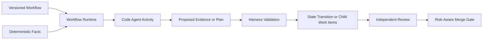

# Workflow-First Autonomous Change System — Decision Record

Status: Proposed — machine-reviewed; owner approval pending

Date: 2026-08-28

Scope: Architecture decisions made before implementation

Companion RFC: `docs/workflow-first-autonomous-change-rfc.md`

## Purpose

This document preserves the decisions reached during the architecture discussion that followed
the review of PR #2010. It is a decision summary, not a verbatim chat transcript. The goal is to
prevent the implementation from drifting back into incremental, cross-layer patching before the
closed-loop architecture is agreed.

The discussion began after a generic classifier prototype proved that a Code Agent can perform a
read-only semantic classification, but review exposed contract gaps across workspace selection,
retry evidence, intake, activity selection, and reducer routing. The conclusion was that classifier
work needs an explicit Workflow-owned contract and runtime enforcement boundary. The bounded
current-runtime path in `docs/workflow-classification-minimal-path.md` may proceed independently of
vNext after owner approval; it must not reproduce the prototype's classifier-specific cross-layer
branches.

## Guiding Principle

```text
Workflow declares policy and required capabilities.
Agents contribute judgment, plans, and implementation.
Harness owns facts, authority, persistence, isolation, and state transitions.
```

The design must avoid both extremes:

- hard-coding product judgment and every activity shape in Rust; and
- delegating facts, authorization, or state integrity to untrusted agent output.

## Decision Map



## Proposed Decision Set

### D-001 — Define the complete-loop boundaries before extending the classifier

The target is the full path from intake to verified merge:

```text
Issue or existing PR
  -> fact collection
  -> risk and policy gates
  -> planning and optional decomposition
  -> implementation
  -> child review
  -> integration review
  -> CI and remote-state verification
  -> tiered merge authorization
  -> merge reconciliation and terminal closure
```

PR #2010 is treated as a prototype and evidence source, not as the architecture itself. The minimal
classification path may be reviewed and implemented before the umbrella RFC, provided it remains a
generic current-runtime vertical slice and does not claim to implement vNext persistence, child
work, review, authorization, merge, or cutover contracts.

### D-002 — Use tiered merge authorization

Three risk levels control the maximum merge authority:

- `low`: automatic squash merge is permitted after every hard gate passes;
- `medium`: execution may finish automatically, but merge requires explicit human confirmation;
- `high`: automatic merge is forbidden.

Risk never bypasses universal gates such as current-head verification, required CI, unresolved
review threads, or independent review.

Alternatives rejected:

- auto-merge every gate-passing change, because gate coverage can be incomplete; and
- require human merge for every change, because that prevents a useful low-risk closed loop.

### D-003 — Deterministic policy sets the risk floor

Server-evaluated universal and operator rules compute a non-lowerable floor. Workflow rules and a
semantic classifier compute the project assessment; the classifier may raise that assessment or
abstain, but may not silently lower it. A human may lower only the project assessment through an
explicit, reasoned, durable override. The override cannot lower the universal or operator floor and
must bind the Workflow definition, input-fact revision, affected scope, plan revision when one
exists, code identity when code exists, issuer, reason, issue time, and expiry.

Examples of facts that can raise the deterministic floor include authentication, authorization,
secrets, destructive operations, database migrations, dependency changes, generated artifacts,
large diffs, protected paths, and incomplete remote evidence. The exact rule set belongs to a
versioned Workflow policy, subject to universal server validation.

### D-004 — Normalize both task-first and PR-first intake into `WorkItem`

The system supports:

- an Issue, task, or API submission before implementation exists; and
- an already-open PR that needs analysis, repair, review, or merge handling.

Ingress adapters normalize both into one `WorkItem` contract. They do not create separate core
state machines for each provider or intake path.

### D-005 — Use tiered execution authorization

- `low`: planning, implementation, review, and merge may proceed automatically.
- `medium`: planning, implementation, and review may proceed automatically; merge waits for human
  confirmation.
- `high`: fact collection, classification, and a proposed implementation plan may run; code
  mutation requires human approval, and merge remains human-only.

### D-006 — Make the system Workflow-first and Code-Agent-neutral

Workflow activities declare the capabilities they require. The workflow runtime matches those
requirements to a configured agent runtime. Core workflow logic must not branch on a model name or
provider.

The runtime boundary remains thin:

- Workflow says what execution properties are required.
- A trusted adapter reports and enforces the execution primitives it supports.
- Harness refuses dispatch when required properties cannot be verified.

The design does not require Claude Code or an Anthropic account. Any Code Agent that satisfies the
activity contract may be used.

### D-007 — Pin an immutable Workflow version per run

Each workflow instance stores the exact definition version and full content hash used at creation.
New definitions affect new runs. An in-flight instance is never silently reinterpreted under a
changed definition.

Agents may propose a future Workflow revision, but may not modify the active instance's rules.
An instance is never migrated in place to a different Workflow definition. Recovery continues only
under its pinned vNext bundle. Moving work to a new definition means cancelling the old Work Item
and creating a new one with explicit provenance.

### D-008 — Use layered planning instead of a universal live DAG

The design adopts a middle path inspired by the strengths and limits of OpenAI Symphony:

- an Agent owns the mutable internal checklist for one `WorkItem`;
- Harness does not model every internal TODO as a scheduler node;
- when work needs independent scheduling, isolation, parallelism, or acceptance, the Agent submits
  a typed `DecompositionProposal`;
- Harness validates the proposal and materializes durable `ChildWorkItem` records;
- the Agent cannot directly mutate the active work graph.

This avoids a heavyweight general-purpose DAG engine while still making meaningful decomposition
observable, recoverable, and reviewable.

Alternatives rejected:

- Symphony-style single-Issue execution with only an agent-owned checklist, because Harness must
  support independently scheduled and reviewed parts of a large change; and
- a universal dynamic DAG for every plan step, because it would harden transient agent reasoning
  into an expensive orchestration model.

### D-009 — Let Workflow constrain the integration strategy

A Workflow may allow one or more integration modes:

- `independent_prs`: children land independently;
- `stacked_prs`: children land in a declared dependency order; and
- `integration_pr`: child outputs are assembled into one atomic parent PR.

The Agent proposes a permitted mode with evidence. Harness validates dependency shape, file overlap,
base/head identity, and risk constraints before materializing the plan.

### D-010 — Require child-level and parent-level independent review

Every code-producing child receives a fresh-context review by a reviewer identity distinct from the
author identity. After children reach their strategy-declared readiness milestone, the parent
receives a composition review that checks requirement coverage and cross-child behavior.

Child approval proves local correctness. Parent approval proves composition. Neither substitutes
for the other. Workflow policy may require additional reviewers or specialist roles for higher
risk, but may not weaken the universal identity-separation and current-head rules.

Before a parent composition review, a registered server materializes a canonical current review
subject from the complete frozen child graph and one current strategy-declared milestone-or-terminal
outcome for every required relation. Every outcome is bound to the pinned decomposition revision;
independent and stacked children use `ready_for_parent_review`, while integration children use
`ready_for_integration`. The parent assignment and receipt reference that immutable snapshot
Evidence ID and aggregate hash; a list of individually approved children is not itself a parent
review subject.

### D-011 — Use a dual-truth reconciliation model

- The Harness event log is authoritative for internal execution history, decisions, authorization,
  and commands.
- GitHub or another tracker is authoritative for current external facts such as PR head SHA, CI,
  review threads, merge state, and merged status.
- Reconciliation compares the two and emits explicit events. It never resolves disagreement with
  last-write-wins.

After restart, Harness replays durable events and then refreshes external facts before any action
whose safety depends on current remote state.

### D-012 — Use a trusted Evidence envelope with Workflow-defined payloads

The core fixes the evidence envelope fields needed for identity and integrity. Workflow definitions
provide versioned schemas for domain-specific payloads. The fields below use the normative envelope
refined by the umbrella RFC; they supersede the earlier conceptual names in this decision record.

```text
Evidence
  evidence_id
  envelope_schema
  evidence_kind
  payload_schema
  producer_id
  producer_class
  producer_role
  subject
  work_item_id
  workflow_definition_hash
  activity_attempt_id?
  code_identity?
  source_identity?
  observed_at
  expires_at?
  content_hash
  payload
```

An Agent may create an agent-authored evidence kind allowed by the active activity contract. It may
not claim a server, CI, GitHub, human, or independent-review producer role. Server-owned gates only
consume evidence from accepted producer classes.

Alternatives rejected:

- arbitrary JSON with prompt-only conventions, because authorship and freshness cannot be trusted;
  and
- a closed Rust enum for every business evidence payload, because every new Workflow domain would
  require a Harness release.

### D-013 — Bind every mergeable Work Item to a durable remote change

Issue-first work does not begin with a PR or merge-request identity. Before provider review, CI, or
merge gates can run, a server-orchestrated provider action must idempotently create or bind the
remote change and persist a `RemoteChangeBinding`. Existing-PR intake creates the same binding during
normalization.

The binding is a supporting record, not a seventh orchestration aggregate. It records provider,
repository, remote object ID, base/head references, current code identity, publication idempotency
key, reconciliation state, and observation identity. Workflow still owns when publication occurs;
the provider-action registry owns the constrained AgentBackend prompt contract used to perform it.
Harness owns authority checks, the transactional outbox, and the completion/reconciliation fold,
but Harness crates never execute `gh`, `git`, or mutating provider SDK calls. The Agent result is a
candidate until the server validates a provider-authenticated webhook or a runtime-enforcement
receipt captured from the constrained provider tool request/response. Agent prose cannot acquire a
trusted provider producer class; only after receipt-bound reconciliation may the server persist the
binding.

### D-014 — Receipts are typed Evidence, not a second authority

`AuthorizationReceipt` and `ReviewReceipt` are payload schemas inside the trusted Evidence
envelope. Merge and reducer gates consume those authoritative Evidence rows. Purpose-built receipt
tables or projections may exist only as rebuildable indexes over Evidence IDs; they must not carry
an independently mutable copy of authorization data.

Agent/reviewer assignments are separate immutable supporting records because they establish the
authority under which an attempt may produce receipt Evidence. An assignment is server-issued,
versioned, and bound to role, scope, author set, protocol, context generation, and permissions.

### D-015 — Separate runtime incompatibility from the cutover mechanism

The owner constraint is that vNext provides no runtime backward compatibility for pre-vNext
Workflow definitions, active instances, serialized policies, Evidence representations, or
compatibility-only API payloads. vNext does not read, import, reinterpret, drain, backfill, or dual
write old runs.

That constraint does **not** decide whether old history is destroyed. Historical audit retention,
provider-object quarantine, database-role fencing, catalog feasibility, rollback, and the physical
cutover mechanism are a separate high-risk proposal in
`docs/workflow-vnext-cutover-rfc.md`. Any destructive transition requires its own owner approval and
a read-only dry-run against the real deployment. The cutover proposal must preserve a verified,
immutable audit export before deleting source data; that archive is not a vNext runtime reader or a
compatibility surface.

Alternatives rejected for the runtime contract:

- a dual-mode compatibility reader and backfill, because it preserves two policy/evidence meanings
  and recreates the dual-truth problem; and
- draining or migrating active v1 runs, because their complete execution policy was never pinned and
  cannot be reconstructed safely.

Physical deletion with only an optional backup is no longer accepted by this decision record. It is
an alternative in the separate cutover RFC and requires explicit approval.

## What Is Core and What Is Workflow-Defined

| Concern | Core invariant | Workflow-defined policy |
|---|---|---|
| State integrity | Only the reducer commits transitions | States, activities, and allowed routes |
| Agent execution | Required capabilities must be verifiable | Required tools, sandbox, output schema, budget |
| Risk | Universal/operator floors cannot be lowered; project reduction requires a bound human receipt | Project rules and semantic escalation rubric |
| Evidence | Trusted envelope, producer identity, hashes | Payload schemas and accepted evidence kinds |
| Decomposition | Agent cannot mutate graph directly | Whether decomposition is allowed and its bounds |
| Integration | Head/base and dependency consistency | Allowed integration modes |
| Review | Fresh context, identity separation, current head | Reviewer roles, quorum, specialist requirements |
| Merge | Fresh remote facts and authorization required | Risk thresholds and repository merge policy |
| Failure | No silent degradation; bounded attempts | Retry counts, backoff, escalation target |

## Symphony Comparison

OpenAI Symphony uses an external Issue as the durable scheduling unit, one isolated workspace per
Issue, and an agent-maintained workpad for the internal plan. Its orchestrator owns claims,
concurrency, retries, and reconciliation, but does not interpret the workpad as a schedulable DAG.
Out-of-scope work becomes another tracker Issue.

Harness adopts the useful separation between durable work units and agent-owned internal planning,
but adds an optional, validated promotion path from an Agent proposal to child work units. This is
necessary for large changes that need independent parallelism, isolation, or review.

References:

- <https://github.com/openai/symphony>
- <https://github.com/openai/symphony/blob/main/SPEC.md>
- <https://github.com/openai/symphony/blob/main/elixir/WORKFLOW.md>

## Existing Harness Documents to Reconcile

The companion RFC is an integrating proposal. Until approved, it does not silently supersede the
following documents:

- `docs/workflow-declarative-definitions.md`
- `docs/prompt-workflow-contract-long-term-design.md`
- `docs/autonomous-github-intake-merge-spec.md`
- `docs/workflow-runtime-v2-state-machine-spec.md`
- `docs/workflow-runtime-hardening-design.md`
- `docs/references/review-integrity.md`
- `docs/runtime-submission-identity-contract.md`
- `docs/run-identity.md`

The RFC must explicitly identify where it preserves, extends, or replaces each contract.

## Questions Carried into the RFC

The discussion intentionally carried these details into the full definition. Phase 0 contains
machine-reviewed proposed resolutions, summarized in RFC section 33; none becomes approved until the
owner accepts the umbrella RFC or the narrower RFC that owns the decision:

1. The exact Workflow schema for activity capabilities, evidence, decomposition, review, and
   authorization.
2. The precise `WorkItem` and child graph lifecycle.
3. Failure taxonomy, retry ownership, and escalation rules.
4. How risk rules combine and how human overrides expire.
5. Budget allocation and protection against recursive decomposition.
6. Which pre-vNext objects must be excluded from the vNext runtime, and whether physical deletion
   is justified after audit-retention and real-database feasibility review.
7. Which parts of PR #2010 can be retained after contract alignment.
8. The implementation sequence and proof required before each phase is enabled.
