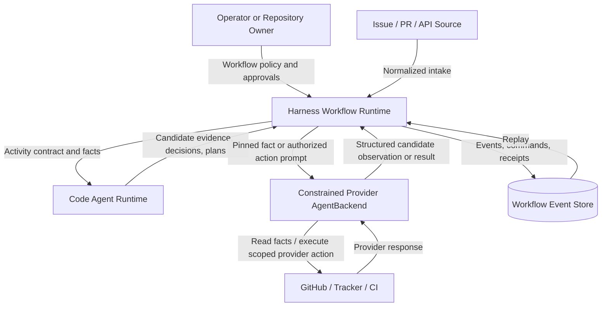
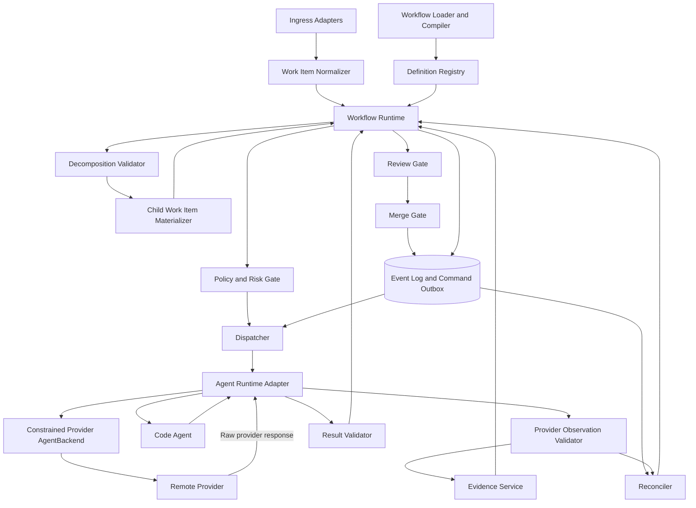
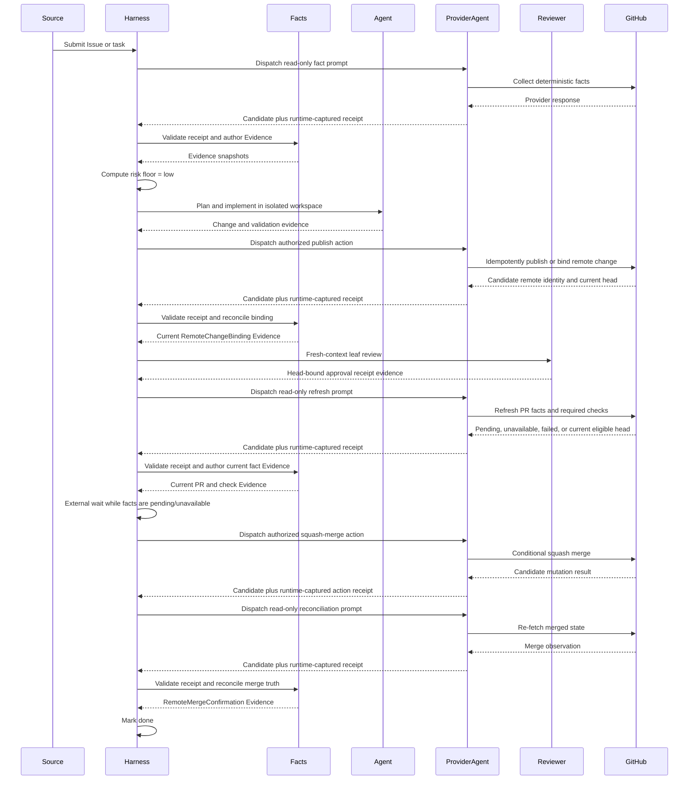

# RFC: Workflow-First Autonomous Change Closure

Status: Proposed — machine-reviewed; owner approval pending

Date: 2026-08-28

Audience: Harness maintainers, workflow authors, runtime implementers, and reviewers

Decision record: `docs/workflow-first-autonomous-change-decisions.md`

Machine review record: two fresh-context agent reviews reported no blocking internal-consistency or
repository-fact findings. This is advisory evidence, not owner approval and not authorization to
implement or cut over production.

## Abstract

This RFC defines a complete Workflow-first architecture for taking an Issue, task, API submission,
or existing pull request through fact collection, risk assessment, optional decomposition,
implementation, independent review, CI verification, tiered authorization, merge, and terminal
reconciliation.

The design deliberately keeps the Harness core small. Core code owns facts, identity, persistence,
leases, authorization, evidence integrity, and transition safety. A versioned Workflow declares
the domain-specific states, activities, capability requirements, payload schemas, routing,
decomposition policy, review policy, retry policy, and merge policy. Agents provide judgment and
execution inside those contracts; they do not own workflow state or authority.

This RFC integrates and narrows several existing Harness designs. It does not authorize code
changes until the RFC is reviewed and approved.

## Normative Language

`MUST`, `MUST NOT`, `SHOULD`, `SHOULD NOT`, and `MAY` are normative as defined by RFC 2119.

## 1. Problem

Harness has strong runtime pieces, but architecture has evolved feature by feature. Intake,
declarative definitions, prompt contracts, classifier activities, workspace isolation, review,
remote fact collection, and merge authorization each have partial contracts. When a new feature
crosses these boundaries, local changes can create system-wide failures. The classifier prototype
in PR #2010 exposed this pattern: a useful semantic activity also affected workspace selection,
retry evidence, intake requirements, activity selection, and reducer routing.

The system needs one complete contract before more autonomous behavior is added. The contract must
answer:

- what the Workflow may declare dynamically;
- what the Harness core must always enforce;
- how arbitrary Code Agents participate without provider-specific workflow logic;
- how large changes are decomposed without turning every agent TODO into a scheduler node;
- how local and integration review remain independent;
- how risk limits execution and merge authority;
- how current GitHub facts and durable Harness history are reconciled; and
- how every failure becomes explicit, bounded, recoverable, and observable.

## 2. Goals

1. Provide one closed loop from intake to externally confirmed merge or an explicit terminal stop.
2. Keep workflow policy repository-owned, versioned, declarative, and extensible.
3. Keep the workflow runtime Code-Agent-neutral and model-neutral.
4. Separate deterministic facts from model judgment.
5. Support both task-first implementation and PR-first repair/review.
6. Support large-change decomposition without requiring a general-purpose live DAG engine.
7. Enforce risk-aware execution and merge authority.
8. Require child-level and parent-level independent review.
9. Preserve deterministic replay and safe recovery across restart.
10. Make every dispatch, retry, approval, review, and merge decision auditable.
11. Prevent silent degradation, stale approval reuse, evidence forgery, and unbounded agent loops.
12. Define a vNext runtime contract that never reads or reinterprets pre-vNext runs; evaluate the
    physical cutover separately from this umbrella architecture.

## 3. Non-Goals

- Model every internal agent planning step as a persisted scheduler node.
- Make agents deterministic.
- Encode project-specific risk judgment in Rust enums.
- Build a generic distributed compute scheduler.
- Require a particular model, provider, CLI, tracker, or review bot.
- Trust agent prose as proof of GitHub, CI, merge, or human-review state.
- Make vNext read or reinterpret any pre-vNext runtime data, definition, event, Evidence, or
  compatibility-only payload. Historical audit retention is owned by the separate cutover RFC.
- Migrate an in-flight Work Item to a different Workflow definition.
- Permit an in-flight Workflow definition to change implicitly.
- Add server-side `git` or `gh` subprocess calls inside Harness crates.
- Automatically merge repositories that have not opted into an eligible policy.

## 4. Design Principles

1. **Workflow declares policy.** States, activities, routes, schemas, capability requirements, and
   bounded operating policy belong in a versioned Workflow.
2. **Harness enforces invariants.** Identity, authorship, freshness, isolation, authorization,
   event ordering, and transition integrity are not delegated.
3. **Agents propose; reducers decide.** An Agent may emit evidence, a verdict, a plan, or a
   decomposition proposal. Only the workflow runtime commits state.
4. **Facts precede judgment.** Cheap machine facts are collected before an Agent is dispatched.
5. **No silent degradation.** Missing capabilities, malformed results, unavailable reviewers, and
   stale evidence produce explicit blocked or failed outcomes.
6. **Every loop is bounded.** Retries, repairs, review cycles, decomposition depth, and child count
   have persisted budgets.
7. **Active definitions are immutable.** Every run pins the exact Workflow content it executes.
8. **Review is evidence, not ceremony.** Approval is bound to reviewer identity, role, scope, and
   exact code identity.
9. **Merge is a fresh transaction.** The merge gate re-reads current remote facts immediately
   before merge.
10. **Extensibility uses schemas, not unchecked maps.** Domain payloads may evolve without making
    their producer, subject, version, or integrity ambiguous.

## 5. Alternatives Considered

### 5.1 Symphony-style Issue runner

One tracker Issue owns one workspace and one Agent-maintained internal plan. The orchestrator owns
claims, concurrency, retries, and reconciliation but does not interpret a child plan.

Benefits:

- small core;
- high Agent flexibility;
- operationally understandable; and
- proven useful for independent Issues.

Limitations:

- large changes remain one opaque execution unit unless manually pre-split;
- no native child-level ownership or review;
- no integration-level completeness proof; and
- an internal checklist cannot be independently scheduled or recovered.

Decision: adopt the durable-work-unit versus internal-plan distinction, but add validated promotion
of selected plan parts into Child Work Items.

References:

- <https://github.com/openai/symphony>
- <https://github.com/openai/symphony/blob/main/SPEC.md>
- <https://github.com/openai/symphony/blob/main/elixir/WORKFLOW.md>

### 5.2 Universal dynamic DAG

Every planning step becomes a typed node that the orchestrator understands and schedules.

Benefits:

- maximum parallelism and observability;
- precise node-level retries and budgets; and
- explicit dependency scheduling.

Limitations:

- hardens transient Agent reasoning into runtime schema;
- greatly expands graph mutation, migration, and consistency complexity;
- creates pressure to encode product judgment in the scheduler; and
- makes simple work expensive.

Decision: rejected as the default abstraction.

### 5.3 Layered planning with promoted Child Work Items

An Agent owns the internal plan for one Work Item. When a part needs independent scheduling,
isolation, parallelism, or acceptance, the Agent submits a typed decomposition proposal. Harness
validates and materializes durable children.

Benefits:

- preserves Agent flexibility;
- exposes only meaningful orchestration boundaries;
- supports independent workspaces and reviews; and
- bounds graph complexity.

Limitations:

- requires explicit promotion criteria;
- requires parent/child aggregation semantics; and
- cannot introspect every internal Agent step.

Decision: selected.

## 6. System Context



## 7. Container Architecture



### 7.1 Responsibility Summary

| Component | Owns | Must not own |
|---|---|---|
| Ingress adapter | Provider normalization and source identity | Workflow transitions |
| Workflow compiler | Definition validation, schema compilation, content hash | Runtime state |
| Provider observation validator | Validate runtime-captured transport receipts or authenticated webhooks and author external-fact Evidence | Provider I/O or semantic verdicts |
| Policy/risk gate | Risk floor and authority ceiling | Agent implementation plan |
| Dispatcher | Capability matching, lease-safe job creation | Product routing judgment |
| Agent adapter | Protocol translation, verified execution properties, and runtime-captured provider transport receipts | Workflow state or provider truth inferred from Agent prose |
| Constrained provider AgentBackend | Prompt-directed provider interaction within one typed action/fact contract | Evidence authorship or Workflow persistence |
| Result validator | Envelope, schema, authorship, and activity-contract validation | Inventing missing facts |
| Reducer | Deterministic state transition and command production | External side effects |
| Decomposition validator | Graph safety and proposal bounds | Creating unvalidated children |
| Review gate | Independence, scope, head, protocol, and quorum checks | Code authorship |
| Merge gate | Fresh remote predicates and authorization | Trusting cached merge state |
| Reconciler | External/internal divergence detection | Last-write-wins repair |

## 8. Thin Core Versus Workflow Policy

The six primary domain objects are not six hard-coded workflows. They are the minimum shared
language needed to identify work, interpret a versioned policy, execute an activity, trust evidence,
record a decision, and relate independently scheduled children.

### 8.1 Core invariants

Core code MUST enforce:

- stable identities and idempotency keys;
- immutable Workflow pinning;
- event ordering and atomic reducer commits;
- activity attempt leases and fencing;
- evidence producer identity and content hashes;
- required schema validation;
- capability requirement satisfaction;
- no author/reviewer identity overlap when independence is required;
- head/base freshness for code-bound evidence;
- bounded graph, retry, repair, and review loops;
- no merge without a fresh eligible authorization receipt; and
- explicit error outcomes instead of silent fallback.

### 8.2 Workflow-defined policy

A Workflow MAY declare:

- logical states and routes;
- activities and prompts;
- required runtime capabilities;
- input, output, signal, and evidence schemas;
- deterministic project risk rules above the universal floor;
- semantic classifier rubrics and verdicts;
- decomposition eligibility and limits;
- allowed integration strategies;
- review roles, quorum, and specialist requirements;
- validation commands;
- retry and backoff within server limits;
- execution and token budgets;
- approval points;
- merge eligibility up to the core safety floor; and
- provider-specific fact requirements through registered adapters.

## 9. Core Domain Model

### 9.1 `WorkItem`

`WorkItem` is the durable unit of user-visible intent. It does not assume whether code already
exists.

This is a logical domain object, not a requirement for a parallel persistence table. The intended
brownfield mapping is the existing `WorkflowInstance` plus its runtime projection and explicitly
typed supporting records. Implementation must extend that path rather than creating a second task
store.

```text
WorkItem
  work_item_id
  submission_id
  parent_work_item_id?
  source
  subject
  intent
  repository
  base_ref?
  observed_head_sha?
  remote_change_binding_id?
  workflow_definition_id
  workflow_definition_version
  workflow_definition_hash
  logical_state
  lifecycle_class
  risk_floor
  effective_risk
  execution_authority
  merge_authority
  integration_strategy?
  budget
  created_at
  updated_at
```

Required invariants:

- `work_item_id` is the workflow instance correlation identity.
- `submission_id` is the stable public submission handle.
- `source + subject` provides a provider-aware dedupe identity when applicable.
- `intent` is persisted and reconstructable after restart.
- the definition hash never changes in place.
- `effective_risk` never falls below the server universal or operator non-lowerable floor; lowering
  the project assessment requires a valid, bound human override receipt.
- logical state is interpreted only by the pinned Workflow.
- lifecycle class is one of `active`, `blocked`, `succeeded`, `failed`, or `cancelled` and provides
  a small universal projection without fixing the logical state graph.

### 9.2 `WorkflowDefinition`

`WorkflowDefinition` is an immutable compiled policy bundle.

```text
WorkflowDefinition
  definition_id
  schema_version
  semantic_version
  content_hash
  intake_bindings
  control_routes
  states
  terminal_mapping
  activities
  evidence_schemas
  risk_policy
  decomposition_policy
  integration_policy
  review_policy
  authorization_policy
  retry_policy
  budget_policy
  recovery_policy
```

Required invariants:

- the source document is repository-owned or explicitly operator-supplied;
- compilation either succeeds completely or the definition is unavailable for dispatch;
- all referenced states, activities, schemas, and routes exist;
- every active state has a progress mechanism;
- every route is reachable or explicitly reserved for failure/recovery;
- limits may be stricter than server limits, never looser;
- unknown required capabilities fail validation;
- control routes are closed, server-authenticated preemption contracts rather than implicit
  transitions; their sources, allowed lifecycle scope, Evidence, handler, and terminal fold are
  compiled and pinned;
- semantic changes produce a different content hash; and
- active instances retain the compiled bundle needed for replay.

### 9.3 `Activity`

`Activity` is a Workflow-declared execution contract, not a Rust-specific implementation name.

```text
Activity
  activity_id
  purpose
  allowed_current_states
  execution_mode
  input_schema
  output_schema
  required_capabilities
  allowed_tools
  permission_policy
  required_evidence
  produced_evidence
  allowed_decisions
  idempotency_contract?
  authority_contract?
  requested_action?
  reconciliation_contract?
  binding_transition_contract?
  provider_precondition_contract?
  action_agent_contract?          # resolved from provider-action registry only
  retry_policy
  repair_policy
  budget
  prompt_template
```

`requested_action` is a typed authorization action identifier, not an activity-name convention. It
is required for every authority evaluator and authorized mutation target and is included in the
canonical compiled bundle. The compiler links an automatic target and any `await_human` operator
gate, or a human-only gate and its authorized target, and rejects the definition unless the
evaluator, gate, and target all name the same action.

An array-valued `required_evidence` is shorthand for an all-of rule. The fixture also uses the
closed `all` plus `by_subject` or `by_binding` form where one registered activity serves several
known Work Item shapes. The compiler requires every subject/binding case to be exhaustive, derives
the discriminator only from the server-owned Work Item relation/current binding, and pins the
selected Evidence IDs and digests in the attempt and result. Agent output cannot select a case, and
the runtime cannot read undeclared implicit state to fill one.

`binding_transition_contract`, when present, is a typed tuple of expected current pointer,
successor Evidence kind, pointer update, and concurrency mode. v1 permits only
`compare_and_swap`. It is valid only for a registered server contract or provider-action descriptor
whose server-owned completion fold declares the same inputs, output, and atomic pointer transition;
the compiler rejects any mismatch. A provider-action Agent can never write Workflow persistence.
For `cardinality: per_stack_entry`, the descriptor expands the same tuple over the exact ordered
bindings in the pinned stack context: each entry names its expected current child pointer, one
successor Evidence row, and one child-pointer CAS. Missing, duplicate, reordered, or mixed-success
entries remain in reconciliation and cannot produce an aggregate success context.

`provider_precondition_contract` is mandatory for `provider_action`. It names the Evidence carrying
the provider subject and either expected absence or an exact observed provider version, declares
single-subject or per-entry cardinality, and requires an atomic provider conditional write. A stale
precondition fails before mutation; local binding compare-and-swap and later reconciliation cannot
substitute for it. A provider contract that cannot enforce the declared condition is not registered
for that action. These optional fields are canonicalized and hashed with the activity.

An `ActivityAttempt` binds the abstract activity to one execution:

```text
ActivityAttempt
  attempt_id
  activity_id
  work_item_id
  command_id
  runtime_job_id
  agent_run_id
  actor_assignment_id
  author_identity
  attempt_kind
  runtime_profile_snapshot
  capability_snapshot
  prompt_packet_hash
  input_envelope_hash
  input_evidence_ids
  attempt_number
  lease_generation
  status
  started_at
  completed_at?
```

Required invariants:

- the prompt packet and runtime profile are snapshotted before execution;
- every primary/correction attempt binds the same pinned input-envelope hash even though its prompt
  packet differs;
- all attempts, including structured-output correction attempts, contribute to enforcement evidence;
- a retry never erases tool use, approval, network, mutation, or model-identity observations from a
  previous attempt in the same activity execution;
- result validation occurs before the reducer sees a candidate decision; and
- a completed process is not equivalent to a successful activity.

A provider transport receipt is immutable `workflow_evidence` with payload schema
`provider-transport-receipt.v1`, `producer_class: runtime_enforcement`, and the attempt ID in its
trusted Evidence envelope; it is not Agent output. Its payload binds lease generation and tool-event
ID, the registered action/fact contract, repository and subject, an `operation_id` required for every
request, `requested_action` plus idempotency key and expected provider precondition (absence or exact
version) for mutations, scoped credential/profile identity, request and raw-response digests,
provider request ID/status when exposed, exit status, timestamp, and immutable raw-response artifact
reference. The runtime appends this Evidence from the actual constrained provider tool event before
the model can summarize the response. The registered provider-action or read-only provider-fact
descriptor declares this runtime-enforcement output; it is not an Agent-produced business artifact.
A backend profile that exposes only an unrestricted shell or final Agent prose and cannot attest the
invoked provider primitive and captured response is ineligible for provider facts or actions.

### 9.4 `Evidence`

Evidence uses a trusted core envelope and a Workflow-defined payload.

```text
Evidence
  evidence_id
  envelope_schema
  evidence_kind
  payload_schema
  producer_id
  producer_class
  producer_role
  subject
  work_item_id
  workflow_definition_hash
  activity_attempt_id?
  code_identity?
  source_identity?
  observed_at
  expires_at?
  content_hash
  payload
```

`producer_class` is core-controlled and includes at least:

- `server_fact_collector`;
- `server_policy_engine`;
- `agent_author`;
- `agent_reviewer`;
- `human_operator`;
- `remote_provider`;
- `ci_system`; and
- `runtime_enforcement`.

An Agent MUST NOT choose its producer class. The runtime derives it from the authenticated attempt
and role assignment.

`remote_provider` is assigned only to a provider-authenticated webhook or to Evidence derived by the
server validator from a valid `provider_transport_receipt` Evidence row.
`server_fact_collector` denotes the server-authored validation/fold of those inputs; it does not
perform provider I/O. Agent candidate output, an Agent-selected producer label, or an unobserved
shell transcript can never acquire either class.

`code_identity` is a tagged union. `single` binds one repository, base ref, head SHA, and optional
tree/diff hash. `aggregate` binds the integration strategy, decomposition revision, canonical
ordered member list of `(work_item_id, single code identity)`, and an aggregate hash. Independent
sets use canonical Work Item ordering; stacks use landing order. `source_identity` binds external
facts to provider, object ID, observation cursor, and remote version when available.

Evidence is invalid when its schema is unknown, content hash mismatches, producer is unauthorized,
required code identity is absent, or freshness requirements are not met. Trusted Evidence payload
schemas are closed: validation rejects unknown fields and requires the exact fields declared by the
pinned schema version.

`ReviewReceipt` and `AuthorizationReceipt` are specialized, versioned Evidence payloads. Their
Evidence rows are the only authorization truth consumed by reducers and merge gates. Any dedicated
receipt projection is a rebuildable index keyed by `evidence_id`, not an independent authority.

### 9.5 `Decision`

`Decision` is a validated proposal to route, authorize, block, retry, decompose, or terminalize.

```text
Decision
  decision_id
  decision_kind
  work_item_id
  current_state
  proposed_state
  workflow_definition_hash
  policy_rule_id
  input_evidence_ids
  candidate_source
  validation_result
  authority_required
  authority_receipt_id?
  reason
  created_at
```

Agents MAY propose decisions permitted by an activity contract. Reducers MUST independently verify:

- the decision kind is allowed;
- the current state and attempt match;
- all required evidence exists and is valid;
- the proposed route exists;
- required authorization is present; and
- the decision cannot bypass a higher-priority deterministic gate.

Invalid candidate decisions become explicit contract failures. They never fall through to success.
Transition paths without an active production caller and focused contract test remain fail-closed.

### 9.6 `ChildWorkItem`

`ChildWorkItem` is a normal `WorkItem` with a persisted parent relation and delegated scope.

```text
ChildWorkItemRelation
  parent_work_item_id
  child_work_item_id
  decomposition_revision
  dependency_ids
  delegated_intent
  acceptance_criteria
  writable_scope
  forbidden_scope
  integration_strategy
  landing_owner
  completion_milestone
  remote_binding_required
  integration_order?
  required_output_evidence
  status
```

Children have their own workflow state, workspace, attempts, evidence, review receipts, and outcomes.
A `ChildOutcome` may record the relation's declared readiness milestone without terminalizing the
child; budget reservation returns only after a later terminal outcome. Parent progress consumes
typed milestone or terminal outcomes rather than inferring completion from prose or branch existence.

### 9.7 Supporting objects

The following supporting objects are required but are not separate business roots:

- `DecompositionProposal`: candidate children and graph revision proposed by an Agent.
- `ReviewReceipt`: validated reviewer identity, scope, verdict, findings, and code identity.
- `AuthorizationReceipt`: human or policy authority, scope, reason, expiry, and risk level.
- `RuntimeCapabilitySnapshot`: trusted effective capabilities and enforcement evidence for one
  attempt.
- `ActorAssignment`: immutable server-issued role, scope, author set, protocol, context generation,
  and permission grant used to authenticate an attempt.
- `RemoteFactSnapshot`: current external facts with subject and observation identity.
- `RemoteChangeBinding`: immutable versioned provider/repository/change-request identity,
  base/head references, publication idempotency key, current code identity, reconciliation state,
  and an optional link to the binding version it supersedes.
- `ParentRelease`: immutable independent-set release generation, aggregate identity/risk/review
  snapshot, released child set, and current/invalidated status. The parent Work Item stores its exact
  current release ID and monotonically increasing generation.
- `ProviderIntakeFence`: immutable cutover boundary per provider, repository, and subject type,
  containing the maximum trustworthy monotonic identity, snapshot source/hash, cutover time, and
  whether automatic intake is enabled or disabled as unverifiable.
- `ExternalWait`: persisted wait identity, subject/fact cursor, refresh contract and command,
  backoff, deadline, budget reservation, and terminal route status.
- `OperatorGate`: persisted requested action, prerequisite identities, accepted receipt kind, and
  finite signal-to-route map for one operator-owned state.
- `ControlContinuation`: persisted control-route source state/generation and exact progress-driver,
  mode-specific context, lease, deadline, budget, and dedupe identities, consumed once by denial or
  invalidated by authorization. A parent-handoff driver binds the child relation, decomposition
  revision, expected parent command/signal set, and dedupe scope even when no command exists yet.
- `IntegrationProgress`: validated strategy/revision, ordered remote bindings, fenced landing cursor,
  landed entries, and current code identities.
- `ChildOutcome`: typed milestone or terminal result returned to the parent and bound to the child
  relation, decomposition revision, current risk, validation, and review evidence.

`Budget` is a supporting value object attached to a Work Item and allocated to attempts and
children. It records limits, reservations, and consumption for turns, tokens, wall time, retries,
repairs, review cycles, child count, and decomposition depth. A child reservation reduces the
parent's available budget atomically; unused reservation returns only through an explicit child
terminal event.

## 10. Workflow Declaration Model

The following is the normative reference fixture for the proposed ownership boundary. Owner
approval freezes this fixture as the Phase 2 compiler's conformance input; Phase 2 cannot complete
until its machine-readable schema and production compiler accept the extracted fixture unchanged.
A field rename then requires updating the schema, fixture, and this document together. Approval of
this proposal does not claim that the unimplemented compiler already exists.

```yaml
schema: harness.workflow.vNext

definition:
  id: autonomous_change
  version: 1
  initial: collecting_facts

  control_routes:
    request_cancellation:
      source: operator
      requested_action: cancel_work_item
      allowed_from: nonterminal_except_cancellation_flow
      excluded_states: [awaiting_cancellation_authorization, resuming_denied_cancellation, reconciling_cancellation, reconciling_cancellation_external_outcome, reconciling_cancellation_stack_entry, cancelling_child_set, awaiting_child_cancellations]
      continuation: persist_source_state_and_driver
      on_duplicate: retain_current_cancellation_state
      target: awaiting_cancellation_authorization
    cancel_child_work_item:
      source: parent_command
      requested_action: cancel_work_item
      allowed_from: nonterminal_except_cancellation_flow
      excluded_states: [awaiting_cancellation_authorization, resuming_denied_cancellation, reconciling_cancellation, reconciling_cancellation_external_outcome, reconciling_cancellation_stack_entry, cancelling_child_set, awaiting_child_cancellations]
      on_duplicate: retain_current_cancellation_state
      required_evidence: [child_cancellation_request, cancellation_receipt]
      target: reconciling_cancellation
      terminal_fold_produces: [child_cancellation_acknowledgement, child_outcome]
    invalidate_independent_release:
      source: parent_command
      allowed_from: [merge_gate, awaiting_merge_authorization, awaiting_remote_checks, awaiting_remote_facts, revalidating_merge_authorization, awaiting_revalidated_remote_checks, awaiting_revalidated_remote_facts, merging, reconciling]
      required_evidence: [parent_release_invalidation]
      target: awaiting_parent_handoff
      on_queued_provider_action: fence_then_target
      on_running_or_ambiguous_provider_outcome: reconciling
      on_confirmed_merge: reconciling

  states:
    collecting_facts:
      activity: collect_change_facts
      on_signal:
        implementation_required: assessing_risk
        repair_required: assessing_review_risk
        review_ready: assessing_review_risk
      on_failure: blocked
    assessing_risk:
      activity: assess_risk
      on_signal:
        low: planning
        medium: planning
        high: planning
        abstain: blocked
      on_failure: blocked
    assessing_review_risk:
      activity: assess_risk
      on_signal:
        low: validating_direct_head
        medium: validating_direct_head
        high: validating_direct_head
        abstain: blocked
      on_failure: blocked
    validating_direct_head:
      activity: validate_direct_head
      on_success: leaf_review_direct
      on_failure: blocked
    collecting_direct_repair_facts:
      activity: collect_change_facts
      on_success: assessing_direct_repair_risk
      on_failure: blocked
    assessing_direct_repair_risk:
      activity: assess_risk
      on_signal:
        low: planning_direct_repair
        medium: planning_direct_repair
        high: planning_direct_repair
        abstain: blocked
      on_failure: blocked
    planning_direct_repair:
      activity: plan_direct_repair
      on_signal:
        direct: authorizing_direct_repair
        abstain: blocked
    planning:
      activity: plan_change
      on_signal:
        direct: authorizing_direct
        decompose: validating_decomposition
        abstain: blocked
    validating_decomposition:
      activity: validate_decomposition
      on_success: authorizing_children
      on_failure: blocked
    authorizing_direct:
      activity: evaluate_direct_execution_authority
      on_signal:
        authorized: implementing
        await_human: awaiting_direct_execution_authorization
        deny: blocked
    authorizing_direct_repair:
      activity: evaluate_direct_repair_authority
      on_signal:
        authorized: repairing_direct_change
        await_human: awaiting_direct_repair_authorization
        deny: blocked
    authorizing_children:
      activity: evaluate_child_execution_authority
      on_signal:
        authorized: materializing_children
        await_human: awaiting_child_execution_authorization
        deny: blocked
    awaiting_direct_execution_authorization:
      progress: operator_gate
      gate:
        evidence_kind: authorization_receipt
        requested_action: implement_change
      on_signal:
        authorized: implementing
        expired: authorizing_direct
        denied: blocked
    awaiting_direct_repair_authorization:
      progress: operator_gate
      gate:
        evidence_kind: authorization_receipt
        requested_action: repair_direct_change
      on_signal:
        authorized: repairing_direct_change
        expired: authorizing_direct_repair
        denied: blocked
    awaiting_child_execution_authorization:
      progress: operator_gate
      gate:
        evidence_kind: authorization_receipt
        requested_action: materialize_children
      on_signal:
        authorized: materializing_children
        expired: authorizing_children
        denied: blocked
    materializing_children:
      activity: materialize_children
      on_success: executing_children
      on_failure: blocked
    executing_children:
      progress: child_barrier
      on_signal:
        independent_ready: preparing_independent_set_review
        stacked_ready: preparing_stack_review
        integration_ready: authorizing_integration
        child_failed: blocked
    preparing_independent_set_review:
      activity: materialize_parent_review_subject
      on_success: collecting_independent_set_review_facts
      on_failure: blocked
    collecting_independent_set_review_facts:
      activity: collect_parent_composition_facts
      on_success: assessing_independent_set_review_risk
      on_failure: blocked
    assessing_independent_set_review_risk:
      activity: assess_risk
      on_signal:
        low: reviewing_independent_set
        medium: reviewing_independent_set
        high: reviewing_independent_set
        abstain: blocked
      on_failure: blocked
    reviewing_independent_set:
      progress: review_barrier
      review:
        activity: review_independent_set
        distinct_assignments: true
        quorum_policy: parent_composition
      on_signal:
        approved: releasing_independent_children
        changes_requested: planning_independent_set_repair
        blocked: blocked
    planning_independent_set_repair:
      activity: plan_independent_set_repair
      on_signal:
        decompose: validating_decomposition
        abstain: blocked
    preparing_stack_review:
      activity: materialize_parent_review_subject
      on_success: collecting_stack_review_facts
      on_failure: blocked
    collecting_stack_review_facts:
      activity: collect_parent_composition_facts
      on_success: assessing_stack_review_risk
      on_failure: blocked
    assessing_stack_review_risk:
      activity: assess_risk
      on_signal:
        low: reviewing_stack
        medium: reviewing_stack
        high: reviewing_stack
        abstain: blocked
      on_failure: blocked
    releasing_independent_children:
      activity: release_independent_children
      on_success: awaiting_independent_landing
      on_failure: blocked
    awaiting_independent_landing:
      progress: child_barrier
      on_signal:
        all_landed: reconciling_child_set
        child_review_stale: awaiting_independent_re_reviews
        child_failed: blocked
    awaiting_independent_re_reviews:
      progress: child_barrier
      on_signal:
        reviews_current: preparing_independent_set_review
        child_failed: blocked
    reconciling_child_set:
      activity: reconcile_child_set
      on_success: done
      on_failure: blocked
    reviewing_stack:
      progress: review_barrier
      review:
        activity: review_stack
        distinct_assignments: true
        quorum_policy: parent_composition
      on_signal:
        approved: stack_merge_gate
        changes_requested: planning_stack_repair
        blocked: blocked
    planning_stack_repair:
      activity: plan_stack_repair
      on_signal:
        decompose: validating_decomposition
        abstain: blocked
    authorizing_integration:
      activity: evaluate_integration_execution_authority
      on_signal:
        authorized: integrating
        await_human: awaiting_integration_execution_authorization
        deny: blocked
    awaiting_integration_execution_authorization:
      progress: operator_gate
      gate:
        evidence_kind: authorization_receipt
        requested_action: integrate_children
      on_signal:
        authorized: integrating
        expired: authorizing_integration
        denied: blocked
    integrating:
      activity: integrate_children
      on_success: collecting_integrated_change_facts
      on_failure: blocked
    authorizing_integration_repair:
      activity: evaluate_integration_repair_authority
      on_signal:
        authorized: repairing_integration
        await_human: awaiting_integration_repair_authorization
        deny: blocked
    awaiting_integration_repair_authorization:
      progress: operator_gate
      gate:
        evidence_kind: authorization_receipt
        requested_action: repair_integration
      on_signal:
        authorized: repairing_integration
        expired: authorizing_integration_repair
        denied: blocked
    repairing_integration:
      activity: repair_integration
      on_success: collecting_integrated_change_facts
      on_failure: blocked
    collecting_integrated_change_facts:
      activity: collect_change_facts
      on_success: assessing_integrated_change_risk
      on_failure: blocked
    assessing_integrated_change_risk:
      activity: assess_risk
      on_signal:
        low: authorizing_integration_publication
        medium: authorizing_integration_publication
        high: authorizing_integration_publication
        abstain: blocked
      on_failure: blocked
    authorizing_integration_publication:
      activity: evaluate_integration_publication_authority
      on_signal:
        authorized: publishing_integrated_change
        await_human: awaiting_integration_publication_authorization
        deny: blocked
    awaiting_integration_publication_authorization:
      progress: operator_gate
      gate:
        evidence_kind: authorization_receipt
        requested_action: publish_integrated_change
      on_signal:
        authorized: publishing_integrated_change
        expired: authorizing_integration_publication
        denied: blocked
    implementing:
      activity: implement_change
      on_success: collecting_implemented_change_facts
      on_failure: blocked
    repairing_direct_change:
      activity: repair_direct_change
      on_success: collecting_implemented_change_facts
      on_failure: blocked
    repairing_child_change:
      activity: repair_child_change
      on_success: collecting_implemented_change_facts
      on_failure: blocked
    authorizing_child_repair:
      activity: evaluate_child_repair_authority
      on_signal:
        authorized: repairing_child_change
        await_human: awaiting_child_repair_authorization
        deny: blocked
    awaiting_child_repair_authorization:
      progress: operator_gate
      gate:
        evidence_kind: authorization_receipt
        requested_action: repair_child_change
      on_signal:
        authorized: repairing_child_change
        expired: authorizing_child_repair
        denied: blocked
    collecting_implemented_change_facts:
      activity: collect_change_facts
      on_success: assessing_implemented_change_risk
      on_failure: blocked
    assessing_implemented_change_risk:
      activity: assess_risk
      on_signal:
        low: routing_implemented_change
        medium: routing_implemented_change
        high: routing_implemented_change
        abstain: blocked
      on_failure: blocked
    routing_implemented_change:
      activity: select_landing_path
      on_signal:
        direct: authorizing_direct_publication
        independent_child: authorizing_child_publication
        stacked_child: authorizing_child_publication
        integration_child: collecting_local_child_review_facts
        invalid: blocked
    authorizing_direct_publication:
      activity: evaluate_change_publication_authority
      on_signal:
        authorized: publishing_direct_change
        await_human: awaiting_direct_publication_authorization
        deny: blocked
    awaiting_direct_publication_authorization:
      progress: operator_gate
      gate:
        evidence_kind: authorization_receipt
        requested_action: publish_change
      on_signal:
        authorized: publishing_direct_change
        expired: authorizing_direct_publication
        denied: blocked
    authorizing_child_publication:
      activity: evaluate_change_publication_authority
      on_signal:
        authorized: publishing_child_change
        await_human: awaiting_child_publication_authorization
        deny: blocked
    awaiting_child_publication_authorization:
      progress: operator_gate
      gate:
        evidence_kind: authorization_receipt
        requested_action: publish_change
      on_signal:
        authorized: publishing_child_change
        expired: authorizing_child_publication
        denied: blocked
    collecting_local_child_review_facts:
      activity: collect_change_facts
      on_success: assessing_local_child_review_risk
      on_failure: blocked
    assessing_local_child_review_risk:
      activity: assess_risk
      on_signal:
        low: leaf_review_child
        medium: leaf_review_child
        high: leaf_review_child
        abstain: blocked
      on_failure: blocked
    publishing_direct_change:
      activity: publish_change
      on_success: refreshing_direct_review_facts
      on_failure: blocked
    publishing_child_change:
      activity: publish_change
      on_success: refreshing_child_review_facts
      on_failure: blocked
    publishing_integrated_change:
      activity: publish_integrated_change
      on_success: refreshing_integration_review_facts
      on_failure: blocked
    leaf_review_direct:
      activity: review_change
      on_signal:
        approved: merge_gate
        changes_requested: collecting_direct_repair_facts
        blocked: blocked
      on_failure: blocked
    leaf_review_child:
      activity: review_change
      on_signal:
        approved: awaiting_parent_handoff
        changes_requested: authorizing_child_repair
        blocked: blocked
      on_failure: blocked
    awaiting_parent_handoff:
      progress: parent_handoff
      on_signal:
        release_independent: merge_gate
        stack_entry_landed: reconciling
        integration_contribution_accepted: done
        re_review_required: refreshing_child_review_facts
        parent_failed: blocked
    integration_review:
      progress: review_barrier
      review:
        activity: review_integration
        distinct_assignments: true
        quorum_policy: integration
      on_signal:
        approved: merge_gate
        changes_requested: authorizing_integration_repair
        blocked: blocked
      on_failure: blocked
    merge_gate:
      activity: evaluate_merge_gate
      on_signal:
        auto_merge: merging
        await_human: awaiting_merge_authorization
        checks_pending: awaiting_remote_checks
        facts_unavailable: awaiting_remote_facts
        direct_review_stale: refreshing_direct_review_facts
        integration_review_stale: refreshing_integration_review_facts
        independent_child_review_stale: fencing_independent_release
        checks_failed: blocked
        deny: blocked
    awaiting_remote_checks:
      progress: external_wait
      wait:
        fact_kind: required_checks
        refresh_contract: registered.change_fact_collection.v1
        max_refreshes: 20
        deadline: 2h
        backoff: {initial: 15s, maximum: 5m, multiplier: 2}
      on_signal:
        checks_eligible: merge_gate
        checks_failed: blocked
        remote_failed: blocked
        deadline_exceeded: blocked
        budget_exhausted: blocked
    awaiting_remote_facts:
      progress: external_wait
      wait:
        fact_kind: remote_subject
        refresh_contract: registered.change_fact_collection.v1
        max_refreshes: 12
        deadline: 1h
        backoff: {initial: 15s, maximum: 5m, multiplier: 2}
      on_signal:
        facts_available: merge_gate
        remote_failed: blocked
        deadline_exceeded: blocked
        budget_exhausted: blocked
    refreshing_direct_review_facts:
      activity: refresh_remote_change_binding
      on_success: assessing_review_risk
      on_failure: blocked
    refreshing_integration_review_facts:
      activity: refresh_remote_change_binding
      on_success: assessing_refreshed_integration_risk
      on_failure: blocked
    assessing_refreshed_integration_risk:
      activity: assess_risk
      on_signal:
        low: validating_refreshed_integration
        medium: validating_refreshed_integration
        high: validating_refreshed_integration
        abstain: blocked
      on_failure: blocked
    validating_refreshed_integration:
      activity: validate_integration_head
      on_success: integration_review
      on_failure: blocked
    refreshing_independent_child_review_facts:
      activity: refresh_remote_change_binding
      on_success: requesting_independent_child_review
      on_failure: blocked
    fencing_independent_release:
      activity: invalidate_independent_release
      on_success: refreshing_independent_child_review_facts
      on_failure: blocked
    requesting_independent_child_review:
      activity: request_independent_child_review
      on_success: assessing_refreshed_child_risk
      on_failure: blocked
    refreshing_child_review_facts:
      activity: refresh_remote_change_binding
      on_success: assessing_refreshed_child_risk
      on_failure: blocked
    assessing_refreshed_child_risk:
      activity: assess_risk
      on_signal:
        low: validating_refreshed_child
        medium: validating_refreshed_child
        high: validating_refreshed_child
        abstain: blocked
      on_failure: blocked
    validating_refreshed_child:
      activity: validate_child_head
      on_success: leaf_review_child
      on_failure: blocked
    awaiting_merge_authorization:
      progress: operator_gate
      gate:
        evidence_kind: authorization_receipt
        requested_action: merge_current_subject
      on_signal:
        authorized: revalidating_merge_authorization
        expired: merge_gate
        denied: blocked
    revalidating_merge_authorization:
      activity: revalidate_merge_authorization
      on_signal:
        authorized: merging
        checks_pending: awaiting_revalidated_remote_checks
        facts_unavailable: awaiting_revalidated_remote_facts
        direct_review_stale: refreshing_direct_review_facts
        integration_review_stale: refreshing_integration_review_facts
        independent_child_review_stale: fencing_independent_release
        checks_failed: blocked
        deny: blocked
      on_failure: blocked
    awaiting_revalidated_remote_checks:
      progress: external_wait
      wait:
        fact_kind: required_checks
        refresh_contract: registered.change_fact_collection.v1
        max_refreshes: 20
        deadline: 2h
        backoff: {initial: 15s, maximum: 5m, multiplier: 2}
      on_signal:
        checks_eligible: revalidating_merge_authorization
        checks_failed: blocked
        remote_failed: blocked
        deadline_exceeded: blocked
        budget_exhausted: blocked
    awaiting_revalidated_remote_facts:
      progress: external_wait
      wait:
        fact_kind: remote_subject
        refresh_contract: registered.change_fact_collection.v1
        max_refreshes: 12
        deadline: 1h
        backoff: {initial: 15s, maximum: 5m, multiplier: 2}
      on_signal:
        facts_available: revalidating_merge_authorization
        remote_failed: blocked
        deadline_exceeded: blocked
        budget_exhausted: blocked
    stack_merge_gate:
      activity: evaluate_stack_entry_gate
      on_signal:
        auto_merge: landing_stack_entry
        await_human: awaiting_stack_merge_authorization
        checks_pending: awaiting_stack_checks
        facts_unavailable: awaiting_stack_facts
        review_stale: requesting_stack_child_reviews
        rebase_required: stack_rebase_gate
        checks_failed: blocked
        stack_complete: reconciling_child_set
        deny: blocked
    awaiting_stack_merge_authorization:
      progress: operator_gate
      gate:
        evidence_kind: authorization_receipt
        requested_action: merge_current_stack_entry
      on_signal:
        authorized: revalidating_stack_merge_authorization
        expired: stack_merge_gate
        denied: blocked
    revalidating_stack_merge_authorization:
      activity: revalidate_stack_merge_authorization
      on_signal:
        authorized: landing_stack_entry
        checks_pending: awaiting_revalidated_stack_checks
        facts_unavailable: awaiting_revalidated_stack_facts
        review_stale: requesting_stack_child_reviews
        rebase_required: stack_rebase_gate
        checks_failed: blocked
        stack_complete: reconciling_child_set
        deny: blocked
      on_failure: blocked
    awaiting_revalidated_stack_checks:
      progress: external_wait
      wait:
        fact_kind: required_checks
        refresh_contract: registered.change_fact_collection.v1
        max_refreshes: 20
        deadline: 2h
        backoff: {initial: 15s, maximum: 5m, multiplier: 2}
      on_signal:
        checks_eligible: revalidating_stack_merge_authorization
        checks_failed: blocked
        remote_failed: blocked
        deadline_exceeded: blocked
        budget_exhausted: blocked
    awaiting_revalidated_stack_facts:
      progress: external_wait
      wait:
        fact_kind: remote_subject
        refresh_contract: registered.change_fact_collection.v1
        max_refreshes: 12
        deadline: 1h
        backoff: {initial: 15s, maximum: 5m, multiplier: 2}
      on_signal:
        facts_available: revalidating_stack_merge_authorization
        remote_failed: blocked
        deadline_exceeded: blocked
        budget_exhausted: blocked
    awaiting_stack_checks:
      progress: external_wait
      wait:
        fact_kind: required_checks
        refresh_contract: registered.change_fact_collection.v1
        max_refreshes: 20
        deadline: 2h
        backoff: {initial: 15s, maximum: 5m, multiplier: 2}
      on_signal:
        checks_eligible: stack_merge_gate
        checks_failed: blocked
        remote_failed: blocked
        deadline_exceeded: blocked
        budget_exhausted: blocked
    awaiting_stack_facts:
      progress: external_wait
      wait:
        fact_kind: remote_subject
        refresh_contract: registered.change_fact_collection.v1
        max_refreshes: 12
        deadline: 1h
        backoff: {initial: 15s, maximum: 5m, multiplier: 2}
      on_signal:
        facts_available: stack_merge_gate
        remote_failed: blocked
        deadline_exceeded: blocked
        budget_exhausted: blocked
    landing_stack_entry:
      activity: merge_stack_entry
      on_success: reconciling_stack_entry
      on_failure: blocked
    reconciling_stack_entry:
      activity: reconcile_stack_entry
      on_signal:
        more_entries: stack_rebase_gate
        stack_complete: reconciling_child_set
        divergence: blocked
      on_failure: blocked
    stack_rebase_gate:
      activity: evaluate_stack_rebase_authority
      on_signal:
        authorized: rebasing_stack
        await_human: awaiting_stack_rebase_authorization
        deny: blocked
    awaiting_stack_rebase_authorization:
      progress: operator_gate
      gate:
        evidence_kind: authorization_receipt
        requested_action: rebase_remaining_stack
      on_signal:
        authorized: rebasing_stack
        expired: stack_rebase_gate
        denied: blocked
    rebasing_stack:
      activity: rebase_remaining_stack
      on_success: stack_republication_gate
      on_failure: blocked
    stack_republication_gate:
      activity: evaluate_stack_republication_authority
      on_signal:
        await_human: awaiting_stack_republication_authorization
        deny: blocked
    awaiting_stack_republication_authorization:
      progress: operator_gate
      gate:
        evidence_kind: authorization_receipt
        requested_action: republish_rebased_stack
      on_signal:
        authorized: publishing_rebased_stack
        expired: stack_republication_gate
        denied: blocked
    publishing_rebased_stack:
      activity: publish_rebased_stack
      on_signal:
        complete: requesting_republished_stack_child_reviews
        partial_progress: preparing_stack_republication_resume
      on_failure: blocked
    preparing_stack_republication_resume:
      activity: prepare_stack_republication_resume
      on_success: stack_republication_gate
      on_failure: blocked
    requesting_stack_child_reviews:
      activity: request_stack_child_reviews
      on_success: awaiting_stack_child_reviews
      on_failure: blocked
    requesting_republished_stack_child_reviews:
      activity: request_republished_stack_child_reviews
      on_success: awaiting_stack_child_reviews
      on_failure: blocked
    awaiting_stack_child_reviews:
      progress: child_barrier
      on_signal:
        reviews_current: preparing_stack_review
        child_failed: blocked
      on_failure: blocked
    merging:
      activity: merge_change
      on_success: reconciling
      on_signal:
        independent_child_precondition_stale: fencing_independent_release
      on_failure: blocked
    reconciling:
      activity: reconcile_remote_state
      on_signal:
        subject_merged: done
        integration_parent_merged: releasing_integration_children
        independent_child_identity_drift: fencing_independent_release
        independent_release_invalidated_unmerged: awaiting_parent_handoff
        independent_release_invalidated_identity_drift: refreshing_child_review_facts
        divergence: blocked
      on_failure: blocked
    releasing_integration_children:
      activity: release_integration_children
      on_success: awaiting_integration_child_acknowledgements
      on_failure: blocked
    awaiting_integration_child_acknowledgements:
      progress: child_barrier
      on_signal:
        all_acknowledged: done
        child_failed: blocked
      on_failure: blocked
    blocked:
      progress: operator_gate
      gate:
        evidence_kind: operator_recovery_receipt
        requested_action: recover_blocked_work_item
      on_signal:
        replan: collecting_facts
    awaiting_cancellation_authorization:
      progress: operator_gate
      gate:
        evidence_kind: cancellation_receipt
        requested_action: cancel_work_item
      on_signal:
        authorized: reconciling_cancellation
        denied: resuming_denied_cancellation
    resuming_denied_cancellation:
      progress: control_return
      control_route: request_cancellation
      on_failure: blocked
    reconciling_cancellation:
      activity: evaluate_cancellation_admission
      on_signal:
        safe_to_cancel: cancelling_child_set
        external_action_committed: reconciling_cancellation_external_outcome
        facts_unavailable: blocked
        ambiguous: blocked
      on_failure: blocked
    reconciling_cancellation_external_outcome:
      activity: reconcile_cancellation_external_outcome
      on_signal:
        subject_succeeded: done
        integration_parent_merged: releasing_integration_children
        stack_entry_merged: reconciling_cancellation_stack_entry
        continuation_required: blocked
        facts_unavailable: blocked
        divergence: blocked
      on_failure: blocked
    reconciling_cancellation_stack_entry:
      activity: reconcile_stack_entry
      on_signal:
        more_entries: cancelling_child_set
        stack_complete: reconciling_child_set
        divergence: blocked
      on_failure: blocked
    cancelling_child_set:
      activity: cancel_child_set
      on_signal:
        no_active_children: cancelled
        cancellations_enqueued: awaiting_child_cancellations
      on_failure: blocked
    awaiting_child_cancellations:
      progress: child_barrier
      on_signal:
        all_terminal: cancelled
        cancellation_failed: blocked
      on_failure: blocked

  recovery_targets:
    - collecting_facts

  terminal:
    done: succeeded
    failed: failed
    cancelled: cancelled

activities:
  collect_change_facts:
    executor: registered_server
    contract: registered.change_fact_collection.v1
    produces: [intake_subject_snapshot, code_change_snapshot, review_subject_snapshot, publication_subject_snapshot]

  refresh_remote_change_binding:
    executor: registered_server
    contract: registered.remote_change_binding_refresh.v1
    required_evidence: [remote_change_binding]
    binding_transition_contract:
      expected_current_ref: work_item.remote_change_binding_id
      successor_output: remote_change_binding
      update_current_ref: work_item.remote_change_binding_id
      concurrency: compare_and_swap
    produces: [remote_change_binding, intake_subject_snapshot, code_change_snapshot, review_subject_snapshot, publication_subject_snapshot]

  collect_parent_composition_facts:
    executor: registered_server
    contract: registered.parent_composition_fact_collection.v1
    required_evidence: [child_materialization, child_outcome, review_subject_snapshot]
    produces: [intake_subject_snapshot, code_change_snapshot]

  assess_risk:
    executor: agent
    requires:
      structured_output: true
      filesystem: none
      network: none
      tools: forbidden
      fresh_context: true
    input_schema: semantic_risk_input.v1
    output_schema: semantic_risk_output.v1
    required_evidence: [intake_subject_snapshot, code_change_snapshot]
    allowed_decisions: [low, medium, high, abstain]
    produces: [semantic_risk_assessment]

  plan_change:
    executor: agent
    requires:
      structured_output: true
      filesystem: read_only
      network: none
      tools: [read]
    input_schema: change_plan_input.v1
    output_schema: change_plan_output.v1
    required_evidence: [intake_subject_snapshot, semantic_risk_assessment]
    allowed_decisions: [direct, decompose, abstain]
    produces: [implementation_plan, decomposition_proposal]
    retry:
      max_attempts: 2

  plan_direct_repair:
    executor: agent
    requires: {structured_output: true, filesystem: read_only, network: none, tools: [read]}
    input_schema: change_plan_input.v1
    output_schema: change_plan_output.v1
    required_evidence: [intake_subject_snapshot, semantic_risk_assessment, review_receipt]
    allowed_decisions: [direct, abstain]
    produces: [implementation_plan]

  plan_independent_set_repair:
    executor: agent
    requires: {structured_output: true, filesystem: read_only, network: none, tools: [read]}
    input_schema: change_plan_input.v1
    output_schema: change_plan_output.v1
    required_evidence: [intake_subject_snapshot, semantic_risk_assessment, decomposition_validation, child_materialization, child_outcome, independent_set_review_receipt]
    allowed_decisions: [decompose, abstain]
    produces: [implementation_plan, decomposition_proposal]

  plan_stack_repair:
    executor: agent
    requires: {structured_output: true, filesystem: read_only, network: none, tools: [read]}
    input_schema: change_plan_input.v1
    output_schema: change_plan_output.v1
    required_evidence: [intake_subject_snapshot, semantic_risk_assessment, decomposition_validation, child_materialization, child_outcome, stack_review_receipt]
    allowed_decisions: [decompose, abstain]
    produces: [implementation_plan, decomposition_proposal]

  validate_decomposition:
    executor: registered_server
    contract: registered.decomposition_validation.v1
    required_evidence: [decomposition_proposal]
    produces: [decomposition_validation]

  materialize_children:
    executor: registered_server
    contract: registered.decomposition_materialization.v1
    authority: execution_authorization
    requested_action: materialize_children
    required_evidence: [decomposition_validation, authorization_gate_result, authorization_receipt]
    produces: [child_materialization]

  materialize_parent_review_subject:
    executor: registered_server
    contract: registered.parent_review_subject_materialization.v1
    required_evidence: [child_materialization, child_outcome]
    produces: [review_subject_snapshot]

  evaluate_direct_execution_authority:
    executor: registered_server
    contract: registered.execution_authority_gate.v1
    authority: execution
    requested_action: implement_change
    required_evidence: [implementation_plan, semantic_risk_assessment]
    produces: [authorization_gate_result, authorization_receipt]

  evaluate_direct_repair_authority:
    executor: registered_server
    contract: registered.execution_authority_gate.v1
    authority: execution
    requested_action: repair_direct_change
    required_evidence: [implementation_plan, semantic_risk_assessment, review_receipt]
    produces: [authorization_gate_result, authorization_receipt]

  evaluate_child_execution_authority:
    executor: registered_server
    contract: registered.execution_authority_gate.v1
    authority: execution
    requested_action: materialize_children
    required_evidence: [decomposition_validation, semantic_risk_assessment]
    produces: [authorization_gate_result, authorization_receipt]

  evaluate_child_repair_authority:
    executor: registered_server
    contract: registered.execution_authority_gate.v1
    authority: execution
    requested_action: repair_child_change
    required_evidence: [implementation_plan, semantic_risk_assessment, review_receipt]
    produces: [authorization_gate_result, authorization_receipt]

  evaluate_integration_execution_authority:
    executor: registered_server
    contract: registered.execution_authority_gate.v1
    authority: execution
    requested_action: integrate_children
    required_evidence: [decomposition_validation, child_materialization, child_outcome, semantic_risk_assessment]
    produces: [authorization_gate_result, authorization_receipt]

  evaluate_integration_repair_authority:
    executor: registered_server
    contract: registered.execution_authority_gate.v1
    authority: execution
    requested_action: repair_integration
    required_evidence: [decomposition_validation, child_materialization, child_outcome, semantic_risk_assessment, integration_review_receipt]
    produces: [authorization_gate_result, authorization_receipt]

  evaluate_change_publication_authority:
    executor: registered_server
    contract: registered.execution_authority_gate.v1
    authority: execution
    requested_action: publish_change
    required_evidence:
      all: [implementation_plan, change_set, validation_report, semantic_risk_assessment, publication_subject_snapshot]
      by_binding:
        unbound: []
        bound: [remote_change_binding]
    produces: [authorization_gate_result, authorization_receipt]

  evaluate_integration_publication_authority:
    executor: registered_server
    contract: registered.execution_authority_gate.v1
    authority: execution
    requested_action: publish_integrated_change
    required_evidence:
      all: [decomposition_validation, child_materialization, child_outcome, integrated_change_set, validation_report, semantic_risk_assessment, publication_subject_snapshot]
      by_binding:
        unbound: []
        bound: [remote_change_binding]
    produces: [authorization_gate_result, authorization_receipt]

  implement_change:
    executor: agent
    requires:
      structured_output: true
      filesystem: isolated_write
      network: none
      cancellation: true
    permissions:
      tools: [read, edit, command]
      provider_actions: []
      writable_scope: plan_authorized
    input_schema: change_implementation_input.v1
    output_schema: change_implementation_output.v1
    authority: execution_authorization
    requested_action: implement_change
    required_evidence: [implementation_plan, authorization_gate_result, authorization_receipt]
    allowed_decisions: []
    produces: [change_set, validation_report]

  repair_direct_change:
    executor: agent
    requires:
      structured_output: true
      filesystem: isolated_write
      network: none
      cancellation: true
    permissions:
      tools: [read, edit, command]
      provider_actions: []
      writable_scope: plan_authorized
    input_schema: change_implementation_input.v1
    output_schema: change_implementation_output.v1
    authority: execution_authorization
    requested_action: repair_direct_change
    required_evidence: [implementation_plan, authorization_gate_result, authorization_receipt, review_receipt]
    allowed_decisions: []
    produces: [change_set, validation_report]

  repair_child_change:
    executor: agent
    requires:
      structured_output: true
      filesystem: isolated_write
      network: none
      cancellation: true
    permissions:
      tools: [read, edit, command]
      provider_actions: []
      writable_scope: plan_authorized
    input_schema: change_implementation_input.v1
    output_schema: change_implementation_output.v1
    authority: execution_authorization
    requested_action: repair_child_change
    required_evidence: [implementation_plan, authorization_gate_result, authorization_receipt, review_receipt]
    allowed_decisions: []
    produces: [change_set, validation_report]

  select_landing_path:
    executor: registered_server
    contract: registered.landing_path_selection.v1
    produces: [landing_path_selection, review_subject_snapshot]

  review_change:
    executor: agent
    role: independent_reviewer
    requires:
      structured_output: true
      filesystem: read_only
      network: none
      fresh_context: true
    permissions: {tools: [read], provider_actions: []}
    input_schema: code_review_input.v1
    output_schema: code_review_output.v1
    required_evidence: [review_subject_snapshot, validation_report]
    allowed_decisions: [approved, changes_requested, blocked]
    produces: [review_receipt]

  integrate_children:
    executor: agent
    requires:
      structured_output: true
      filesystem: isolated_write
      network: none
      cancellation: true
    permissions:
      tools: [read, edit, command]
      provider_actions: []
      writable_scope: plan_authorized
    input_schema: child_integration_input.v1
    output_schema: child_integration_output.v1
    authority: execution_authorization
    requested_action: integrate_children
    required_evidence: [decomposition_validation, child_materialization, child_outcome, authorization_gate_result, authorization_receipt]
    allowed_decisions: []
    produces: [integrated_change_set, validation_report]

  repair_integration:
    executor: agent
    requires:
      structured_output: true
      filesystem: isolated_write
      network: none
      cancellation: true
    permissions:
      tools: [read, edit, command]
      provider_actions: []
      writable_scope: plan_authorized
    input_schema: child_integration_input.v1
    output_schema: child_integration_output.v1
    authority: execution_authorization
    requested_action: repair_integration
    required_evidence: [decomposition_validation, child_materialization, child_outcome, authorization_gate_result, authorization_receipt, integration_review_receipt]
    allowed_decisions: []
    produces: [integrated_change_set, validation_report]

  review_integration:
    executor: agent
    role: independent_reviewer
    requires:
      structured_output: true
      filesystem: read_only
      network: none
      fresh_context: true
    permissions: {tools: [read], provider_actions: []}
    input_schema: integration_review_input.v1
    output_schema: code_review_output.v1
    required_evidence: [integrated_change_set, validation_report, review_subject_snapshot, semantic_risk_assessment]
    allowed_decisions: [approved, changes_requested, blocked]
    produces: [integration_review_receipt]

  validate_integration_head:
    executor: registered_server
    contract: registered.integration_head_validation.v1
    required_evidence: [integrated_change_set, remote_change_binding, review_subject_snapshot, semantic_risk_assessment]
    produces: [validation_report]

  validate_direct_head:
    executor: registered_server
    contract: registered.direct_head_validation.v1
    required_evidence: [remote_change_binding, code_change_snapshot, review_subject_snapshot, semantic_risk_assessment]
    produces: [validation_report]

  validate_child_head:
    executor: registered_server
    contract: registered.child_head_validation.v1
    required_evidence: [remote_change_binding, code_change_snapshot, review_subject_snapshot, semantic_risk_assessment]
    produces: [validation_report]

  review_independent_set:
    executor: agent
    role: independent_reviewer
    requires: {structured_output: true, filesystem: read_only, network: none, fresh_context: true}
    permissions: {tools: [read], provider_actions: []}
    input_schema: child_set_review_input.v1
    output_schema: code_review_output.v1
    required_evidence: [child_materialization, child_outcome, review_subject_snapshot, semantic_risk_assessment]
    allowed_decisions: [approved, changes_requested, blocked]
    produces: [independent_set_review_receipt]

  review_stack:
    executor: agent
    role: independent_reviewer
    requires: {structured_output: true, filesystem: read_only, network: none, fresh_context: true}
    permissions: {tools: [read], provider_actions: []}
    input_schema: stack_review_input.v1
    output_schema: code_review_output.v1
    required_evidence: [child_materialization, child_outcome, review_subject_snapshot, semantic_risk_assessment]
    allowed_decisions: [approved, changes_requested, blocked]
    produces: [stack_review_receipt]

  release_independent_children:
    executor: registered_server
    contract: registered.parent_handoff_release.v1
    required_evidence: [child_materialization, child_outcome, semantic_risk_assessment, independent_set_review_receipt]
    produces: [parent_release_snapshot, parent_handoff_receipt]

  invalidate_independent_release:
    executor: registered_server
    contract: registered.parent_handoff_invalidation.v1
    required_evidence: [parent_release_snapshot, parent_handoff_receipt, merge_gate_result]
    produces: [parent_release_invalidation]

  release_integration_children:
    executor: registered_server
    contract: registered.integration_child_handoff_release.v1
    required_evidence: [child_materialization, child_outcome, remote_merge_confirmation]
    produces: [parent_handoff_receipt]

  reconcile_child_set:
    executor: registered_server
    contract: registered.child_set_reconciliation.v1
    produces: [child_set_reconciliation]

  cancel_child_set:
    executor: registered_server
    contract: registered.child_set_cancellation.v1
    requested_action: cancel_work_item
    required_evidence: [cancellation_receipt]
    produces: [child_cancellation_request, cancellation_receipt]

  evaluate_cancellation_admission:
    executor: registered_server
    contract: registered.cancellation_admission.v1
    requested_action: cancel_work_item
    required_evidence: [cancellation_receipt]
    produces: [cancellation_reconciliation]

  reconcile_cancellation_external_outcome:
    executor: registered_server
    contract: registered.cancellation_external_reconciliation.v1
    required_evidence: [cancellation_receipt, cancellation_reconciliation]
    produces: [remote_merge_confirmation]

  publish_change:
    executor: provider_action
    contract: registered.provider_change_publish_or_bind.v1
    idempotency: required
    authority: execution_authorization
    requested_action: publish_change
    required_evidence:
      all: [change_set, validation_report, publication_subject_snapshot, authorization_gate_result, authorization_receipt]
      by_binding:
        unbound: []
        bound: [remote_change_binding]
    provider_precondition_contract:
      expected_versions_from: authorization_gate_result
      cardinality: single_subject
      enforcement: atomic_conditional_write
      on_stale: fail_before_mutation
    binding_transition_contract:
      expected_current_ref: work_item.remote_change_binding_id
      successor_output: remote_change_binding
      update_current_ref: work_item.remote_change_binding_id
      concurrency: compare_and_swap
    reconciliation: registered.remote_binding_reconciliation.v1
    produces: [remote_change_binding, review_subject_snapshot]

  publish_integrated_change:
    executor: provider_action
    contract: registered.provider_change_publish_or_bind.v1
    idempotency: required
    authority: execution_authorization
    requested_action: publish_integrated_change
    required_evidence:
      all: [integrated_change_set, validation_report, publication_subject_snapshot, authorization_gate_result, authorization_receipt]
      by_binding:
        unbound: []
        bound: [remote_change_binding]
    provider_precondition_contract:
      expected_versions_from: authorization_gate_result
      cardinality: single_subject
      enforcement: atomic_conditional_write
      on_stale: fail_before_mutation
    binding_transition_contract:
      expected_current_ref: work_item.remote_change_binding_id
      successor_output: remote_change_binding
      update_current_ref: work_item.remote_change_binding_id
      concurrency: compare_and_swap
    reconciliation: registered.remote_binding_reconciliation.v1
    produces: [remote_change_binding, review_subject_snapshot]

  evaluate_merge_gate:
    executor: registered_server
    contract: registered.merge_gate.v1
    requested_action: merge_current_subject
    required_evidence:
      all: [remote_change_binding, semantic_risk_assessment, validation_report, review_subject_snapshot]
      by_subject:
        direct: [review_receipt]
        independent_child: [review_receipt, parent_release_snapshot, parent_handoff_receipt]
        integration_parent: [integration_review_receipt]
    produces: [merge_fact_snapshot, merge_gate_result, authorization_receipt]

  revalidate_merge_authorization:
    executor: registered_server
    contract: registered.merge_gate.v1
    requested_action: merge_current_subject
    required_evidence:
      all: [remote_change_binding, merge_gate_result, authorization_receipt]
      by_subject:
        direct: []
        independent_child: [parent_release_snapshot, parent_handoff_receipt]
        integration_parent: []
    produces: [merge_fact_snapshot, merge_gate_result]

  merge_change:
    executor: provider_action
    contract: registered.provider_merge.v1
    idempotency: required
    authority: merge_authorization
    requested_action: merge_current_subject
    required_evidence:
      all: [remote_change_binding, merge_gate_result, authorization_receipt]
      by_subject:
        direct: []
        independent_child: [parent_release_snapshot, parent_handoff_receipt]
        integration_parent: []
    provider_precondition_contract:
      expected_versions_from: merge_gate_result
      cardinality: single_subject
      enforcement: atomic_conditional_write
      on_stale: fail_before_mutation
      subject_signal:
        independent_child: independent_child_precondition_stale
    reconciliation: registered.remote_reconciliation.v1
    reconciliation_signal:
      confirmed_unmerged_identity_drift:
        independent_child: independent_child_identity_drift
    produces: [merge_attempt_receipt]

  evaluate_stack_entry_gate:
    executor: registered_server
    contract: registered.stack_entry_merge_gate.v1
    requested_action: merge_current_stack_entry
    required_evidence: [remote_change_binding]
    produces: [merge_gate_result, stack_rebase_context, stack_review_refresh_context, authorization_receipt]

  revalidate_stack_merge_authorization:
    executor: registered_server
    contract: registered.stack_entry_merge_gate.v1
    requested_action: merge_current_stack_entry
    required_evidence: [remote_change_binding, merge_gate_result, authorization_receipt]
    produces: [merge_gate_result, stack_rebase_context, stack_review_refresh_context]

  merge_stack_entry:
    executor: provider_action
    contract: registered.provider_stack_entry_merge.v1
    idempotency: required
    authority: stack_entry_merge_authorization
    requested_action: merge_current_stack_entry
    required_evidence: [remote_change_binding, merge_gate_result, authorization_receipt]
    provider_precondition_contract:
      expected_versions_from: merge_gate_result
      cardinality: single_subject
      enforcement: atomic_conditional_write
      on_stale: fail_before_mutation
    reconciliation: registered.stack_entry_reconciliation.v1
    produces: [merge_attempt_receipt]

  reconcile_stack_entry:
    executor: registered_server
    contract: registered.stack_entry_reconciliation.v1
    produces: [stack_entry_reconciliation, stack_rebase_context]

  evaluate_stack_rebase_authority:
    executor: registered_server
    contract: registered.stack_rebase_authority_gate.v1
    authority: stack_rebase_authorization
    requested_action: rebase_remaining_stack
    required_evidence: [stack_rebase_context]
    produces: [authorization_gate_result, authorization_receipt]

  rebase_remaining_stack:
    executor: agent
    requires:
      structured_output: true
      filesystem: isolated_write
      network: none
      cancellation: true
    permissions:
      tools: [read, edit, command]
      provider_actions: []
      writable_scope: plan_authorized
    input_schema: stack_rebase_input.v1
    output_schema: stack_rebase_output.v1
    required_evidence: [stack_rebase_context, authorization_gate_result, authorization_receipt]
    allowed_decisions: []
    authority: stack_rebase_authorization
    requested_action: rebase_remaining_stack
    produces: [change_set, validation_report]

  evaluate_stack_republication_authority:
    executor: registered_server
    contract: registered.stack_republication_authority_gate.v1
    authority: stack_republication_authorization
    requested_action: republish_rebased_stack
    required_evidence: [stack_rebase_context, change_set, validation_report]
    produces: [authorization_gate_result, authorization_receipt]

  publish_rebased_stack:
    executor: provider_action
    contract: registered.provider_stack_republish.v1
    idempotency: required
    authority: stack_republication_authorization
    requested_action: republish_rebased_stack
    required_evidence: [stack_rebase_context, change_set, validation_report, authorization_gate_result, authorization_receipt]
    provider_precondition_contract:
      expected_versions_from: authorization_gate_result
      cardinality: per_stack_entry
      enforcement: atomic_conditional_write
      on_stale: fail_before_mutation
    binding_transition_contract:
      cardinality: per_stack_entry
      expected_current_refs_from: stack_rebase_context.remaining_ordered_bindings
      successor_output: remote_change_binding
      update_current_refs: child_work_items.remote_change_binding_id
      concurrency: compare_and_swap
    reconciliation: registered.stack_republication_reconciliation.v1
    produces: [remote_change_binding, stack_republication_receipt, stack_review_refresh_context]

  prepare_stack_republication_resume:
    executor: registered_server
    contract: registered.stack_republication_resume.v1
    required_evidence: [stack_rebase_context, stack_republication_receipt, remote_change_binding]
    produces: [stack_rebase_context]

  request_stack_child_reviews:
    executor: registered_server
    contract: registered.stack_child_review_refresh.v1
    required_evidence: [child_materialization, child_outcome, stack_review_refresh_context]
    produces: [child_review_refresh]

  request_republished_stack_child_reviews:
    executor: registered_server
    contract: registered.stack_child_review_refresh.v1
    required_evidence: [child_materialization, child_outcome, stack_review_refresh_context, stack_republication_receipt]
    produces: [child_review_refresh]

  request_independent_child_review:
    executor: registered_server
    contract: registered.independent_child_review_refresh.v1
    required_evidence: [child_materialization, child_outcome, remote_change_binding, review_subject_snapshot]
    produces: [child_review_refresh, review_subject_snapshot]

  reconcile_remote_state:
    executor: registered_server
    contract: registered.remote_reconciliation.v1
    produces: [remote_merge_confirmation]

evidence:
  implementation_plan:
    payload_schema: .harness/schemas/implementation-plan.v1.json
    allowed_producers: [agent_author]
  decomposition_proposal:
    payload_schema: .harness/schemas/decomposition-proposal.v1.json
    allowed_producers: [agent_author]
  semantic_risk_assessment:
    payload_schema: .harness/schemas/semantic-risk-assessment.v1.json
    allowed_producers: [agent_author]
  change_set:
    payload_schema: .harness/schemas/change-set.v1.json
    allowed_producers: [agent_author]
  validation_report:
    payload_schema: .harness/schemas/validation-report.v1.json
    allowed_producers: [agent_author, server_policy_engine]
  provider_transport_receipt:
    payload_schema: .harness/schemas/provider-transport-receipt.v1.json
    allowed_producers: [runtime_enforcement]
  integrated_change_set:
    payload_schema: .harness/schemas/integrated-change-set.v1.json
    allowed_producers: [agent_author]
  code_change_snapshot:
    payload_schema: .harness/schemas/code-change-snapshot.v1.json
    allowed_producers: [server_fact_collector]
  review_subject_snapshot:
    payload_schema: .harness/schemas/review-subject-snapshot.v1.json
    allowed_producers: [server_fact_collector, server_policy_engine, remote_provider]
  intake_subject_snapshot:
    payload_schema: .harness/schemas/intake-subject-snapshot.v1.json
    allowed_producers: [server_fact_collector]
  publication_subject_snapshot:
    payload_schema: .harness/schemas/publication-subject-snapshot.v1.json
    allowed_producers: [server_fact_collector]
  decomposition_validation:
    payload_schema: .harness/schemas/decomposition-validation.v1.json
    allowed_producers: [server_policy_engine]
  child_materialization:
    payload_schema: .harness/schemas/child-materialization.v1.json
    allowed_producers: [server_policy_engine]
  child_outcome:
    payload_schema: .harness/schemas/child-outcome.v1.json
    allowed_producers: [runtime_enforcement]
  authorization_gate_result:
    payload_schema: .harness/schemas/authorization-gate-result.v1.json
    allowed_producers: [server_policy_engine]
  authorization_receipt:
    payload_schema: .harness/schemas/authorization-receipt.v1.json
    allowed_producers: [server_policy_engine, human_operator]
  operator_recovery_receipt:
    payload_schema: .harness/schemas/operator-recovery-receipt.v1.json
    allowed_producers: [human_operator]
  cancellation_receipt:
    payload_schema: .harness/schemas/cancellation-receipt.v1.json
    allowed_producers: [human_operator, server_policy_engine]
  landing_path_selection:
    payload_schema: .harness/schemas/landing-path-selection.v1.json
    allowed_producers: [server_policy_engine]
  review_receipt:
    payload_schema: .harness/schemas/review-receipt.v1.json
    allowed_producers: [agent_reviewer, human_operator]
  integration_review_receipt:
    payload_schema: .harness/schemas/review-receipt.v1.json
    allowed_producers: [agent_reviewer, human_operator]
  independent_set_review_receipt:
    payload_schema: .harness/schemas/review-receipt.v1.json
    allowed_producers: [agent_reviewer, human_operator]
  stack_review_receipt:
    payload_schema: .harness/schemas/review-receipt.v1.json
    allowed_producers: [agent_reviewer, human_operator]
  parent_handoff_receipt:
    payload_schema: .harness/schemas/parent-handoff-receipt.v1.json
    allowed_producers: [server_policy_engine]
  parent_release_snapshot:
    payload_schema: .harness/schemas/parent-release-snapshot.v1.json
    allowed_producers: [server_policy_engine]
  parent_release_invalidation:
    payload_schema: .harness/schemas/parent-release-invalidation.v1.json
    allowed_producers: [server_policy_engine]
  child_set_reconciliation:
    payload_schema: .harness/schemas/child-set-reconciliation.v1.json
    allowed_producers: [server_policy_engine]
  child_cancellation_request:
    payload_schema: .harness/schemas/child-cancellation-request.v1.json
    allowed_producers: [server_policy_engine]
  child_cancellation_acknowledgement:
    payload_schema: .harness/schemas/child-cancellation-acknowledgement.v1.json
    allowed_producers: [runtime_enforcement]
  cancellation_reconciliation:
    payload_schema: .harness/schemas/cancellation-reconciliation.v1.json
    allowed_producers: [server_policy_engine]
  stack_entry_reconciliation:
    payload_schema: .harness/schemas/stack-entry-reconciliation.v1.json
    allowed_producers: [server_policy_engine]
  stack_rebase_context:
    payload_schema: .harness/schemas/stack-rebase-context.v1.json
    allowed_producers: [server_policy_engine]
  stack_review_refresh_context:
    payload_schema: .harness/schemas/stack-review-refresh-context.v1.json
    allowed_producers: [server_policy_engine, remote_provider]
  stack_republication_receipt:
    payload_schema: .harness/schemas/stack-republication-receipt.v1.json
    allowed_producers: [remote_provider]
  child_review_refresh:
    payload_schema: .harness/schemas/child-review-refresh.v1.json
    allowed_producers: [server_policy_engine]
  remote_change_binding:
    payload_schema: .harness/schemas/remote-change-binding.v1.json
    allowed_producers: [remote_provider, server_fact_collector]
  merge_gate_result:
    payload_schema: .harness/schemas/merge-gate-result.v1.json
    allowed_producers: [server_policy_engine]
  merge_fact_snapshot:
    payload_schema: .harness/schemas/merge-fact-snapshot.v1.json
    allowed_producers: [server_fact_collector]
  merge_attempt_receipt:
    payload_schema: .harness/schemas/merge-attempt-receipt.v1.json
    allowed_producers: [remote_provider]
  remote_merge_confirmation:
    payload_schema: .harness/schemas/remote-merge-confirmation.v1.json
    allowed_producers: [server_fact_collector]

risk:
  floor_rules:
    - id: protected_paths
      when:
        changed_paths_any: ["auth/**", "migrations/**", ".github/**"]
      at_least: high
  semantic_activity: assess_risk
  classifier_may_lower_floor: false

decomposition:
  enabled: true
  max_depth: 2
  max_children_per_revision: 8
  max_total_children: 20
  require_acceptance_coverage: true
  require_non_overlapping_write_scopes: true
  allowed_integration_strategies:
    - independent_prs
    - stacked_prs
    - integration_pr
  strategy_profiles:
    independent_prs:
      landing_path_signal: independent_child
      child_review_target: awaiting_parent_handoff
      landing_owner: child
      completion_milestone: ready_for_parent_review
      parent_release_signal: release_independent
      parent_completion: all_remote_merges_confirmed
    stacked_prs:
      landing_path_signal: stacked_child
      child_review_target: awaiting_parent_handoff
      landing_owner: parent
      completion_milestone: ready_for_parent_review
      parent_completion_signal: stack_entry_landed
      parent_merge_subject: ordered_child_bindings
      parent_completion: stack_remote_merges_confirmed
    integration_pr:
      landing_path_signal: integration_child
      child_review_target: awaiting_parent_handoff
      landing_owner: parent
      completion_milestone: ready_for_integration
      parent_completion_signal: integration_contribution_accepted
      parent_merge_subject: integrated_change_binding
      parent_completion: integration_remote_merge_and_child_acknowledgements

review:
  child:
    fresh_context: true
    author_reviewer_separation: true
    quorum: 1
  parent_composition:
    fresh_context: true
    author_reviewer_separation: true
    risk_evidence: semantic_risk_assessment
    quorum_by_risk:
      low: 1
      medium: 1
      high: 2
  integration:
    fresh_context: true
    author_reviewer_separation: true
    risk_evidence: semantic_risk_assessment
    quorum_by_risk:
      low: 1
      medium: 1
      high: 2

authorization:
  execution:
    low: automatic
    medium: automatic
    high: human
  merge:
    low: automatic
    medium: human
    high: human_only
  stack_rebase_authorization:
    low: automatic
    medium: automatic
    high: human
  stack_republication_authorization:
    low: human_only
    medium: human_only
    high: human_only
```

### 10.1 Declaration versus reality

A Workflow may require `filesystem: read_only`; it does not make an Agent read-only by saying so.
The dispatcher MUST select a runtime profile that can enforce the requirement and persist the
effective enforcement snapshot. If no eligible runtime exists, dispatch fails explicitly.

Workflow declarations are policy input. Trusted runtime observations prove effective behavior.

## 11. Standard Closed-Loop Profile

The core does not require the following logical state names. The standard
`autonomous_change.v1` Workflow profile SHOULD use them for shared tooling and dashboards:

```mermaid
stateDiagram-v2
    [*] --> collecting_facts
    collecting_facts --> assessing_risk: task implementation required
    collecting_facts --> assessing_review_risk: existing PR repair or review required
    assessing_risk --> planning
    assessing_review_risk --> validating_direct_head: risk classified
    validating_direct_head --> leaf_review_direct: current head validated
    collecting_direct_repair_facts --> assessing_direct_repair_risk: facts refreshed
    assessing_direct_repair_risk --> planning_direct_repair: risk classified
    planning_direct_repair --> authorizing_direct_repair: direct repair plan
    planning --> authorizing_direct: direct plan
    planning --> validating_decomposition: decomposition proposed
    validating_decomposition --> authorizing_children: valid
    authorizing_direct --> implementing: execution authorized
    authorizing_direct_repair --> repairing_direct_change: repair authorized
    authorizing_children --> materializing_children: execution authorized
    authorizing_direct --> awaiting_direct_execution_authorization: human required
    authorizing_direct_repair --> awaiting_direct_repair_authorization: human required
    authorizing_children --> awaiting_child_execution_authorization: human required
    awaiting_direct_execution_authorization --> implementing: direct plan approved
    awaiting_direct_repair_authorization --> repairing_direct_change: repair approved
    repairing_direct_change --> collecting_implemented_change_facts: repaired code recorded
    awaiting_child_execution_authorization --> materializing_children: child plan approved
    materializing_children --> executing_children: batch committed
    executing_children --> preparing_independent_set_review: independent children ready
    preparing_independent_set_review --> collecting_independent_set_review_facts: aggregate identity materialized
    collecting_independent_set_review_facts --> assessing_independent_set_review_risk: aggregate facts collected
    assessing_independent_set_review_risk --> reviewing_independent_set: aggregate risk classified
    executing_children --> preparing_stack_review: stack ready
    preparing_stack_review --> collecting_stack_review_facts: ordered identity materialized
    collecting_stack_review_facts --> assessing_stack_review_risk: aggregate facts collected
    assessing_stack_review_risk --> reviewing_stack: aggregate risk classified
    executing_children --> authorizing_integration: integration inputs ready
    authorizing_integration --> integrating: execution authorized
    authorizing_integration --> awaiting_integration_execution_authorization: human required
    awaiting_integration_execution_authorization --> integrating: integration approved
    reviewing_independent_set --> releasing_independent_children: approved
    reviewing_independent_set --> planning_independent_set_repair: changes requested
    planning_independent_set_repair --> validating_decomposition: repair decomposition proposed
    releasing_independent_children --> awaiting_independent_landing
    awaiting_independent_landing --> reconciling_child_set: all remotely merged
    awaiting_independent_landing --> awaiting_independent_re_reviews: child review stale
    awaiting_independent_re_reviews --> preparing_independent_set_review: child reviews current
    reconciling_child_set --> done
    reviewing_stack --> stack_merge_gate: approved
    reviewing_stack --> planning_stack_repair: changes requested
    planning_stack_repair --> validating_decomposition: repair decomposition proposed
    stack_merge_gate --> landing_stack_entry: entry eligible
    stack_merge_gate --> awaiting_stack_merge_authorization: human required
    stack_merge_gate --> awaiting_stack_checks: checks pending
    stack_merge_gate --> awaiting_stack_facts: facts unavailable
    stack_merge_gate --> requesting_stack_child_reviews: review stale
    stack_merge_gate --> stack_rebase_gate: rebase required
    stack_merge_gate --> reconciling_child_set: stack already complete
    landing_stack_entry --> reconciling_stack_entry
    reconciling_stack_entry --> stack_rebase_gate: more entries
    reconciling_stack_entry --> reconciling_child_set: stack complete
    stack_rebase_gate --> rebasing_stack: authorized
    stack_rebase_gate --> awaiting_stack_rebase_authorization: human required
    awaiting_stack_rebase_authorization --> rebasing_stack: authorization received
    rebasing_stack --> stack_republication_gate: local identities changed
    stack_republication_gate --> awaiting_stack_republication_authorization: human required
    awaiting_stack_republication_authorization --> publishing_rebased_stack: authorization received
    publishing_rebased_stack --> requesting_republished_stack_child_reviews: all provider outcomes recorded
    publishing_rebased_stack --> preparing_stack_republication_resume: partial progress recorded
    preparing_stack_republication_resume --> stack_republication_gate: successor context materialized
    requesting_stack_child_reviews --> awaiting_stack_child_reviews: child commands committed
    requesting_republished_stack_child_reviews --> awaiting_stack_child_reviews: child commands committed
    awaiting_stack_child_reviews --> preparing_stack_review: all leaf reviews current
    awaiting_parent_handoff --> refreshing_child_review_facts: re-review required
    implementing --> collecting_implemented_change_facts
    repairing_child_change --> collecting_implemented_change_facts
    collecting_implemented_change_facts --> assessing_implemented_change_risk: local code facts collected
    assessing_implemented_change_risk --> routing_implemented_change: local risk classified
    routing_implemented_change --> authorizing_direct_publication: direct
    routing_implemented_change --> authorizing_child_publication: independent or stacked child
    routing_implemented_change --> collecting_local_child_review_facts: integration child
    authorizing_direct_publication --> publishing_direct_change: publication authorized
    authorizing_direct_publication --> awaiting_direct_publication_authorization: human required
    awaiting_direct_publication_authorization --> publishing_direct_change: publication approved
    authorizing_child_publication --> publishing_child_change: publication authorized
    authorizing_child_publication --> awaiting_child_publication_authorization: human required
    awaiting_child_publication_authorization --> publishing_child_change: publication approved
    collecting_local_child_review_facts --> assessing_local_child_review_risk: local identity collected
    assessing_local_child_review_risk --> leaf_review_child: risk classified
    publishing_direct_change --> refreshing_direct_review_facts: remote identity bound
    publishing_child_change --> refreshing_child_review_facts: remote identity bound
    leaf_review_direct --> collecting_direct_repair_facts: changes requested
    leaf_review_direct --> merge_gate: approved
    leaf_review_child --> authorizing_child_repair: changes requested
    authorizing_child_repair --> repairing_child_change: repair authorized
    authorizing_child_repair --> awaiting_child_repair_authorization: human required
    awaiting_child_repair_authorization --> repairing_child_change: repair approved
    leaf_review_child --> awaiting_parent_handoff: approved
    awaiting_parent_handoff --> merge_gate: independent released
    awaiting_parent_handoff --> reconciling: stack entry landed
    awaiting_parent_handoff --> done: integration contribution accepted
    integrating --> collecting_integrated_change_facts
    repairing_integration --> collecting_integrated_change_facts
    collecting_integrated_change_facts --> assessing_integrated_change_risk: integrated facts collected
    assessing_integrated_change_risk --> authorizing_integration_publication: integrated risk classified
    authorizing_integration_publication --> publishing_integrated_change: publication authorized
    authorizing_integration_publication --> awaiting_integration_publication_authorization: human required
    awaiting_integration_publication_authorization --> publishing_integrated_change: publication approved
    publishing_integrated_change --> refreshing_integration_review_facts: remote identity bound
    integration_review --> authorizing_integration_repair: changes requested
    authorizing_integration_repair --> repairing_integration: repair authorized
    authorizing_integration_repair --> awaiting_integration_repair_authorization: human required
    awaiting_integration_repair_authorization --> repairing_integration: repair approved
    integration_review --> merge_gate: approved
    merge_gate --> merging: low risk auto-authorized
    merge_gate --> awaiting_merge_authorization: medium/high
    merge_gate --> awaiting_remote_checks: checks pending
    merge_gate --> awaiting_remote_facts: facts unavailable
    merge_gate --> refreshing_direct_review_facts: direct review stale
    merge_gate --> refreshing_integration_review_facts: integration review stale
    merge_gate --> fencing_independent_release: child review stale
    merge_gate --> blocked: checks failed or denied
    awaiting_remote_checks --> merge_gate: checks eligible
    awaiting_remote_facts --> merge_gate: facts available
    refreshing_direct_review_facts --> assessing_review_risk: current identity collected
    refreshing_integration_review_facts --> assessing_refreshed_integration_risk: current identity collected
    assessing_refreshed_integration_risk --> validating_refreshed_integration: risk classified
    validating_refreshed_integration --> integration_review: current head validated
    fencing_independent_release --> refreshing_independent_child_review_facts: release invalidated and siblings fenced
    refreshing_independent_child_review_facts --> requesting_independent_child_review: current identity collected
    requesting_independent_child_review --> assessing_refreshed_child_risk: parent notified
    refreshing_child_review_facts --> assessing_refreshed_child_risk: current identity collected
    assessing_refreshed_child_risk --> validating_refreshed_child: risk classified
    validating_refreshed_child --> leaf_review_child: current head validated
    awaiting_merge_authorization --> revalidating_merge_authorization: authorization received
    revalidating_merge_authorization --> merging: current gate eligible
    revalidating_merge_authorization --> awaiting_revalidated_remote_checks: checks pending
    revalidating_merge_authorization --> awaiting_revalidated_remote_facts: facts unavailable
    awaiting_revalidated_remote_checks --> revalidating_merge_authorization: checks eligible
    awaiting_revalidated_remote_facts --> revalidating_merge_authorization: facts available
    revalidating_merge_authorization --> refreshing_direct_review_facts: direct review stale
    revalidating_merge_authorization --> refreshing_integration_review_facts: integration review stale
    revalidating_merge_authorization --> fencing_independent_release: child review stale
    awaiting_stack_merge_authorization --> revalidating_stack_merge_authorization: authorization received
    revalidating_stack_merge_authorization --> landing_stack_entry: current gate eligible
    revalidating_stack_merge_authorization --> awaiting_revalidated_stack_checks: checks pending
    revalidating_stack_merge_authorization --> awaiting_revalidated_stack_facts: facts unavailable
    awaiting_revalidated_stack_checks --> revalidating_stack_merge_authorization: checks eligible
    awaiting_revalidated_stack_facts --> revalidating_stack_merge_authorization: facts available
    revalidating_stack_merge_authorization --> requesting_stack_child_reviews: review stale
    revalidating_stack_merge_authorization --> stack_rebase_gate: rebase required
    revalidating_stack_merge_authorization --> reconciling_child_set: stack complete
    awaiting_stack_checks --> stack_merge_gate: checks eligible
    awaiting_stack_facts --> stack_merge_gate: facts available
    merging --> reconciling
    merging --> fencing_independent_release: independent child precondition stale
    reconciling --> fencing_independent_release: independent child identity drift while unmerged
    reconciling --> awaiting_parent_handoff: invalidated release and merge proven absent
    reconciling --> refreshing_child_review_facts: invalidated release with unmerged identity drift
    reconciling --> done: ordinary subject merge confirmed
    reconciling --> releasing_integration_children: integration parent merge confirmed
    releasing_integration_children --> awaiting_integration_child_acknowledgements: releases committed
    awaiting_integration_child_acknowledgements --> done: all children acknowledged
    state blocked
    collecting_facts --> blocked
    assessing_risk --> blocked
    assessing_review_risk --> blocked
    validating_direct_head --> blocked
    collecting_direct_repair_facts --> blocked
    assessing_direct_repair_risk --> blocked
    planning_direct_repair --> blocked
    planning --> blocked
    validating_decomposition --> blocked
    authorizing_direct --> blocked
    authorizing_direct_repair --> blocked
    authorizing_children --> blocked
    awaiting_direct_execution_authorization --> blocked
    awaiting_direct_repair_authorization --> blocked
    repairing_direct_change --> blocked
    awaiting_child_execution_authorization --> blocked
    materializing_children --> blocked
    executing_children --> blocked
    preparing_independent_set_review --> blocked
    collecting_independent_set_review_facts --> blocked
    assessing_independent_set_review_risk --> blocked
    reviewing_independent_set --> blocked
    planning_independent_set_repair --> blocked
    releasing_independent_children --> blocked
    awaiting_independent_landing --> blocked
    awaiting_independent_re_reviews --> blocked
    reconciling_child_set --> blocked
    preparing_stack_review --> blocked
    collecting_stack_review_facts --> blocked
    assessing_stack_review_risk --> blocked
    reviewing_stack --> blocked
    planning_stack_repair --> blocked
    authorizing_integration --> blocked
    awaiting_integration_execution_authorization --> blocked
    implementing --> blocked
    authorizing_child_repair --> blocked
    awaiting_child_repair_authorization --> blocked
    repairing_child_change --> blocked
    collecting_implemented_change_facts --> blocked
    assessing_implemented_change_risk --> blocked
    routing_implemented_change --> blocked
    authorizing_direct_publication --> blocked
    awaiting_direct_publication_authorization --> blocked
    authorizing_child_publication --> blocked
    awaiting_child_publication_authorization --> blocked
    collecting_local_child_review_facts --> blocked
    assessing_local_child_review_risk --> blocked
    publishing_direct_change --> blocked
    publishing_child_change --> blocked
    publishing_integrated_change --> blocked
    leaf_review_direct --> blocked
    leaf_review_child --> blocked
    awaiting_parent_handoff --> blocked
    integrating --> blocked
    authorizing_integration_repair --> blocked
    awaiting_integration_repair_authorization --> blocked
    repairing_integration --> blocked
    collecting_integrated_change_facts --> blocked
    assessing_integrated_change_risk --> blocked
    authorizing_integration_publication --> blocked
    awaiting_integration_publication_authorization --> blocked
    integration_review --> blocked
    merge_gate --> blocked
    revalidating_merge_authorization --> blocked
    awaiting_revalidated_remote_checks --> blocked
    awaiting_revalidated_remote_facts --> blocked
    awaiting_remote_checks --> blocked
    awaiting_remote_facts --> blocked
    refreshing_direct_review_facts --> blocked
    refreshing_integration_review_facts --> blocked
    assessing_refreshed_integration_risk --> blocked
    validating_refreshed_integration --> blocked
    fencing_independent_release --> blocked
    refreshing_independent_child_review_facts --> blocked
    requesting_independent_child_review --> blocked
    refreshing_child_review_facts --> blocked
    assessing_refreshed_child_risk --> blocked
    validating_refreshed_child --> blocked
    stack_merge_gate --> blocked
    awaiting_stack_merge_authorization --> blocked
    revalidating_stack_merge_authorization --> blocked
    awaiting_revalidated_stack_checks --> blocked
    awaiting_revalidated_stack_facts --> blocked
    awaiting_stack_checks --> blocked
    awaiting_stack_facts --> blocked
    landing_stack_entry --> blocked
    reconciling_stack_entry --> blocked
    stack_rebase_gate --> blocked
    awaiting_stack_rebase_authorization --> blocked
    rebasing_stack --> blocked
    stack_republication_gate --> blocked
    awaiting_stack_republication_authorization --> blocked
    publishing_rebased_stack --> blocked
    preparing_stack_republication_resume --> blocked
    requesting_stack_child_reviews --> blocked
    requesting_republished_stack_child_reviews --> blocked
    awaiting_stack_child_reviews --> blocked
    merging --> blocked
    reconciling --> blocked
    releasing_integration_children --> blocked
    awaiting_integration_child_acknowledgements --> blocked
    blocked --> collecting_facts: authorized replan
    awaiting_cancellation_authorization --> reconciling_cancellation: cancellation authorized
    awaiting_cancellation_authorization --> resuming_denied_cancellation: cancellation denied
    state "persisted source state and progress driver" as cancellation_continuation
    resuming_denied_cancellation --> cancellation_continuation: restore exactly once
    reconciling_cancellation --> cancelling_child_set: no external write committed
    reconciling_cancellation --> reconciling_cancellation_external_outcome: external write committed
    reconciling_cancellation_external_outcome --> done: subject completed
    reconciling_cancellation_external_outcome --> releasing_integration_children: integration parent merged
    reconciling_cancellation_external_outcome --> reconciling_cancellation_stack_entry: stack entry merged
    reconciling_cancellation_stack_entry --> cancelling_child_set: entries remain
    reconciling_cancellation_stack_entry --> reconciling_child_set: stack complete
    cancelling_child_set --> cancelled: no active children
    cancelling_child_set --> awaiting_child_cancellations: cancellation commands committed
    awaiting_child_cancellations --> cancelled: all children terminal
    cancelling_child_set --> blocked
    awaiting_child_cancellations --> blocked
    awaiting_cancellation_authorization --> blocked
    resuming_denied_cancellation --> blocked
    reconciling_cancellation --> blocked
    reconciling_cancellation_external_outcome --> blocked
    reconciling_cancellation_stack_entry --> blocked
    done --> [*]
```

The compiled `request_cancellation` control route can enter
`awaiting_cancellation_authorization` from any nonterminal state outside the cancellation flow; the
diagram does not duplicate that same control edge beside every active state. A duplicate operator
request or parent command retains the current cancellation gate, reconciliation, stack-entry
reconciliation, or child barrier.
The parent-issued `cancel_child_work_item` control enters `reconciling_cancellation` directly with
its server-derived child receipt rather than requiring a second human gate.

`failed` and `cancelled` are terminal classes. `blocked` is operator-owned and non-terminal. A
Workflow may define additional states, but every active state MUST have an activity, a child
barrier, a review barrier, an external wait, an operator gate, a parent handoff, or a compiled
control return. A review barrier owns immutable, distinct reviewer assignments and does not emit
`approved` until its declared quorum is satisfied.

## 12. End-to-End Flow

### 12.1 Task-first low-risk flow



### 12.2 Existing PR flow

An existing PR ingress creates a `WorkItem` bound to the observed repository, PR number, base ref,
and head SHA through the same `RemoteChangeBinding` used by issue-first publication. Fact
collection runs before any Agent. The bound PR always passes through current-risk assessment,
head validation, and Harness review before any repair or merge-gate evaluation. Any new push
invalidates prior code-bound review and gate evidence.
The registered fact collector is the sole author of these routes: task/issue ingress emits
`implementation_required`; existing PR ingress emits `repair_required` or `review_ready` from
trusted provider facts. Both existing-PR signals pass through `assessing_review_risk`; provider
repair facts inform the Harness review but never authorize mutation directly. Every newly ingested
PR therefore has a current `SemanticRiskAssessment` and Harness `ReviewReceipt` before repair or
the merge gate; provider review status cannot bypass either requirement. Missing, malformed, stale,
or abstaining semantic output routes to `blocked`, never to review or merge authorization. An Agent
cannot self-select a later state. If that review requests changes, the Work Item returns to
`collecting_direct_repair_facts`; current facts and risk are refreshed, and
`plan_direct_repair` consumes the exact findings-bearing `ReviewReceipt` before execution
authorization and any repair mutation. Because the Work Item is already bound to that PR, this
planner may choose only direct repair or abstention; it cannot decompose into replacement child PRs
and leave the original binding unresolved.

Publication also preserves that identity. The publication activity snapshots the exact current
`work_item.remote_change_binding_id`: `null` permits one issue-first initial binding, while a
non-null value requires updating the provider object named by that binding and creating or reusing
one immutable successor version. Reconciled activity completion inserts the successor and
compare-and-swaps the Work Item pointer in one transaction. A lost CAS reloads and reconciles the
winner; it never creates a replacement PR or repeats an already confirmed provider write.

### 12.3 High-risk flow

High-risk work may collect facts, run semantic assessment, and produce a plan. Before a mutating
activity is dispatched, Harness requires an execution authorization receipt scoped to the exact
Work Item, Workflow hash, risk assessment, plan revision, and authorized writable scope. Runtime
workspace enforcement MUST reject an attempted write outside that scope before mutation, persist
runtime-enforcement Evidence, and route the Work Item to `blocked`. Renewing or broadening scope
uses the operator-owned `replan` route through fact collection, renewed risk assessment, and a new
action-specific authorization; it never jumps directly back to mutation. Merge remains human-only
even after implementation and review.

## 13. Risk and Authorization

### 13.1 Risk computation

Risk is an ordered set:

```text
low < medium < high
```

Risk is computed in two stages:

```text
project_assessment = max(workflow_deterministic_floor,
                         semantic_classifier_result)

effective_risk = max(server_universal_floor,
                     operator_non_lowerable_floor,
                     operator_escalation,
                     valid_human_override
                       ? human_override_level
                       : project_assessment)
```

A classifier may return `low`, `medium`, `high`, or `abstain`. `abstain`, missing output, malformed
output, unsupported execution enforcement, or stale inputs MUST NOT reduce risk. The Workflow
declares the fail-closed route, subject to server minimums.

`registered.change_fact_collection.v1` always emits a trusted `CodeChangeSnapshot`. Existing code
uses a current single or aggregate `code_identity`; work with no code uses an explicit tagged
`absent` payload rather than omitting the Evidence. `assess_risk` consumes both the intake and code
snapshots and copies the observed code identity into its result. A later head or effective-diff
change therefore invalidates the semantic assessment; an `absent` snapshot permits intake-only
classification but cannot authorize review or merge of code.

A code-producing path cannot carry that intake-only assessment into review. After a direct,
independent-child, stacked-child, or integrated change is published, the Workflow collects the
bound remote code facts, reassesses semantic risk, validates that current head, and only then
dispatches review. An integration child that is not published performs the same fact and risk
refresh against its local change before leaf review. A publication whose reconciled code identity
differs from the produced change invalidates the prior Evidence and cannot advance to review.

A human risk override substitutes only for `project_assessment`; it never lowers the universal or
operator floor and never cancels an explicit operator escalation. It is valid only when bound to
the exact Workflow definition, input-fact revision, affected scope, plan revision when present,
code identity when code exists, issuer, reason, issue time, and expiry. Any bound change invalidates
the override before another mutating or merge action.

### 13.2 Risk floor inputs

The universal server floor SHOULD cover facts whose unsafe interpretation would compromise the
runtime itself. Project-specific path and domain rules belong in Workflow policy.

Candidate inputs include:

- protected paths;
- authentication, authorization, payments, secrets, or cryptography;
- schema/data migrations;
- dependency additions or security-sensitive upgrades;
- destructive commands or deletion scope;
- generated or vendored code;
- diff size, file count, and subsystem count;
- required test unavailability;
- unknown or incomplete remote facts;
- cross-repository impact; and
- manual override history.

### 13.3 Authorization receipts

```text
AuthorizationReceipt
  receipt_id
  authority_kind
  actor_id
  action
  work_item_id
  workflow_definition_hash
  plan_revision?
  code_identity?
  input_fact_revision
  scope
  effective_risk
  reason
  issued_at
  expires_at?
  revoked_at?
```

Receipts are action-specific. Plan approval is not merge approval. A receipt becomes invalid when
its bound definition, plan revision, code identity, risk, or expiry changes.

Low-risk automatic execution or merge still requires an `AuthorizationReceipt`. The trusted
`server_policy_engine` may issue it only in the same accepted transaction as an eligible gate result
bound to current fact Evidence, risk, action, definition, and code identity. Human-required routes
cannot receive a policy receipt. A gate result is never implicitly treated as authorization.
For a stack entry, the policy receipt additionally binds the integration-progress generation,
landing cursor, current remote binding, and `merge_current_stack_entry` action.

Every mutation governed by execution policy declares `authority: execution_authorization` and
requires both the accepted `authorization_gate_result` and its current `authorization_receipt`.
Direct implementation, direct repair, child materialization, child repair, integration, integration
repair, and provider publication use explicit `requested_action` values. A human operator gate
persists the
matching receipt before routing to the mutation; the dispatcher then revalidates its definition,
plan or decomposition revision, risk, scope, code identity when present, expiry, revocation, and
exact activity action. A receipt for one mutation cannot authorize another, and neither a gate
result alone nor an older receipt is usable. Publication receives a separate receipt after local
code facts and semantic risk are current; an implementation or integration receipt cannot publish.
A trusted `publication_subject_snapshot` supplies either expected absence for an unbound subject or
the exact current provider version for a bound subject. The publication authority result and target
action consume the same snapshot ID/digest; a bound case additionally consumes the matching current
`RemoteChangeBinding`. A provider observation or binding change between gate and dispatch is stale
before mutation and cannot be recovered by reading implicit current state.

The merge gate consumes its declared current binding, semantic risk, validation report, review
subject snapshot, and subject-specific receipt set. Direct work requires its leaf receipt,
integration requires the integration receipt, and an independently released child requires both its
leaf receipt and the parent handoff receipt. During that registered evaluation, its constrained
provider fact read creates one trusted `merge_fact_snapshot` covering the current open/draft,
repository/base, head, required-check, unresolved-thread, provider-review, mergeability, and
provider-version facts. The gate result and any policy authorization receipt bind the exact input
Evidence IDs/digests and that snapshot ID/digest in the same server-owned completion transaction;
replay cannot reconstruct them from a mutable projection. A provider fact read or snapshot
materialization failure emits no eligible result.

Stack rewrite policy is Workflow-owned rather than inferred by the compiler.
`stack_rebase_authorization` uses the execution tiers: low and medium may receive current
server-policy receipts, while high requires a human receipt. `stack_republication_authorization`
is human-only at every risk tier because it rewrites remote heads. The rebase receipt binds the
exact ordered bindings, landing cursor, pre-rewrite code identities, authorized output scope, and
`rebase_remaining_stack` action. After the rebase, the republication gate consumes that context,
the produced `change_set`, and its `validation_report`; its receipt binds the pre/post rewrite code
identities and `republish_rebased_stack` action before any remote publication. An execution, merge,
or rebase receipt cannot substitute for republication authority.

## 14. Layered Planning and Decomposition

### 14.1 Internal Agent plan

The Agent may freely refine a plan inside one activity or Work Item, provided it remains within the
delegated intent, permission scope, budget, and Workflow contract. Harness may persist the plan as
an artifact for observability, but does not schedule its checklist nodes.

### 14.2 Promotion criteria

A plan item SHOULD become a Child Work Item when one or more apply:

- it can execute independently;
- it needs a separate writable scope or workspace;
- it can run in parallel;
- it has a distinct acceptance contract;
- it needs a different capability or reviewer role;
- it has an explicit dependency relationship; or
- it should land as a separate or stacked PR.

### 14.3 `DecompositionProposal`

```text
DecompositionProposal
  proposal_id
  parent_work_item_id
  workflow_definition_hash
  based_on_evidence_ids
  revision
  rationale
  integration_strategy
  children[]
  dependencies[]
  acceptance_coverage
  predicted_write_scopes
  budget_allocation
```

Each proposed child includes intent, acceptance criteria, expected evidence, write/forbidden scope,
dependencies, risk hints, and budget.

### 14.4 Validation rules

Harness MUST reject a proposal when:

- it exceeds Workflow or server depth/child limits;
- the graph is cyclic;
- a dependency refers to an unknown child;
- required parent acceptance criteria are uncovered;
- sibling writable scopes overlap without serialization or an integration strategy that permits it;
- total child budget exceeds the parent's remaining budget;
- a child attempts to broaden repository, authority, or risk scope without approval;
- the proposed integration strategy is not allowed;
- the proposal is based on stale code or fact identity; or
- it duplicates active or completed work without an explicit replacement relation.

Materialization of the complete candidate batch and the parent barrier command MUST commit
atomically. Any illegal candidate aborts the transaction; a database test MUST prove that no child
is skipped or partially committed.

The `materializing_children` state is the sole caller of
`registered.decomposition_materialization.v1`. It consumes the validated proposal revision and its
bound execution authorization, then writes all child relations, child start commands, and the
parent barrier in one transaction. Agent output is only a proposal and cannot write these records.

### 14.5 Revision

An Agent cannot mutate a materialized graph. It may submit a new proposal revision. The validator
classifies changes as additive, replacement, cancellation, or dependency adjustment. Completed or
merged children are immutable. Revision may require renewed plan authorization when risk or scope
increases.

## 15. Integration Strategies

### 15.1 `independent_prs`

Use when each child is independently valid on the target base. Each child passes its own merge gate.
After leaf review each child waits at `parent_handoff`. The parent reviews the complete independent
set, releases eligible children to their own merge gates, then waits for typed remote-merge outcomes.
The parent does not create or merge an integration change and closes only after all required child
merges and set-level acceptance are reconciled.

### 15.2 `stacked_prs`

Use when child B depends on child A. The plan persists base/head relationships and landing order.
After leaf review, children wait at `parent_handoff`; the parent reviews the ordered binding set and
owns the ordered merge action. Approval of a lower stack head is invalidated when its effective diff
changes after rebasing. The parent merge subject is the ordered child binding set, not a synthetic
integration PR.

### 15.3 `integration_pr`

Use when intermediate changes must not land independently. Children produce reviewed change
artifacts or branches. A dedicated integration activity assembles them under one fenced workspace
and records exact child inputs. The integration PR receives a fresh parent review; child approvals
do not approve the assembled head automatically. Children stop at `parent_handoff` and cannot
publish or merge independently. Their reviewed `ready_for_integration` milestone lets the parent
integrate without terminalizing them. After the integration PR merge is reconciled, the parent
atomically releases every child with `integration_contribution_accepted` and waits for a terminal
acknowledgement from every child in the pinned decomposition revision before it reaches `done` or
returns unused child budget.

### 15.4 Strategy changes

Changing strategy after child execution begins requires a new decomposition revision and explicit
validation. Changing from separate landing to atomic integration, or the reverse, invalidates
affected integration and merge receipts.

An independent-set or stack parent review that requests changes cannot fall through to direct
parent implementation. Its repair planner consumes the current materialized graph, child outcomes,
decomposition validation, and findings-bearing aggregate receipt, and may only abstain or propose a
new decomposition revision. Validation and atomic materialization then preserve, replace, or cancel
children through explicit revision relations before the parent rejoins its strategy-specific
barrier.

## 16. Code Agent Runtime Contract

Workflow activity requirements are matched against trusted runtime profiles. The core must not
contain provider-specific product routing.

Minimum capability vocabulary SHOULD include:

- execution mode: `oneshot` or `per_turn`;
- structured output support;
- filesystem enforcement: `none`, `read_only`, or `isolated_write`;
- tool allowlist enforcement;
- network policy enforcement;
- approval handling;
- cancellation;
- timeout and stall detection;
- transcript capture;
- usage accounting;
- tool/event observability;
- model-selection evidence when a Workflow requires it; and
- fresh-context support.

Capabilities are not trusted merely because an Agent claims them. A configured adapter and runtime
host establish what can be enforced. `RuntimeCapabilitySnapshot` records the effective profile and
attempt-level enforcement evidence.

Ordinary Agent mutation activities never receive provider credentials or provider-action authority.
Their contracts require `network: none` and `provider_actions: []`, while command access remains
confined to the authorized local workspace. Any attempted external write fails the activity.

`executor: provider_action` remains a server-owned authority, idempotency, transactional-outbox,
provider-precondition, and reconciliation boundary, but it is not a server-side GitHub/git client.
Its registry descriptor resolves and pins an action-specific AgentBackend prompt contract into the
compiled bundle. Before dispatch, the server validates the gate, receipt, current binding, action,
and expected provider precondition (absence or exact version) and persists one immutable action
request and idempotency key. The
prompt packet binds those values and accepted Evidence IDs/digests; action-scoped credentials are
injected by the eligible backend profile and never stored in prompts or Evidence. Only that
constrained AgentBackend turn may perform the actual `gh`, `git`, or provider mutation, with an
allowlist containing exactly the requested typed action. Harness crates do not spawn `gh`/`git` or
invoke a mutating provider SDK.

The Agent response is only a candidate result. The server-owned completion fold accepts success
Evidence or a `RemoteChangeBinding` only from a validated provider-authenticated webhook or a
runtime-captured provider transport receipt from the constrained action/read-only reconciliation
turn. The validator checks the receipt against the pinned request, raw response artifact, subject,
action, credential/profile identity, and expected absence-or-version before assigning
`remote_provider` or
authoring `server_fact_collector` Evidence. Agent prose or structured candidate fields cannot
establish remote truth. Registered server contracts that need provider facts use the same
prompt-triggered, runtime-observed transport; they do not call `gh`, `git`, or a provider API from
Harness code.

The remote operation invoked by the action prompt must enforce expected absence or the exact
provider version atomically and return stale without mutation on mismatch; prompted
check-then-write, local pointer CAS, and post-write reconciliation are not substitutes. A
registry/backend pair that cannot invoke such a provider-native conditional primitive and emit its
runtime-attested request/response receipt is ineligible for that action. Ambiguous results reconcile
before retry. Per-stack-entry actions preserve a distinct expected version and idempotency identity
for each entry and reconcile partial success without replaying completed entries.

Before any provider I/O, the constrained tool channel compares the requested provider operation,
subject, typed action, idempotency key, and expected absence/version with the pinned action request.
Any omission or mismatch fails locally without network dispatch, and the profile does not expose an
unconditional primitive for the same mutation. A registry/backend path that cannot enforce this
pre-dispatch parameter binding is not registrable; receipt validation after a write cannot repair
that deficiency.

Unknown events in an enforcement-sensitive mode MUST be handled according to a declared safe-event
policy. For a no-tool classifier, an unknown action-like event cannot be silently ignored and then
used as proof that no tools were used.

## 17. Result and Evidence Validation

Validation occurs in this order:

1. process and protocol completion;
2. runtime enforcement evidence collection across all attempts;
3. result extraction;
4. core envelope validation;
5. Workflow payload schema validation;
6. producer and role authorization;
7. activity-specific semantic validation;
8. freshness and code/source identity validation;
9. decision validation; and
10. reducer transition.

The validator MUST strip or reject server-reserved evidence kinds from Agent output. An activity
that permits exactly one business artifact MUST reject additional artifacts rather than allowing
them to satisfy unrelated terminal evidence requirements.

Formatting-only repair MAY be attempted within a bounded budget. Repair MUST NOT invent facts,
commands, tests, approvals, reviewers, code identity, or verdicts.

## 18. Review Architecture

### 18.1 Reviewer assignment

A review assignment is an immutable, server-issued supporting record. It records:

- assignment ID and schema version;
- author identity or identities;
- reviewer identity;
- reviewer role;
- reviewed code identity;
- reviewed scope;
- Workflow definition hash;
- issuer identity;
- required protocol; and
- independence mode;
- context-generation identity;
- effective read/write/tool permissions; and
- issue time, expiry, and revocation state.

The same effective identity cannot author and approve the same scope. Identity comparison uses
stable runtime/agent identity, not display name alone. Attempts and ReviewReceipt Evidence reference
the assignment ID; replay never reconstructs assignment authority from a display name or transcript.

Every code review assignment consumes one current `review_subject_snapshot`. The tagged snapshot
binds either one exact local change set/remote binding or a canonical complete child binding set,
including base/head/tree/diff identities and observation revisions. Publication results,
registered landing-path selection for an unpublished integration child, refreshed provider facts,
and registered parent-review materialization may produce it. The parent materializer consumes the
frozen child graph and one current strategy-declared milestone-or-terminal `ChildOutcome` for every
required relation, all bound to the pinned decomposition revision. Independent and stacked children
use `ready_for_parent_review`; integration children use `ready_for_integration`. A terminal outcome
is acceptable only when it remains current for that same revision. For a stack, membership order
and expected-parent identities are part of the snapshot hash. A missing member, superseded identity,
or identity mismatch cannot create an assignment or receipt.

### 18.2 Review receipt

```text
ReviewReceipt
  review_id
  assignment_id
  reviewer_id
  reviewer_role
  independence_mode
  work_item_id
  scope
  review_subject_snapshot_id
  review_subject_hash
  base_sha?
  head_sha?
  diff_hash?
  workflow_definition_hash
  verdict
  findings
  protocol_status
  created_at
```

Allowed verdicts are Workflow-declared from a core protocol family such as `approved`,
`changes_requested`, `blocked`, or `abstained`. Missing or unparseable protocol output is
`protocol_failure`, never approval.

`review_subject_snapshot_id` is mandatory for both leaf and composition review. Leaf receipts may
also repeat their single base/head/diff fields for indexing. Composition receipts omit those
single-head fields and bind the snapshot's tagged aggregate `code_identity` through
`review_subject_hash`; reducers validate the immutable referenced Evidence rather than reconstruct
membership from receipt prose.

Every leaf review consumes a `validation_report` bound to the same code identity as its
`review_subject_snapshot`. Initial or refreshed direct heads use
`registered.direct_head_validation.v1`; refreshed remote child heads use
`registered.child_head_validation.v1`; an unpublished integration child uses the report produced
by its implementation attempt. The review-result validator rejects `approved` when the report is
missing, stale, bound to another subject, or records any required validation as failed or
unavailable.

Releasing an approved independent set consumes the aggregate semantic risk assessment and aggregate
review receipt, advances the server-owned parent release generation, and atomically installs one
current `parent_release_snapshot`. The snapshot binds the complete aggregate identity, decomposition
revision, review/risk IDs and digests, risk floor, and released child set. Each child-specific
`parent_handoff_receipt` binds that snapshot and release generation. The child merge gate computes
`effective_risk = max(current_child_risk, released_aggregate_risk_floor)` and validates that the
snapshot is still the parent's exact current release pointer. The revalidation activity and provider
merge dispatcher repeat that pointer/generation check before external I/O.

When any released child or aggregate identity becomes stale, the child first enters
`fencing_independent_release`. Its registered activity locks the parent and current `ParentRelease`,
compare-and-swaps the parent's release pointer to null, marks that generation invalidated, fences
merge dispatch for every released but unmerged sibling, and atomically emits the invalidation,
parent notification, and child commands before any refresh begins. Concurrent stale children reuse
the accepted invalidation rather than creating another generation. Each sibling command uses the
declared `invalidate_independent_release` control route: unstarted work returns to
`awaiting_parent_handoff`, while a running action, returned completion candidate, or existing
`reconciling` state retains/enters reconciliation with the invalidation Evidence attached. The
reconciler routes a proven unmerged unchanged subject to `awaiting_parent_handoff`, a proven
unmerged identity drift through child fact/risk/validation/review refresh, and a committed merge
through truthful completion. The route's `allowed_from` list is exhaustive and excludes every
cancellation/control-return state, so it cannot discard an active control continuation. A later
parent release creates a new generation and receipts. A medium or high aggregate therefore cannot
be lowered by individually low-risk children, and no receipt from an invalidated generation can
authorize merge.
The independent-child provider merge descriptor also emits the same fence route when its atomic
precondition rejects a stale provider version before mutation, or when reconciliation proves an
identity drift and proves that no merge committed. These outcomes never fall through the generic
`on_failure: blocked` edge while the old release generation remains current.

### 18.3 Child review

Every code-producing child requires an eligible current-head receipt before it can contribute a
successful child outcome.

For a stack rebase or stale stack receipt, the parent consumes a current
`stack_review_refresh_context` through `registered.stack_child_review_refresh.v1`. That contract
atomically invalidates affected child outcomes and enqueues one idempotent `re_review_required`
command per affected Work Item; it does not manufacture child-owned provider snapshots. Each child
returns from `parent_handoff` through `refreshing_child_review_facts`, where
`refresh_remote_change_binding` collects current provider facts, compare-and-swaps that child's
binding pointer, and creates the successor single-tagged `review_subject_snapshot`. It then runs
`assessing_refreshed_child_risk` and `validating_refreshed_child` before `leaf_review_child`.
Runtime enforcement regenerates its
`ChildOutcome` only when the new semantic risk assessment, validation report, and leaf review
receipt are all bound to the same current child code identity. The parent waits at
`awaiting_stack_child_reviews` and cannot rematerialize the stack review subject until every
affected outcome is current.

For an independently released child whose merge gate detects stale review evidence,
`registered.independent_child_review_refresh.v1` performs the same child-owned snapshot and outcome
invalidation, notifies the parent with `child_review_stale`, and routes the child through current
code risk, validation, and leaf review. The parent waits at `awaiting_independent_re_reviews`,
rematerializes the complete set only after current child outcomes arrive, obtains a new parent
review, and releases the set again.

Independent-set, stacked-set, and integrated-parent reviews all use `review_barrier` with immutable
distinct assignments and the `parent_composition` or `integration` quorum policy. At high risk each
policy requires two eligible reviewers of the same aggregate subject; no single activity result can
emit the barrier's `approved` signal. Before an independent-set or stack barrier opens, the
registered parent-composition collector derives a `CodeChangeSnapshot` from the exact materialized
aggregate subject and `assess_risk` binds its result to that aggregate identity. The barrier and
each review activity consume that assessment, so quorum never falls back to the pre-child risk.

### 18.4 Integration review

The parent reviewer checks:

- all acceptance criteria are covered;
- child outcomes correspond to the materialized decomposition revision;
- cross-child interactions and migrations are valid;
- the combined diff contains no unexplained scope;
- required validation ran against the integrated head; and
- no child failure or unresolved finding is hidden by aggregation.

For the standard high-risk profile, `integration_review` uses a review barrier with two distinct
immutable reviewer assignments. Each assignment produces its own head-bound receipt, and the
barrier emits `approved` only after both eligible receipts approve the same integrated head.
`review_integration` also requires a `validation_report` bound to the same current integrated head
as its `review_subject_snapshot`. When provider facts reveal a changed integration head,
`registered.integration_head_validation.v1` reruns the declared validation against that head before
the review barrier can be entered. The merge gate rejects an integration receipt whose validation
or review subject does not match the current remote binding.

### 18.5 Invalidation

A code-bound receipt is invalid when head SHA or effective diff changes. A Workflow may permit a
documented metadata-only exception, but the merge gate never infers that exception from prose.

The merge gate classifies stale review evidence from persisted subject/landing identity rather than
using one ambiguous retry edge. Direct subjects refresh provider facts and rerun semantic risk
assessment before review. Integration subjects refresh provider facts, rerun semantic risk and
registered validation against the refreshed head, and only then re-enter integration review. An
independent child refreshes its own leaf review and invalidates the parent set outcome. The stack
gate refreshes affected child leaf reviews before rematerializing the ordered aggregate. None of
these routes can reuse stale risk, validation, or review evidence or jump directly to merge.

Every remote refresh first runs `registered.remote_change_binding_refresh.v1`. From authenticated
provider facts it either reuses the current immutable binding when base/head/code identity are
unchanged or atomically creates a superseding binding version and the matching fact/review
snapshots. Subsequent risk, validation, review, stack, and merge inputs reference that current
version. A changed external head can therefore never be validated against the prior immutable
binding, and a missing or ambiguous provider identity blocks the refresh.

The refresh contract locks the Work Item's `remote_change_binding_id`, treats it as the expected
input, inserts at most one successor with `binding_version + 1`, and compare-and-swaps the Work Item
pointer in the same transaction. The table uniquely constrains both `(workflow_id,
binding_version)` and a non-null predecessor reference. Concurrent or replayed refreshes that lose
the compare-and-swap reload the accepted pointer; they cannot fork the binding chain. Required
`remote_change_binding` Evidence for the next command resolves to that exact persisted pointer, not
to an arbitrary or latest-by-time record.

### 18.6 Findings-driven repair

Every accepted `changes_requested` verdict enters a repair-specific state, never the initial
planning or mutation activity. `plan_direct_repair`, `repair_direct_change`, `repair_child_change`,
`repair_integration`, `plan_independent_set_repair`, and `plan_stack_repair` require the exact
current findings-bearing receipt for their review scope. The dispatcher includes that immutable
receipt in the new attempt input; a missing, stale, wrong-subject, or non-`changes_requested`
receipt fails activity validation. Repair remains bounded by the existing plan authorization,
writable scope, and repair budget; findings do not grant new mutation authority.
Direct, child, and integration repair also pass through their action-specific execution-authority
gates.
Aggregate independent-set and stack repair cannot select direct implementation; it must submit a
validated decomposition revision or abstain.

## 19. CI and Merge Gate

The merge gate is deterministic and server-owned. Immediately before merge it MUST refresh and
validate at least:

- PR is open and not draft;
- expected repository and base branch match;
- current head SHA equals the authorized head;
- required checks exist and are successful;
- unresolved, non-outdated review threads are absent;
- required review receipts are current and valid;
- provider review requirements are satisfied;
- mergeability is acceptable;
- no child or integration barrier remains;
- Workflow definition and policy receipt remain valid;
- effective risk has not increased;
- the required merge authorization exists; and
- the merge method is allowed.

A human authorization receipt never routes directly to a provider merge action. It returns the
Work Item to the relevant merge gate, which refreshes every hard predicate above against current
provider state before creating the provider-action command.

Risk authorization is applied after all hard predicates:

| Risk | Execute code | Merge |
|---|---|---|
| Low | Automatic | Automatic when opted in and all gates pass |
| Medium | Automatic | Human authorization required |
| High | Human plan authorization required | Human-only; never policy-auto-approved |

Merge completion is not accepted from Agent output. Harness re-fetches provider state and records a
remote merge fact before terminalizing the parent.

Remote checks and facts have four distinct outcomes: `pending`, `unavailable`, `failed`, and
`eligible`. `pending` and retryable `unavailable` enter a bounded `external_wait` and re-evaluate the
gate when a new accepted fact arrives. `failed` follows the Workflow's repair/block route. Only
`eligible` may proceed to risk/authorization evaluation. None of these states is inferred as human
authorization or policy denial.

Review freshness is a separate gate outcome. `evaluate_merge_gate` emits exactly one of
`direct_review_stale`, `integration_review_stale`, or `independent_child_review_stale` from the
pinned landing relation. `evaluate_stack_entry_gate` emits `review_stale`. Each signal follows the
declared refresh and re-review path before risk or merge authorization is evaluated again.

## 20. Failure, Retry, and Recovery

### 20.1 Failure taxonomy

| Class | Example | Default handling |
|---|---|---|
| `configuration` | Invalid Workflow or missing schema | Block dispatch until corrected |
| `capability` | No runtime can enforce requirements | Block with explicit missing capability |
| `contract` | Malformed or unauthorized Agent result | Bounded repair, then block |
| `transient_runtime` | Timeout, temporary provider failure | Bounded retry with backoff |
| `external_dependency` | GitHub or CI unavailable | Wait/retry without losing current state |
| `policy_denied` | Risk or authorization forbids action | Operator gate or terminal denial |
| `stale_evidence` | Head changed after review | Invalidate evidence and re-enter required gate |
| `workspace_conflict` | Lease loss or overlapping writes | Stop, fence stale attempt, reschedule safely |
| `budget_exhausted` | Token, turn, repair, or child limit | Block with consumed-budget evidence |
| `semantic_abstention` | Classifier cannot decide | Workflow-declared escalation, never guessed success |
| `terminal_domain` | Impossible or unsafe requested outcome | Fail or cancel according to Workflow |

### 20.2 Retry rules

- Retry policy is declared by Workflow within server maximums.
- Retryability is classified before success-only attestations that could overwrite the original
  transient failure.
- Every retry has a stable reservation/idempotency identity.
- Provider actions reconcile an ambiguous remote result before retrying and never repeat an
  externally confirmed write.
- Retries preserve enforcement history relevant to the final acceptance decision.
- Repeated identical contract failures trigger suppression or operator attention.
- A terminal Work Item never reopens in place; retry creates a new run or an explicit recovery run.

### 20.3 Recovery

After restart:

1. replay the pinned Workflow and event log;
2. rebuild projections;
3. fence expired leases and orphaned attempts;
4. identify active states without an active command, job, wait, child barrier, review barrier,
   parent handoff, operator gate, or control continuation/control-return driver;
5. refresh external facts needed for reconciliation;
6. emit repair commands or block with evidence; and
7. never silently rewrite logical state to make projections look healthy.

Recovery accepts a cancellation authorization gate or `control_return` state as healthy only when
exactly one active `workflow_control_continuations` row matches the Workflow, compiled control route,
source state generation, and persisted driver identities. Missing, duplicate, mismatched, or already
consumed continuations fail closed before accepting authorization or restoring work. Denial commits
the `active -> restored` continuation transition, source-state return, and driver reattachment or
buffered-completion consumption atomically. Authorization commits `active -> invalidated` and the
route to cancellation reconciliation atomically before any driver fence. Replay of either committed
transition is a no-op; it cannot restore and invalidate the same continuation.

An operator recovery receipt may retry only a declared failed gate or authorize `replan`. `replan`
returns to `collecting_facts`, where server-owned facts and risk are recomputed before any later
state. Recovery never jumps directly from `blocked` to implementation, review, or merge.

Cancellation uses its own `cancel_work_item` action and `cancellation_receipt`; an operator recovery
receipt cannot authorize it. The compiled `request_cancellation` control may preempt any
nonterminal logical state outside the cancellation flow but first enters
`awaiting_cancellation_authorization`. Repeated requests while a cancellation gate,
reconciliation, or child barrier is active are idempotent and retain that state.

The request transition atomically persists one control continuation containing the exact source
state, source state generation, active command/job/wait/gate/barrier/parent-handoff identity, lease
generation, deadline, budget reservation, and dedupe identity. A `parent_handoff` is itself a
driver: its continuation records the child relation, decomposition revision, expected parent
command/signals, and dedupe scope rather than requiring a pre-existing command. The request suspends
source-state reduction and new dispatch without fencing or cancelling the underlying driver. Driver
completion that arrives while authorization is pending is durably recorded but not reduced through
either state. If cancellation
is denied, `resuming_denied_cancellation` uses the compiled `control_return` primitive to restore the
same state and driver exactly once: it reattaches a live driver, applies one buffered completion, or
reconstructs only a provably missing driver with the original identities and remaining deadline and
budget. It never recollects facts, resets a wait, consumes a new attempt, or routes through
`collecting_facts`. If restoration cannot prove the continuation, it fails to `blocked`. If
cancellation is authorized, the runtime atomically invalidates the continuation before fencing and
reconciling the current work.

After human authorization, and immediately for a parent-issued child command,
`evaluate_cancellation_admission` first fences new dispatch for the current Work Item, interrupts or
cancels local jobs, and reconciles its own in-flight provider action. Only `safe_to_cancel` reaches
`cancel_child_set`. A confirmed direct merge follows the truthful success route, a confirmed
integration-parent merge releases and awaits its children, and a confirmed stack-entry merge enters
`reconciling_cancellation_stack_entry`. That cancellation-aware reconciliation records the landed
entry without returning to rebase or landing: a complete stack follows normal successful child-set
reconciliation, while remaining entries proceed directly to cancellation fan-out. A committed
nonterminal mutation, unavailable fact, ambiguity, or divergence remains nonterminal and routes to
`blocked`; none is labelled cancelled.

`cancel_child_set` then locks the pinned child set and atomically enqueues one idempotent
`cancel_child_work_item` command plus a server-derived, child-specific cancellation receipt for
every nonterminal child. Each child enters the same admission and descendant barrier recursively,
so a depth-two relation cannot acknowledge upstream while its own descendant remains active. With
no active children the current Work Item may emit `no_active_children`; otherwise it waits at
`awaiting_child_cancellations`. A child terminal fold emits both a
`child_cancellation_acknowledgement` and terminal `ChildOutcome` bound to the upstream request and
pinned relation, releasing its reservation. Failure or incomplete acknowledgement returns the
parent to operator-owned `blocked`, never to `cancelled`.

## 21. Workspace and Concurrency

- Every mutating activity executes in a leased isolated workspace unless a stricter Workflow policy
  forbids mutation entirely.
- Read-only semantic activities use an ephemeral empty workspace unless their declared input
  contract explicitly requires a repository snapshot.
- Presence of an optional JSON field is never sufficient to select a privileged workspace path;
  snapshots must be non-null and schema-valid.
- Output schema files, transcripts, and temporary runtime artifacts must be created in runtime-owned
  temporary storage, not an unleased source checkout.
- Sibling children with overlapping writable scope must be serialized or use an approved
  integration strategy.
- Lease generation fences stale workers from committing results.
- Workspace cleanup cannot erase evidence required for replay or review.

## 22. Persistence and Atomicity

The following must commit atomically for one accepted completion:

- runtime job terminal status;
- command status;
- activity result envelope;
- accepted evidence records;
- candidate and accepted decision records;
- workflow event;
- instance state/version;
- new command outbox rows;
- child materialization or barrier changes; and
- inline deterministic side effects owned by the runtime transaction.

External writes use an outbox/reconciliation model. A database commit never pretends an external
merge or tracker update succeeded.

Every persisted object includes schema/version information sufficient for replay. Unknown required
schema versions block replay explicitly.

`workflow_evidence` is the sole Evidence authority for every vNext definition. Review and
authorization receipts are typed Evidence payloads in that table. Dedicated receipt views or
indexes are derived from Evidence IDs and are rebuildable. Artifacts and evaluation tables never
become an alternate Evidence source.

Actor assignments, remote change bindings, and parent releases are immutable/versioned supporting
records. The parent Work Item's current-release ID and generation are the only current-release
authority; release and invalidation compare-and-swap those fields in the same transaction as
snapshot Evidence, child commands, and status changes. An attempt references its assignment and
lease generation. Attempt observations and terminal folds MUST verify the current lease generation;
attempt numbers are allocated atomically per runtime job.

Entering an external wait atomically persists its wait identity, fact subject/cursor, refresh
contract, next delayed refresh command, bounded backoff, deadline, and budget reservation. A webhook
fact or refresh result may route the Workflow only after matching that identity. A nonterminal
webhook fact update, such as `queued` to `running`, updates the same wait's fact cursor without
leaving the state, incrementing its refresh-attempt count, replacing its deadline, or reserving a
new budget. Only an unsuccessful execution of the persisted refresh command increments the
cumulative refresh-attempt count. Only an eligible
or failed terminal fact, remote failure, original deadline expiry, or cumulative budget exhaustion
emits a declared route. Recovery treats a wait as healthy only when its original deadline,
reservation, cumulative attempts, and scheduled refresh command are present.

Entering an operator gate atomically persists its requested action, prerequisite Evidence IDs,
accepted receipt kind, and compiled signal-to-route map. Direct implementation, direct repair, child
materialization, child repair, integration, integration repair, provider publication,
direct/integration merge, stack-entry merge, stack rebase, and stack republication are distinct
actions. Automatic authority activities declare the same `requested_action` used by their human
gate counterpart. A validated receipt may emit only the matching declared signal; the API and
reducer do not infer an action or resume target from a state name.

An operator gate validates and persists the human receipt but does not implicitly collect external
facts. Human authorization for direct/integration or stack-entry merge routes first to the explicit
`revalidate_merge_authorization` or `revalidate_stack_merge_authorization` activity. Those
activities rerun the registered gate against current provider facts and the persisted receipt;
pending, unavailable, stale, failed, or denied results follow their declared non-mutation routes.
Pending checks or unavailable facts after human authorization enter dedicated revalidated wait
states that retain the receipt and return only to the same revalidation activity. They never resume
through the initial merge gate or emit a second human prompt for the unchanged action.
The stack gate contract also loads the current `IntegrationProgress` supporting record and fences
the evaluation on its generation, landing cursor, and current binding. Its declared `produces` list
is the set of possible signal-bound outputs: `stack_rebase_context` exists only for
`rebase_required`, while `stack_review_refresh_context` exists only for `review_stale`; an eligible
first entry requires neither context. Revalidation consumes the prior `merge_gate_result` and human
receipt, not a rebase context, and rejects either when its recorded generation, cursor, binding, or
action differs from current progress.
Other authorized mutations rely on the target dispatcher to revalidate the exact action, Evidence
IDs, code identity, binding or integration generation, expiry, and revocation immediately before
execution. No human receipt routes directly to a provider merge action.

Stack landing persists an `IntegrationProgress` cursor before its first gate. Each entry refreshes
facts and authorization against its current code identity, records the provider result, reconciles
that entry, and advances the cursor. Before rebasing remaining entries, an action-specific gate
authorizes the new expected-parent identity and writable scope; the rebase invalidates old
code-bound review Evidence. A second action-specific gate binds the resulting code identity before
an idempotent provider republication. Each successful update creates a superseding remote binding,
and the server completion fold compare-and-swaps that successor into the corresponding child Work
Item before the post-republication refresh context can name it. A fact collector confirms the remote
code identities before fresh review. Per-entry partial success persists one reconciled successor and
advances the publish cursor without replaying it. It emits `partial_progress`, never aggregate
success. The registered resume activity locks current integration progress, verifies every completed
successor/CAS, and creates a successor `stack_rebase_context` for only the remaining entries with the
new generation, publish cursor, and current ordered bindings. That context returns through
`stack_republication_gate`, so the remainder receives a new action-specific human authorization;
the old gate result and receipt cannot be reused. Missing or failed successor CAS keeps the aggregate
action nonterminal and blocks review dispatch. Crash recovery reconciles remote facts into the same
complete-or-partial signal and resumes from persisted cursors; it never repeats an externally
confirmed write or treats a partial stack as complete.

The same progress record persists cumulative stack-review rounds and stale-review rounds at the
current landing cursor. Review dispatch atomically consumes those counters: the standard profile
allows at most 32 rounds per decomposition revision, comprising at most eight initial or
cursor-advancing rounds and at most three stale-fact re-review rounds at each cursor. Advancing the
landing cursor resets only the per-cursor stale count; recovery and replay preserve the cumulative
count.

A parent never applies the singular Work Item binding-refresh contract to an ordered stack. A stale
stack review invokes `request_stack_child_reviews` with a `stack_review_refresh_context` produced by
the current stack-entry gate and bound to its post-observation integration generation, landing
cursor, and affected child bindings. Successful republication instead invokes
`request_republished_stack_child_reviews` with a new refresh context bound to the post-action
generation, publish cursor, affected successor bindings, and exact `stack_republication_receipt`.
Both contracts lock their declared generation, invalidate the affected child outcomes, and
atomically enqueue one idempotent `re_review_required` command per affected child. Each child then
refreshes and compare-and-swaps its own binding pointer before risk, validation, and leaf review.
Stack republication reconciliation records one provider outcome per remaining entry and advances
the publish cursor and integration generation by compare-and-swap; partial or mixed identities do
not reach the parent review barrier.

`stack_rebase_context` normalizes the two legal rebase triggers: current merge-gate base drift and
post-landing advancement to remaining entries. It binds the integration-progress generation,
landing cursor, expected parent, remaining ordered bindings, current remote facts, and trigger. The
rebase authority gate and Agent activity consume that same context, so neither path depends on
Evidence that only the other path can produce.

`stack_review_refresh_context` is distinct from `stack_rebase_context`: it authorizes only the
generation-scoped child re-review fan-out described above and cannot trigger a rebase. A stale gate
context is invalid after any cursor or generation change. A post-republication context is invalid
without its matching republication receipt or after any later provider observation advances the
generation.

## 23. Dual-Truth Reconciliation

Harness owns internal execution history; providers own current external state.

Reconciliation classifies divergence:

- `expected`: an authorized external write is not yet visible;
- `external_advance`: provider state moved forward independently;
- `external_regression`: PR closed, checks changed, approval dismissed, or head moved;
- `internal_gap`: event state has no command/job/wait explanation;
- `identity_mismatch`: provider object no longer matches bound repository/base/head;
- `unknown`: facts are incomplete or provider is unavailable.

Each classification emits evidence and a Workflow event. `unknown` is never treated as safe.

## 24. API and Operator Actions

Existing public identity rules remain:

- `submission_id` addresses submission reads;
- `workflow_id` addresses workflow actions;
- `request_id` is intake correlation; and
- workspace task IDs are not public handles.

The architecture requires actions equivalent to:

- submit Work Item;
- inspect trace, facts, evidence, decisions, children, reviews, and budgets;
- approve a high-risk plan revision;
- approve a medium/high-risk merge;
- raise risk;
- lower risk with a reasoned override;
- cancel;
- retry through a new run or recovery run;
- unblock to a declared recovery target; and
- recreate work under a new Workflow version by cancelling the old Work Item and submitting a new
  one with explicit replacement provenance.

All mutating operator actions create authorization/audit evidence before state changes.

## 25. Observability

Operators must be able to answer without reading database tables:

- What is this Work Item doing now?
- Which Workflow version controls it?
- Why was this Agent dispatched?
- Which facts and policy rules set its risk?
- What authority can it currently exercise?
- Which children exist and what blocks the parent?
- Who authored and reviewed each code identity?
- Which evidence is stale or invalid?
- Why is the system retrying, waiting, blocked, or refusing merge?
- Did the provider confirm the final merge?

Required metrics include:

- Work Items by lifecycle class and logical state;
- queue age and active lease count;
- Agent dispatches and skips by reason/fact hash;
- attempts, retries, repairs, and suppressions by activity;
- risk-level counts and human approval latency;
- decomposition depth, child count, and graph rejection reasons;
- review protocol failures, degraded independence, and stale receipt invalidations;
- merge gate rejection reasons;
- reconciliation divergence classes; and
- token/time budget consumption per Work Item and child graph.

## 26. Security and Threat Model

| Threat | Consequence | Required mitigation |
|---|---|---|
| Agent forges CI/review evidence | Unsafe merge | Producer classes are runtime-assigned; remote facts are server-collected |
| Author reviews own work | False independence | Stable identity separation and role validation |
| Head changes after approval | Stale review merged | Head/diff-bound receipts invalidated on change |
| Classifier uses forbidden tools | Contaminated semantic decision | Attempt-wide event enforcement and fail-closed unknown events |
| Agent injects extra artifact kinds | Bypassed evidence gate | Activity allowlist and reserved-kind rejection |
| Workflow requests unsupported isolation | Unenforced policy | Capability matching must prove effective enforcement |
| Child graph recursively explodes | Cost and operational exhaustion | Depth, count, budget, and revision limits |
| Concurrent children overwrite files | Lost or mixed changes | Writable-scope validation, leases, serialization, integration strategy |
| External state differs after DB commit | Incorrect terminal state | Outbox plus provider reconciliation |
| Human override remains valid forever | Stale authority | Scope, hash, risk, action, and mandatory expiry binding |
| Workflow update changes active rules | Non-deterministic replay | Immutable per-run definition pinning |

## 27. Success Metrics

| Metric | Current | Target | Measurement |
|---|---|---|---|
| Silent user-visible degradation | Partially guarded | 0 accepted cases | Contract and incident audit |
| Agent dispatch without persisted reason and fact identity | Multiple legacy paths | 0 | Runtime invariant test and metric |
| Merge using stale head-bound evidence | Merge step is partly head-pinned | 0 | Merge-gate integration tests |
| Same-identity author/reviewer approval | Not universally prevented | 0 | Review assignment invariant |
| Active run silently reinterpreted under new Workflow | Definition pinning exists | 0 regressions | Replay/version tests |
| Ordinary job bypassing required workspace lease | Regression found in PR #2010 | 0 | Workspace selection regression suite |
| Covered unchanged remote work dispatching an Agent | Partially prevented | 0 | Poll/reconciliation tests |
| Low-risk eligible change requiring human merge | Not measured | <5% policy exceptions | Authorization metrics |
| Medium-risk merge without human receipt | No unified receipt contract | 0 | Merge gate audit |
| High-risk mutation without plan approval | No unified plan gate | 0 | Dispatch gate audit |
| Unbounded retries/reviews/decomposition | Per-loop limits vary | 0 | Budget exhaustion tests |
| Restart recovery with duplicate active command/job | Partial recovery coverage | 0 | Database-backed crash/replay tests |
| Parent marked done with incomplete required child | No general child contract | 0 | Child barrier integration tests |
| Pre-vNext runtime rows imported into vNext | Current runtime data exists | 0 | Destructive-cutover acceptance test |
| Legacy reader/dual-write/compatibility runtime branches | Multiple current paths | 0 | Static search plus cutover integration tests |
| Binary/database epoch mismatch serves traffic | No vNext epoch contract | 0 | Startup matrix test |
| Pre-cutover provider object automatically becomes a vNext Work Item | Legacy intake rediscovers open objects | 0 | Fence conformance and ingestion tests |
| Old database credential/session writes after cutover begins | No enforced deployment epoch | 0 | Role revocation and held-session integration test |

## 28. Testing Strategy

### 28.1 Definition conformance

- the normative reference Workflow is extracted from this RFC (or generated from one canonical
  fixture) and passes the production parser, schema validator, linker, and compiler;
- every `operator_gate` declares exactly one requested action, accepted receipt kind, and a finite
  signal-to-route map;
- no undeclared field such as a prose-only dynamic action source is accepted;
- unknown state, activity, schema, capability, route, or producer fails validation;
- active state without progress mechanism fails;
- unsafe limits above server caps fail;
- content hash changes for semantic policy changes;
- invalid reload leaves existing pinned runs unchanged and reports an error.

### 28.2 Property and invariant tests

- effective risk never drops below the floor without a valid override;
- graph validation rejects cycles and uncovered acceptance criteria;
- lifecycle terminal states never dispatch ordinary work;
- an activity cannot consume evidence from an unauthorized producer class;
- author/reviewer identity overlap cannot produce approval;
- stale head-bound receipts cannot satisfy merge;
- command/job dedupe holds under concurrent dispatch.

### 28.3 Runtime and contract tests

- capability mismatch fails before process launch;
- structured-output retry retains first-attempt tool-use evidence;
- unknown enforcement-sensitive events fail closed;
- extra Agent artifacts are rejected when not allowed;
- transient failures remain retryable when success-only identity evidence is absent;
- invalid input returns a client error, not an internal server error;
- optional null snapshots do not select specialized execution paths;
- referenced-activity collection ignores unrelated global activity policy;
- route tokens are canonicalized before validation and comparison;
- semantic `blocked` status cannot bypass required decision/evidence validation; and
- declarative intake constructs required semantic input or returns a typed client error.

### 28.4 Parent/child tests

- valid proposal materializes children and parent barrier atomically;
- failed materialization creates no partial graph;
- sibling overlaps require serialization or permitted integration;
- child outcomes are typed and replayable;
- parent cannot complete with missing required children;
- a graph revision cannot mutate completed children;
- each integration strategy produces the expected review and merge gates.

### 28.5 Review and merge tests

- malformed reviewer output is protocol failure, never approval;
- same identity cannot fill author and reviewer roles;
- push after review invalidates the receipt;
- child approval does not satisfy parent integration review;
- unresolved current review thread blocks merge;
- missing required check blocks merge;
- medium/high merge lacks automatic authorization;
- provider confirmation is required before terminal `done`.

### 28.6 Crash and reconciliation tests

Inject crashes after each atomic persistence boundary and verify replay converges without duplicate
commands, children, or merge attempts. Simulate remote head changes, PR closure, CI regression,
review dismissal, provider timeout, and externally completed merge.

Breaking-cutover fixtures MUST prove that an old schema epoch cannot start under the vNext binary;
cutover requires explicit destructive confirmation bound to its manifest, source fingerprint,
locked counts, provider-fence digest, and epochs; old runtime rows are not imported; a full old
server and a worker holding an old database connection lose access when their exclusive role is
revoked and their sessions are terminated; a shared role refuses cutover; unknown catalog objects
refuse cutover; shared task rows outside the exact workflow predicate survive; the vNext listener
does not bind when runtime storage fails; a fresh vNext instance restarts from its compiled bundle;
and a stale worker cannot complete after lease reassignment. Provider fixtures MUST also prove that
final fence capture is refused until every active provider action is reconciled to a terminal
outcome and old provider credentials are revoked with zero writers verified; objects observed or
changed during drain fall at or before the final fence; every poll, webhook, and submission path
quarantines those pre-cutover objects; an unverifiable provider boundary disables automatic intake;
and explicit human-authorized adoption creates only new vNext identities.

### 28.7 Real dogfood profiles

At minimum:

1. low-risk documentation-only change through automatic merge;
2. medium-risk code change through human merge confirmation;
3. high-risk protected-path change blocked before mutation until plan approval;
4. large task decomposed into two non-overlapping children;
5. atomic integration PR with child and parent reviews;
6. existing PR ingestion and feedback repair;
7. service restart during child execution; and
8. Code-Agent substitution using the same Workflow contract.

## 29. Breaking Cutover and Relationship to Existing Designs

### 29.0 Document disposition

When this RFC is approved, it becomes the integrating architecture. Detailed documents remain
normative only where they do not conflict with it.

| Existing document | Disposition | Relationship |
|---|---|---|
| `workflow-declarative-definitions.md` | Extend | Preserve structural validation, blocked fallback, intake bindings, and definition pinning; add capability, evidence, risk, decomposition, review, authorization, and budget policy. |
| `prompt-workflow-contract-long-term-design.md` | Incorporate | Preserve compiled prompt packets, activity contracts, bounded repair, and typed results; place them under the Evidence and Activity contracts in this RFC. |
| `autonomous-github-intake-merge-spec.md` | Revise and incorporate | Preserve server-authored GitHub Evidence, fact-hash dispatch gates, quiescent ready state, and external merge confirmation; derive remote facts only from validated webhooks or runtime-captured provider transport receipts, never Agent claims. |
| `workflow-runtime-v2-state-machine-spec.md` | Extend with explicit supersession | Preserve workflow runtime ownership, atomic completion, outbox, recovery, and projections. Supersede the fixed list of permitted long-lived definitions where validated Child Work Items require additional instances. |
| `workflow-runtime-hardening-design.md` | Preserve | Its fail-closed output, reducer, retry, lease, and observability invariants become core conformance requirements. |
| `references/review-integrity.md` | Incorporate | Adopt fail-closed reviewer protocol, explicit independence identity, current-head receipts, and durable escalation evidence. |
| `runtime-submission-identity-contract.md` | Preserve | Keep `submission_id`, `workflow_id`, `request_id`, and workspace identity semantics. |
| `run-identity.md` | Extend | Use agent run identity as one input to stable author/reviewer identity; add remote-runtime identity binding without changing public submission identity. |

### 29.1 Preserve

- workflow runtime as the single orchestration truth;
- event-sourced reducers and command outbox direction;
- declarative definition validation and per-instance pinning;
- submission/workflow/run identity separation;
- deterministic server-authored GitHub Evidence and merge predicates derived from authenticated
  webhooks or runtime-captured provider transport receipts;
- prompt packet compilation and activity result validation direction;
- workspace leases and runtime host model; and
- head-bound merge verification.

### 29.2 Extend

- declarative definitions with evidence schemas, capability requirements, risk, decomposition,
  review, integration, authorization, and budgets;
- activity contracts with producer roles and attempt-wide enforcement evidence;
- parent/child outcome handling with general Child Work Items;
- review receipts with stable author/reviewer identities and code identity;
- remote fact snapshots with a common trusted Evidence envelope; and
- runtime projections with child graphs, risk, authority, and reconciliation state.

### 29.3 Replace or retire

- Agent prose or prompt-only claims used without an authenticated webhook or runtime-captured
  provider transport receipt;
- runtime-kind-specific classifier routing in core workflow logic;
- arbitrary artifact kinds satisfying terminal evidence;
- mutable or implicit Workflow reinterpretation;
- agent-authored approval or merge proof;
- duplicated orchestration paths beside workflow runtime; and
- any vestigial configuration or data model without a live producer/consumer path.

### 29.4 PR #2010 disposition

PR #2010 should not be expanded by patching each review finding independently. After RFC approval,
its changes should be mapped to the target contracts:

- retain generic classifier policy concepts that fit Workflow-declared activity and evidence schemas;
- retain Code Agent structured-output integration that satisfies the generic capability contract;
- retain server-authored assessment and pinned policy ideas;
- rework workspace selection, attempt-wide enforcement, intake input construction, referenced
  activity selection, failure ordering, and artifact allowlisting;
- remove any provider- or classifier-specific core branching that belongs in Workflow policy; and
- use `docs/workflow-classification-minimal-path.md` for the independently reviewable current-runtime
  classification slice rather than treating this entire RFC as its prerequisite.

### 29.5 No-backward-compatibility boundary

The preserve/extend dispositions above refer to design ideas and implementation primitives, not
runtime data compatibility. vNext does not accept pre-vNext definitions, instances, events,
artifacts-as-evidence, serialized policies, or compatibility-only request payloads. No old run is
visible through the vNext API.

This RFC deliberately does not choose the physical deletion, retention, database fencing, or
provider-quarantine procedure. Those high-risk decisions are proposed separately in
`docs/workflow-vnext-cutover-rfc.md` and require real-database dry-run evidence plus explicit owner
and operational approval.

The cutover RFC requires a verified immutable audit archive before any source data is destroyed.
vNext never reads that archive; offline audit access is not runtime backward compatibility. Old
submission/workflow handles still have no vNext redirect or payload alias.

## 30. Implementation Plan

No phase may depend on declarations that are not wired into execution. Each phase requires focused
tests proving its end-to-end path.

No vNext phase below is authorized while this RFC is `Proposed`. The current-runtime generic
classification path is reviewed independently in `docs/workflow-classification-minimal-path.md`.
Approving that narrow path neither approves nor begins this vNext plan.

Even after owner approval of this umbrella RFC, each Phase 1-9 implementation scope requires a
separate owner approval before work begins. Phase 9 additionally requires the independent cutover
RFC and its operational/database gates to be approved; umbrella approval alone never authorizes a
production cutover.

### Phase 0 — Approve contracts

- Review this RFC and decision record.
- Resolve remaining schema questions.
- Mark conflicting older document sections as superseded or update them.
- Define conformance fixtures before implementation.

### Phase 1 — Compiled identity and attempt foundation

- Introduce the vNext database schema epoch and a schema-tagged compiled-bundle envelope before any
  vNext instance is accepted.
- Canonically pin every execution-relevant field supported at this phase, including referenced
  activity policies and dispatch constraints.
- Add immutable actor assignments and fenced activity attempts with input Evidence IDs,
  `lease_generation`, atomic attempt numbering, and capability snapshots.
- Make vNext runtime-store initialization and binary/database epoch mismatch fatal before listener
  bind. Keep the pre-vNext runtime as the only production runtime through Phases 1-8; dormant vNext
  components neither accept production traffic nor read old rows.
- Add startup and fresh-vNext replay tests. Do not implement or simulate the physical cutover in this
  phase; that work is gated by the separate cutover RFC.

### Phase 2 — Workflow compiler and Evidence foundation

- Add activity capability, evidence, risk, retry, and budget declarations to the compiled bundle.
- Compile payload JSON Schemas and pin the complete bundle for replay.
- Introduce the trusted Evidence envelope and producer classes with `workflow_evidence` as the sole
  vNext authority.
- Bind code/source identity and content hashes; represent authorization and review receipts as typed
  Evidence payloads, not independent authorities.
- Add immutable remote change bindings and adapt one existing remote fact collector without
  duplicating collection.
- Add strict docs, fresh-vNext replay, and example conformance tests.

### Phase 3 — Generic semantic activity

- Implement classifier as an ordinary Workflow activity profile.
- Enforce no-tool/read-only execution through trusted runtime evidence.
- Accumulate enforcement across correction attempts.
- Restrict output to declared evidence and decisions.

### Phase 4 — Risk and authorization gates

- Implement deterministic floor evaluation.
- Add semantic escalation/abstention.
- Add scoped human execution and merge receipts.
- Expose risk and authority in status APIs.

### Phase 5 — Layered decomposition

- Add proposal schema and validation.
- Materialize children atomically with parent barriers.
- Enforce graph, scope, depth, and budget bounds.
- Implement revision semantics.

### Phase 6 — Integration strategies

- Add independent, stacked, and integration PR contracts.
- Add workspace and dependency fencing.
- Persist typed child outcomes.

### Phase 7 — Review architecture

- Enforce assignment identities and ReviewReceipt Evidence introduced by the foundation phases.
- Enforce child and parent review separation.
- Fail closed on protocol or independence degradation.
- Invalidate stale receipts.

### Phase 8 — Merge and reconciliation closure

- Bind merge gate to fresh remote facts, risk, authority, reviews, and children.
- Confirm merge externally before terminal closure.
- Add crash/replay and remote divergence tests.

### Phase 9 — Activation and dogfood

- Require independent approval and completion evidence from `workflow-vnext-cutover-rfc.md` before
  any production activation.
- Route only new task-first and PR-first submissions through the standard profile; never import old
  runs.
- Run all dogfood profiles and publish evidence.
- Enable low-risk automatic merge only after the complete gate is proven.

## 31. Risks and Mitigations

| Risk | Severity | Likelihood | Mitigation |
|---|---|---|---|
| RFC becomes a second architecture beside existing specs | High | High | Explicit disposition table, implementation traceability, supersede conflicting sections |
| Workflow schema grows into an unmaintainable language | High | Medium | Thin core vocabulary, profile composition, server caps, conformance fixtures |
| Excessive flexibility weakens safety | Critical | Medium | Universal invariants cannot be lowered by Workflow |
| Core accumulates domain-specific hard-coding | High | Medium | Schema-driven payloads and generic activity contracts |
| Decomposition becomes a hidden general DAG engine | High | Medium | Promote only independently schedulable work; strict depth/count limits |
| Review identity appears independent but is not | Critical | Medium | Stable effective identities and explicit degraded mode that cannot approve |
| Remote fact collectors drift or duplicate | High | Medium | Reuse shared collectors and contract tests |
| Physical cutover is treated as implicitly approved by this RFC | Critical | Medium | Separate proposed cutover RFC with owner/operational gates and mandatory archive |
| Automatic merge exposes an incomplete gate | Critical | Low | Low-risk opt-in only after dogfood and merge invariant tests |
| Workflow authors cannot understand failures | Medium | Medium | Startup validation, typed error categories, trace/status surfaces |
| Agent cost explodes through children/review loops | High | Medium | Parent budget allocation, hard graph/retry/review limits |

## 32. Acceptance Criteria

This architecture is ready for implementation only when:

1. The RFC receives a fresh-context architecture review with no blocking finding.
2. The core-versus-Workflow ownership table is accepted.
3. Every domain object has identity, version, authorship, and replay semantics.
4. Workflow schema examples can express task-first, PR-first, direct, decomposed, and high-risk
   flows without provider-specific state-machine code.
5. Alternatives and rejected trade-offs remain documented.
6. Existing specs have an explicit preserve/extend/replace disposition.
7. PR #2010 has a file/commit-level salvage plan mapped to implementation phases.
8. Test fixtures are defined for risk, evidence, decomposition, review, merge, and replay.
9. Success metrics and operator-visible evidence are agreed.
10. No implementation phase requires a silent fallback or an unbounded loop.
11. The runtime boundary proves zero old-run import and zero compatibility runtime path; physical
    cutover approval remains explicitly outside this RFC.

The implementation is complete only when:

1. All required conformance, invariant, database-backed, crash/replay, and dogfood profiles pass.
2. No legacy parallel orchestration path remains for the adopted closed loop.
3. Low-risk automatic merge is demonstrably bound to current remote facts and independent review.
4. Medium/high merge requires a valid human receipt.
5. High-risk mutation requires valid plan authorization.
6. A large change can produce, run, review, integrate, and close Child Work Items without manual
   database or workspace repair.
7. The same Workflow can dispatch an alternative conforming Code Agent runtime without changing
   workflow state logic.

## 33. Resolved Questions from Phase 0

The Phase 0 map records the complete rationale. The normative outcomes are:

1. Payload schemas may be inline or under `.harness/schemas/`; resolved canonical content is hashed.
2. Universal and operator floors are non-lowerable; project path/domain rules belong to versioned
   Workflow policy unless an operator explicitly promotes them into its floor.
3. Independence uses immutable server assignments, distinct runs, fresh context generation, scoped
   permissions, and stable observable runtime identity; model diversity is optional policy.
4. A head change invalidates review. A new derived receipt requires proof of identical tree/diff and
   explicit Workflow permission.
5. Graph revisions invalidate affected evidence; medium risk requires human approval for expansion,
   while high risk requires it for every post-mutation revision.
6. Standard defaults are depth 2, 8 children per revision, 20 descendants, 2 primary attempts, 1
   correction per primary attempt, 2 repair cycles, 3 findings-driven child and integration review
   cycles per Work Item, 32 persisted stack review rounds per decomposition revision (at most 8
   initial/cursor-advancing rounds and 3 stale-fact rounds per cursor), and 3 graph revisions, all
   capped by server ceilings.
7. Stack code identity binds repository, target, stack revision/position, expected parent, head,
   tree, and diff; rebasing creates a new identity.
8. This RFC owns architecture; future machine schemas own syntax. Older documents remain normative
   only for non-conflicting shipped behavior until explicitly superseded.

## 34. Related Documents

- `docs/workflow-first-autonomous-change-decisions.md`
- `docs/workflow-classification-minimal-path.md`
- `docs/workflow-vnext-cutover-rfc.md`
- `docs/workflow-declarative-definitions.md`
- `docs/prompt-workflow-contract-long-term-design.md`
- `docs/autonomous-github-intake-merge-spec.md`
- `docs/workflow-runtime-v2-state-machine-spec.md`
- `docs/workflow-runtime-hardening-design.md`
- `docs/references/review-integrity.md`
- `docs/runtime-submission-identity-contract.md`
- `docs/run-identity.md`
