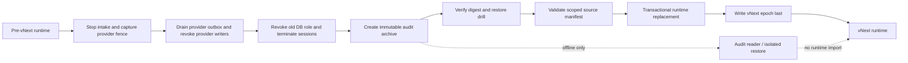

# RFC: Workflow vNext Cutover and Audit Retention

Status: Proposed — owner and operational approval pending

Date: 2026-08-28

Related architecture: `docs/workflow-first-autonomous-change-rfc.md`

## 1. Decision Boundary

This RFC owns the physical transition from the pre-vNext Workflow runtime to vNext. It does not own
the vNext Workflow language, classifier behavior, Evidence semantics, or merge policy.

One constraint is already explicit: vNext will not read, import, reinterpret, backfill, or dual
write pre-vNext runtime records. That is a runtime compatibility boundary. It does not require the
destruction of historical audit data.

No destructive command, role revocation, schema replacement, or production cutover is authorized
while this RFC is `Proposed`.

## 2. Problem

Pre-vNext instances do not pin enough execution policy to be replayed safely under the vNext
contract. Treating them as vNext runs would create two meanings for policy, Evidence, review, and
authorization.

At the same time, old events, decisions, attempts, provider bindings, and Evidence may be required
for incident investigation, compliance, debugging, or operator accountability. Runtime
incompatibility therefore must not silently become audit destruction.

The production catalog may also contain far more unrelated schemas and objects than a clean test
database. The feasibility and cost of catalog inspection are unknown until measured against the
real deployment or a current production clone.

## 3. Proposed Outcome

Use an offline, one-way runtime cutover with a mandatory immutable audit archive:

1. atomically stop pre-vNext intake and write provider intake fences to an immutable cutover
   manifest outside the runtime schema being replaced;
2. cancel or drain active provider-action outbox work, revoke old provider credentials, and verify
   zero pre-vNext provider writers;
3. revoke old database-writer access, terminate its sessions, and verify zero remaining database
   writers;
4. create and verify a versioned audit archive from the fenced source;
5. verify an exact, versioned source manifest;
6. replace only the manifest-owned runtime objects and exact shared rows;
7. install the verified provider fences and then the vNext epoch; and
8. start vNext only after its critical storage/epoch handshake succeeds.

vNext never reads the audit archive. Audit inspection uses an offline export reader or an isolated
restoration environment. This preserves the no-compatibility boundary without deleting the only
auditable record of earlier decisions.

## 4. Mandatory Audit Archive

The archive MUST be created after the old writer fence and before destructive data mutation. It
MUST contain:

- manifest version and configured schema names;
- source schema epoch and applied migration-ledger variants;
- canonical schema/catalog fingerprint for every manifest-owned object;
- locked row counts and content digests for every exported table;
- complete pre-vNext definitions, instances, events, decisions, commands, jobs, runtime events,
  artifacts, prompt payloads, remote fact snapshots, run evidence, and usage/lease records;
- issue/project lifecycle rows owned by the superseded stores;
- exact exported shared rows selected by the Workflow ownership predicates;
- provider/repository/subject bindings needed to identify remote branches, issues, and pull
  requests;
- export tool version, start/end timestamps, database identity, and operator identity; and
- one root digest covering the manifest, metadata, and all content digests.

Before cutover, an isolated restore drill MUST prove that:

- the root digest verifies;
- every exported table count matches the locked source count;
- representative instance/event/decision histories can be queried;
- remote bindings can be enumerated without contacting or mutating the provider; and
- the archive can be retained under the configured retention and access policy.

A backup that has not passed this verification is not an archive and cannot satisfy the cutover
gate. “Optional backup” is explicitly rejected.

## 5. Scoped Catalog Dry-Run

Before implementing destructive execution, Harness MUST provide a read-only dry-run that runs
against a current production clone or, with operator approval, production itself.

The dry-run MUST:

- query only the configured runtime, issue, project, and shared task schemas;
- parameterize schema names and fixed shared-row predicates;
- inventory relations, columns, constraints, indexes, functions, triggers, and migration ledgers;
- report missing and unknown objects without mutating them;
- report the query plan and duration of every catalog query;
- count candidate rows without acquiring destructive locks;
- exclude unrelated per-workspace schemas from the fingerprint; and
- produce the exact digest that a later data-loss acknowledgement would bind.

Initial feasibility targets:

| Measurement | Target | Failure action |
|---|---:|---|
| Total catalog dry-run time | under 5 minutes | Redesign/scoped indexing review; no cutover implementation |
| Longest catalog query | under 30 seconds | Inspect plan and narrow query |
| Unknown objects in owned schemas | 0 | Update/re-review manifest or remove object explicitly |
| Unrelated schemas included | 0 | Treat as a correctness bug |
| Source rows modified | 0 | Treat as a critical safety bug |

These are proposal thresholds, not claims about the current production database. Actual results
must be attached before this RFC can be approved.

## 6. Source Manifest

The current candidate source inventory is maintained in
`docs/workflow-first-autonomous-change-phase-0-map.md` section 6.5. It currently describes runtime
migrations `1..32`, 17 runtime tables, two functions, two triggers, issue migrations `1..6`, project
migrations `1..4`, accepted ledger variants, and exact shared task predicates.

Each shared task predicate binds both `store_key = <configured task-store identity>` and
`runtime_workflow_id IS NOT NULL`; neither column alone proves ownership.

That inventory is a review input, not an executable authorization. Any intervening source migration
changes the manifest version and invalidates prior counts, fingerprints, approvals, and dry-run
evidence.

## 7. Writer and Provider Fencing

An advisory lock is not sufficient to fence already-connected writers. Before the archive snapshot,
a future approved cutover must use a Harness-exclusive old database role, revoke its
login/privileges, terminate its sessions, verify zero remaining sessions, and provision a distinct
vNext role. If the role is shared with a non-Harness client, cutover refuses.

The provider side is a separate write surface. Before the archive snapshot, cutover must stop
provider intake, cancel or drain every active provider-action outbox item and attempt, revoke the
old provider credentials, and verify that no pre-vNext worker can publish, update, or merge remote
objects. A database writer fence does not prove this condition.

The provider boundary is captured atomically with stopping pre-vNext intake. Subjects at or before
the boundary remain fenced from vNext rediscovery; subjects created after it are preserved for
normal vNext intake and are not suppressed merely because they arrived during archive or restore
work. An unverifiable boundary disables automatic intake for that binding. Explicit adoption
requires a human authorization receipt and creates new vNext identities; it does not import old
Harness runtime state.

The captured provider fence records and their digest are stored in the immutable cutover manifest,
outside the runtime schema that will be replaced. The replacement transaction installs those exact
verified records into vNext `provider_intake_fences` before writing the vNext epoch. The vNext
listener remains disabled until the installed fence digest matches the manifest, so schema
replacement cannot erase the boundary.

## 8. Alternatives

### A. Mandatory archive plus one-way runtime cutover — recommended proposal

Pros:

- preserves the no-runtime-compatibility constraint;
- retains auditable history;
- keeps vNext free of legacy readers; and
- supports full rollback and incident investigation.

Cons:

- requires an export format, verification, retention policy, and restore drill;
- extends the maintenance window; and
- still requires high-risk database fencing.

### B. Keep legacy schemas online as read-only history

Pros:

- simple ad hoc SQL access; and
- no export format required initially.

Cons:

- old schema remains operationally coupled to production;
- permissions and accidental reads are harder to contain; and
- schema name and tooling collisions can recreate a compatibility surface.

Decision: not preferred. It may be reconsidered only if the archive restore/read path is
operationally inadequate.

### C. Dual-read or backfill old runs into vNext

Pros:

- one API could display all history.

Cons:

- reintroduces two runtime meanings;
- old execution policy cannot be reconstructed safely; and
- creates a permanent compatibility burden.

Decision: rejected by the owner’s no-backward-compatibility constraint.

### D. Delete source data with an optional backup

Pros:

- smallest cutover implementation.

Cons:

- unverifiable backups can lose the only audit history;
- violates the architecture’s auditability objective; and
- makes rollback depend on an untested artifact.

Decision: rejected.

## 9. Risks and Mitigations

| Risk | Severity | Mitigation |
|---|---|---|
| Archive is incomplete or corrupt | Critical | Root digest, locked counts, representative queries, mandatory restore drill |
| Catalog inspection is infeasible on the real database | High | Read-only scoped benchmark before implementation; redesign on threshold failure |
| Old process writes during cutover | Critical | Exclusive role, credential revocation, session termination, zero-session verification |
| Old provider writer mutates remote state after archive | Critical | Drain provider outbox/attempts, revoke credentials, and verify zero provider writers before archive |
| Shared task rows are over-deleted | Critical | Fixed predicates, locked counts, cleanup preconditions, preservation tests |
| Old provider object re-enters as new work | High | Provider intake fences and fail-closed unverifiable bindings |
| Archive becomes an accidental runtime dependency | High | No vNext archive reader; offline tooling and isolated restore only |
| Rollback crosses incompatible credentials/data | Critical | Restore rehearsal covering database, old credential, deployment, and traffic routing |

## 10. Approval Gates

This RFC cannot move to `Approved` until all of the following exist:

- owner approval of the retention and downtime policy;
- attached real-database dry-run results meeting the feasibility targets;
- an exact reviewed manifest version;
- a versioned archive format and successful restore drill;
- a tested old-role/session fencing procedure;
- a tested provider-writer drain, credential revocation, and zero-writer verification procedure;
- provider-fence conformance tests for poll, webhook, and direct submission;
- a rollback rehearsal; and
- an independent operational/database review.

Approval of the umbrella Workflow architecture does not imply approval of this cutover RFC.

## 11. Open Questions

1. What retention period and access policy does the audit archive require?
2. Where is the immutable archive stored and who can decrypt/read it?
3. Is production dry-run acceptable, or must it use a current clone?
4. What maximum maintenance window is acceptable?
5. Which operator identities must approve the final digest?
6. What offline audit-reader format is sufficient for investigations?
